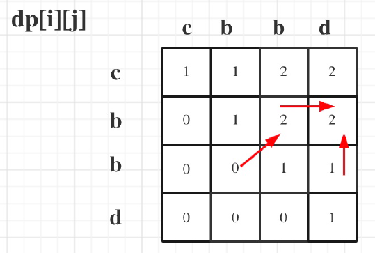
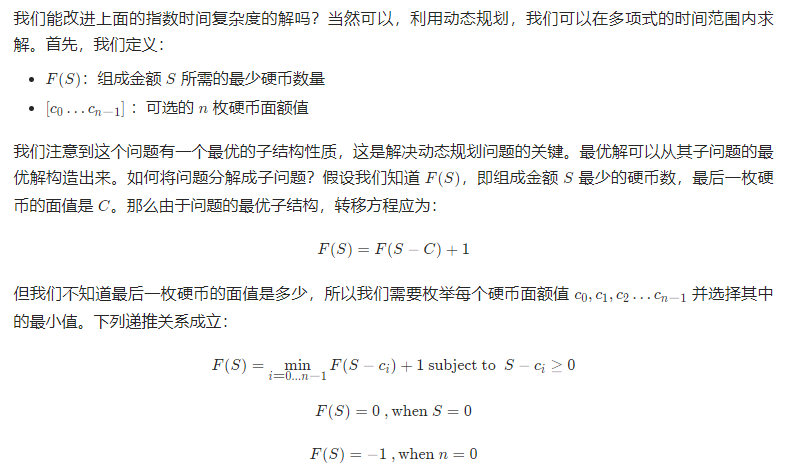
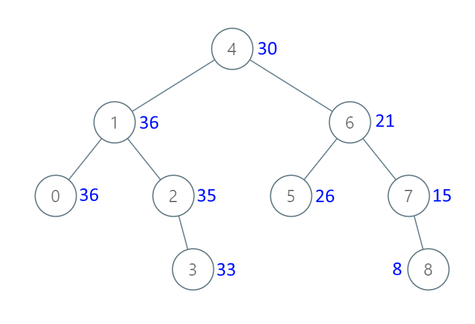

*<u><strong style="color:red;">下面是剑指offer第二版的刷题记录</strong></u>* 👇👇👇

# 剑指offer第二版

## 寻找两个有序数组的中位数

这题我只能说血难：https://leetcode-cn.com/problems/median-of-two-sorted-arrays/solution/xun-zhao-liang-ge-you-xu-shu-zu-de-zhong-wei-s-114/

## 删除链表的倒数第N个结点

这道题用了一种快慢指针的方法。https://leetcode-cn.com/problems/remove-nth-node-from-end-of-list/

定义了两个指针，一个叫快指针，一个叫慢指针，先都初始化为链表的head，然后先让快指针走n步，这样快慢指针差n，之后两个同时一步步走，直到快指针走到链表最后一个元素，此时慢指针指向的就是需要删除的结点，只需要将慢指针指向的下一结点修改为下一结点指向的结点即可把倒数第n个结点删除。

```Cpp
/**
 * Definition for singly-linked list.
 * struct ListNode {
 *     int val;
 *     ListNode *next;
 *     ListNode() : val(0), next(nullptr) {}
 *     ListNode(int x) : val(x), next(nullptr) {}
 *     ListNode(int x, ListNode *next) : val(x), next(next) {}
 * };
 */
class Solution {
public:
    ListNode* removeNthFromEnd(ListNode* head, int n) {
        // 快慢指针的应用
        if (head == nullptr) return head;
        auto runner = head;
        auto chaser = head;
        while(n>0){
            n--;
            runner = runner->next;
        }
        if (runner == nullptr){
            return head->next;
        }
        while(runner->next!=nullptr){
            runner = runner->next;
            chaser = chaser->next;
        }
        chaser->next = chaser->next->next;
        return head;
    }
};
```

## 剑指 Offer 12. 矩阵中的路径

给定一个 m x n 二维字符网格 board 和一个字符串单词 word 。如果 word 存在于网格中，返回 true ；否则，返回 false 。

单词必须按照字母顺序，通过相邻的单元格内的字母构成，其中“相邻”单元格是那些水平相邻或垂直相邻的单元格。同一个单元格内的字母不允许被重复使用。

例如，在下面的 3×4 的矩阵中包含单词 "ABCCED"（单词中的字母已标出）。


**示例 1：**

输入：board = [["A","B","C","E"],["S","F","C","S"],["A","D","E","E"]], word = "ABCCED"
输出：true
**示例 2：**

输入：board = [["a","b"],["c","d"]], word = "abcd"
输出：false

**求解：**

这道题很像做路径规划的时候A\*算法啥的...hhh

主要解决手段是：**DFS + 回溯**

思路：从某一个点出发，上下左右“试探”,如果越界或者当前字符与word对应的字符不一致则返回false，如果都满足（就说明没有越界的情况下字符还是相同的），则判断是不是word的最后一个字符，如果是则直接返回true。如果不是则标记board相应位置为'\0'（下一次判断word字符与这个字符等不等结果一定不等），之后递归四个方向（用或关系），递归下面就是回溯的灵魂了，即撤销之前的标记操作，最后返回上面递归的结果。

```Cpp
class Solution {
public:
    int row, col;
    bool exist(vector<vector<char>>& board, string word) {
        row = board.size();
        col = board[0].size();
        for(int i = 0; i < row; ++i){
            for(int j = 0; j < col; ++j){
                if(dfs(board,word,0,i,j)) return true;
            }
        }
        return false;
    }

    bool dfs(vector<vector<char>> & board, string& word, int k, int i, int j){
        if(i < 0 || j < 0 || i >= row || j >= col || word[k] != board[i][j]) return false;
        if(k == word.size() - 1) return true;
        board[i][j] = '\0';
        bool res = dfs(board, word, k + 1, i + 1, j) || dfs(board, word, k + 1, i - 1, j) ||
                   dfs(board, word, k + 1, i, j + 1) || dfs(board, word, k + 1, i, j - 1);
        board[i][j] = word[k];
        return res;
    }
};
```

## 剑指 Offer 13. 机器人的运动范围（中）

地上有一个m行n列的方格，从坐标 [0,0] 到坐标 [m-1,n-1] 。一个机器人从坐标 [0, 0] 的格子开始移动，它每次可以向左、右、上、下移动一格（不能移动到方格外），也不能进入行坐标和列坐标的数位之和大于k的格子。例如，当k为18时，机器人能够进入方格 [35, 37] ，因为3+5+3+7=18。但它不能进入方格 [35, 38]，因为3+5+3+8=19。请问该机器人能够到达多少个格子？

**示例 1：**

```
输入：m = 2, n = 3, k = 1
输出：3
```

**求解：**

这道题用dfs，创建一个visited表，存储是否到达某个点，dfs返回 1+周围4个点的dfs，如果dfs的某个点出界或者被访问或者位之和大于k则返回0。

```Cpp
class Solution {
public:
    int movingCount(int m, int n, int k) {
        vector<vector<bool>> visited(m,vector<bool>(n,0));
        return dfs(m,n,0,0,k,visited);
    }

    int dfs(int m,int n,int i,int j,int k,vector<vector<bool>>& visited){
        if(i > m-1 || j > n-1 || i < 0 || j < 0 || calSum(i)+calSum(j)>k || visited[i][j] == true){
            return 0;
        }
        visited[i][j] = true;
        return 1 + dfs(m,n,i+1,j,k,visited) + dfs(m,n,i,j+1,k,visited)+
                dfs(m,n,i-1,j,k,visited) + dfs(m,n,i,j-1,k,visited);
    }

    int calSum(int i){
        int s = 0;
        while(i>0){
            s += i % 10;
            i /= 10;
        }
        return s;
    }
};
```

## 剑指 Offer 14- I. 剪绳子

给你一根长度为 n 的绳子，请把绳子剪成整数长度的 m 段（m、n都是整数，n>1并且m>1），每段绳子的长度记为 k[0],k[1]...k[m-1] 。请问 k[0]*k[1]*...*k[m-1] 可能的最大乘积是多少？例如，当绳子的长度是8时，我们把它剪成长度分别为2、3、3的三段，此时得到的最大乘积是18。

**示例 1:**

```
输入: 10
输出: 36
解释: 10 = 3 + 3 + 4, 3 × 3 × 4 = 36
```

**求解：**这道题k神用导数推出了数学特性就是尽量多的以3为长度分绳子。https://leetcode-cn.com/problems/jian-sheng-zi-lcof/

```Cpp
class Solution {
public:
    int cuttingRope(int n) {
        if(n <= 3) return n-1;
        int a = n / 3, b = n % 3;
        if(b == 0) return (int)pow(3,a);
        if(b == 1) return (int)pow(3,a-1)*4;
        return (int)pow(3,a) * 2;
    }
};
```

也有人说可以用DP，我不太会，之后学学吧。

剑指 Offer 14- II. 剪绳子 II

给你一根长度为 n 的绳子，请把绳子剪成整数长度的 m 段（m、n都是整数，n>1并且m>1），每段绳子的长度记为 k[0],k[1]...k[m - 1] 。请问 k[0]*k[1]*...*k[m - 1] 可能的最大乘积是多少？例如，当绳子的长度是8时，我们把它剪成长度分别为2、3、3的三段，此时得到的最大乘积是18。

答案需要取模 1e9+7（1000000007），如计算初始结果为：1000000008，请返回 1。

**示例 1:**

```
输入: 10
输出: 36
解释: 10 = 3 + 3 + 4, 3 × 3 × 4 = 36
```

**求解：**这道题和剪绳子Ⅰ的区别在于需要大数取余，这里采用循环取余的方式：$(x y) \odot p=[(x \odot p)(y \odot p)] \odot p$，那么：$x^{a} \odot p=\left[\left(x^{a-1} \odot p\right)(x \odot p)\right] \odot p=\left[\left(x^{a-1} \odot p\right) x\right] \odot p$.利用此公式，可通过循环操作依次求$x^1,x^2...,x^{a-1}$对p的余数，保证每轮中间值rem都在int32取值范围中。

```Cpp
class Solution {
public:
    int cuttingRope(int n) {
        if(n <= 3) return n - 1;
        int b = n % 3, p = 1000000007;
        long rem = 1, x = 3;
        for(int a = n / 3 - 1; a > 0; a /= 2){  // 循环取余求x^1...x^{}
            if(a % 2 == 1) rem = (rem * x) % p;
            x = (x * x) % p;
        }
        if(b == 0) return (int)(rem * 3 % p);
        if(b == 1) return (int)(rem * 4 % p);
        return (int)(rem * 6 % p);
    }
};
```

## 剑指 Offer 16. 数值的整数次方

实现 pow(x, n) ，即计算 x 的 n 次幂函数（即，xn）。不得使用库函数，同时不需要考虑大数问题。

**示例 1：**

输入：x = 2.00000, n = 10
输出：1024.00000
示例 2：

输入：x = 2.10000, n = 3
输出：9.26100
**示例 3：**

输入：x = 2.00000, n = -2
输出：0.25000
解释：2-2 = 1/22 = 1/4 = 0.25

**求解：**

**算法：快速幂**     **原理：二分法**


```Cpp
class Solution {
public:
    double myPow(double x, int n) {
        if (x == 0) return 0;
        long b = n;
        double res = 1.0;
        if (b < 0){
            x = 1 / x;
            b = -b;
        }
        while (b > 0){
            if ((b & 1) == 1) res *= x;
            x *= x;
            b >>= 1;
        }
        return res;
    }
};
```

## 剑指 Offer 24. 反转链表

定义一个函数，输入一个链表的头节点，反转该链表并输出反转后链表的头节点。

**示例:**

```
输入: 1->2->3->4->5->NULL
输出: 5->4->3->2->1->NULL
```

<u>这道题实验室门口哥们面小米自动驾驶岗被问了，一时间我只知道我做过，但是具体还给忘了，赶紧回味了一下。</u>

**求解：**

主要使用的技术是栈，先顺序将链表元素入栈，之后出栈生成新的链表。我在VS上重写了完整的题目，包括链表定义。

```Cpp
#include <iostream>
#include <vector>
#include <stack>
using namespace std;
struct ListNode {
	int val;
	ListNode * next = nullptr;
};

ListNode *  reverseList(ListNode* head) {
	ListNode * h = new ListNode;
	ListNode * s = h;
	stack<int> stk;
	while (head) {
		stk.push(head->val);
		head = head->next;
	}
	while (!stk.empty()) {
		ListNode * node = new ListNode;
		node->val = stk.top();
		stk.pop();
		s->next = node;
		s = s->next;
	}
	return h->next;
}

int main()
{
	ListNode* head = new ListNode;
	ListNode * p = head;
	head->val = 1;
	for (int i = 2; i < 10; ++i) {
		ListNode * node = new ListNode;
		node->val = i;
		p->next = node;
		p = node;
	}
	ListNode* h = reverseList(head);
	while (h) {
		cout << h->val << endl;
		h = h->next;
	}
	return 0;
}
```

## 剑指offer 25. 合并两个排序的链表

题目：输入两个递增排序的链表，合并这两个链表并使新链表中的节点仍然是递增排序的。

示例：

```
输入：1->2->4, 1->3->4
输出：1->1->2->3->4->4
```

这题的递归解法真的巧，记录一下

```Cpp
class Solution {
    public ListNode mergeTwoLists(ListNode l1, ListNode l2) {
        if (l1 == null) {
            return l2;
        }
        if (l2 == null) {
            return l1;
        }
        if (l1.val <= l2.val) {
            l1.next = mergeTwoLists(l1.next, l2);
            return l1;
        } else {
            l2.next = mergeTwoLists(l1, l2.next);
            return l2;
        }
    }
}
```

## 剑指 Offer 26. 树的子结构

输入两棵二叉树A和B，判断B是不是A的子结构。(约定空树不是任意一个树的子结构)

B是A的子结构， 即 A中有出现和B相同的结构和节点值。

例如:
给定的树 A:

​      3

​     / \

   4   5
  / \
 1   2
给定的树 B：

   4 
  /
 1
返回 true，因为 B 与 A 的一个子树拥有相同的结构和节点值。

**求解：**

先判断A和B是否为空，只要有空的一定为false。之后判断A和B是否包含，如果不同就递归调用A的左右子树看是否和B相同。包含的函数：返回A的左子树和B的左子树与上A的右子树和B的右子树是否包含，递归停止条件是B为空的话返回True，若B不为空而A为空或者B不为空但是A B的结点值不同的话，则说明不存在包含关系，返回false。

```Cpp
class Solution {
public:
    bool isSubStructure(TreeNode* A, TreeNode* B) {
        if(!A || !B) return false;
        return isContain(A,B) || isSubStructure(A->right,B) || isSubStructure(A->left,B);
    }

    bool isContain(TreeNode * A, TreeNode * B){
        if(!B) return true;
        if(!A || A->val != B->val) return false;
        return isContain(A->left,B->left) && isContain(A->right,B->right);
    }
};
```

这道题挺抽象的，没做出来。看评论区有个人的观点挺好的：递归不要考虑太多细节问题，主要记住递归函数是干什么的这一宏观概念就行了。

## 剑指 Offer 27. 二叉树的镜像

题目：

请完成一个函数，输入一个二叉树，该函数输出它的镜像。

例如输入：

​     4

   /   \
  2     7
 / \   / \
1   3 6   9
镜像输出：

​     4

   /   \
  7     2
 / \   / \
9   6 3   1

**示例 1：**

```
输入：root = [4,2,7,1,3,6,9]
输出：[4,7,2,9,6,3,1]
```

这道题经典二叉树递归：

```Cpp
class Solution {
public:
    TreeNode* mirrorTree(TreeNode* root) {
        if(root == nullptr) return nullptr;
        TreeNode * left = mirrorTree(root->left);
        TreeNode * right = mirrorTree(root->right);
        root->right = left;
        root->left = right;
        return root;
    }
};
```

## 剑指 Offer 28. 对称的二叉树

题目：请实现一个函数，用来判断一棵二叉树是不是对称的。如果一棵二叉树和它的镜像一样，那么它是对称的。

例如，二叉树 [1,2,2,3,4,4,3] 是对称的。

  1
  / \
 2  2
 / \ / \
3  4 4  3

但是下面这个 [1,2,2,null,3,null,3] 则不是镜像对称的:

  1
  / \
 2  2
   \     \
    3     3

**示例 1：**

```
输入：root = [1,2,2,3,4,4,3]
输出：true
```

**示例 2：**

```
输入：root = [1,2,2,null,3,null,3]
输出：false
```

这道题也是二叉树递归的典型题：

```Cpp
class Solution {
public:
    bool isSymmetric(TreeNode* root) {
        return root == nullptr ? true : recur(root->right,root->left);
    }

    bool recur(TreeNode* t1, TreeNode * t2){
        if(t1 == nullptr && t2 == nullptr) return true;
        if(t1 == nullptr || t2 == nullptr || t1->val != t2->val) return false;
        return recur(t1->right,t2->left) && recur(t1->left,t2->right);
    }
};
```

第8行表示递归过程中同时越过叶结点那么认为比较结果是true，第9行表示第8行不满足的条件下即其中有一个为null有一个不为null那么这个树在结构上就是不对称的，另外，如果结点的值不相等那么也是不对称的，返回false。如果8，9行都不满足，递归检查t1,t2的左右结点并用与作为结果返回。

## 剑指 Offer 44. 数字序列中某一位的数字

数字以0123456789101112131415…的格式序列化到一个字符序列中。在这个序列中，第5位（从下标0开始计数）是5，第13位是1，第19位是4，等等。

请写一个函数，求任意第n位对应的数字。

 

示例 1：

输入：n = 3
输出：3
示例 2：

输入：n = 11
输出：0

**求解：**讲道理，这种找规律的题太靠智商了，我估计临场是想不出来的，K神把整个过程分为三部分来解决，可以看题解。

```Cpp
class Solution {
public:
    int findNthDigit(int n) {
        int digit = 1;
        long start = 1, count = 9;
        while(n > count){
            n -= count;
            digit += 1;
            start *= 10;
            count = digit * start * 9;
        }
        long num = start + (n - 1) / digit;
        return to_string(num).at((n - 1) % digit) - '0';
    }
};
```


## 剑指 Offer 46. 把数字翻译成字符串（中）

给定一个数字，我们按照如下规则把它翻译为字符串：0 翻译成 “a” ，1 翻译成 “b”，……，11 翻译成 “l”，……，25 翻译成 “z”。一个数字可能有多个翻译。请编程实现一个函数，用来计算一个数字有多少种不同的翻译方法。

示例 1:

输入: 12258
输出: 5
解释: 12258有5种不同的翻译，分别是"bccfi", "bwfi", "bczi", "mcfi"和"mzi"

**求解：**

先说我自己的做法，递归，最后出来结果是用时击败100%，但是空间复杂度太高，具体做法就是判断第一位数的特征，之后递归去除这一位数字后的数：举个例子，当这个数大于2时就直接递归left+1到末尾这个数，当这个数为1时返回两个递归之和（left+1,right)+(left+2,right)。

```Cpp
class Solution {
public:
    int translateNum(int num) {
        if(num == 0) return 1;
        vector<int> tmp;
        while(num>0){
            tmp.push_back(num%10);
            num /= 10;
        }
        reverse(tmp.begin(),tmp.end());
        int left = 0;
        return recur(tmp,left);
    }

    int recur(vector<int> tmp,int left){
        if(left == tmp.size()-1) return 1;
        if(tmp[left]>2){
            return recur(tmp,left+1);
        }else if(tmp[left] == 2){
            if(tmp[left+1]>5){
                return recur(tmp,left+1);
            }else{
                if(left+2<=tmp.size()-1){
                    return recur(tmp,left+1) + recur(tmp,left+2);
                }else return recur(tmp,left+1)+1;
            }
        }else if(tmp[left]==0){
            return recur(tmp,left+1);
        }else{
            if(left+2<=tmp.size()-1){
                return recur(tmp,left+1) + recur(tmp,left+2);
            }else return recur(tmp,left+1)+1;
        }
    }
};
```

<strong style="color:#e67c86;">2021.11.5增加K神DP做法：</strong>

这道题DP做法很像青蛙跳台阶，也雷同斐波那契数列。具体做法就是当$x_{i-1}x_i$可以连续翻译时，那么以$x_i$结尾总共的翻译方法就是以$x_{i-2}$为结尾（$x_{i-1}x_i$一起翻译）和以$x_{i-1}$为结尾（$x_{i-1}x_i$分开翻译）的翻译总数之和。那么可以先令b = 1,a=1,b指向-1，a指向0号位置，遍历从第二个字母开始，判断其是否在10到25之间，如果在就令c=a+b，否则就等于a，然后更新a b，最后得到的a就是翻译方法总数。（这道题K神的动图做得很好：https://leetcode-cn.com/problems/ba-shu-zi-fan-yi-cheng-zi-fu-chuan-lcof/solution/mian-shi-ti-46-ba-shu-zi-fan-yi-cheng-zi-fu-chua-6/）

```Cpp
class Solution {
public:
    int translateNum(int num) {
        string str = to_string(num);
        int b = 1, a = 1;
        for (int i = 2; i <= str.size(); ++i){
            string tmp = str.substr(i-2,2);
            int c = 0;
            if (tmp >= "10" && tmp<="25"){
                c = b + a;
            }else{
                c = a;
            }
            b = a;
            a = c;
        }
        return a;
    }
};
```


## 剑指 Offer 32 - II. 从上到下打印二叉树 II

题目：从上到下按层打印二叉树，同一层的节点按从左到右的顺序打印，每一层打印到一行。

例如:
给定二叉树: `[3,9,20,null,null,15,7]`

```
    3
   / \
  9  20
    /  \
   15   7
```

返回其层次遍历结果：

```
[
  [3],
  [9,20],
  [15,7]
]
```

这道题和普通层序遍历稍有不同在于其每一层作为一个整体打印。

```Cpp
class Solution {
public:
    vector<vector<int>> levelOrder(TreeNode* root) {
        vector<vector<int>> res;
        queue<TreeNode *> q;
        if(root) q.push(root);
        while(!q.empty()){
            vector<int> tmp;
            for(int i = q.size(); i>0 ;--i){
                TreeNode * t = q.front();
                q.pop();
                tmp.push_back(t->val);
                if (t->left) q.push(t->left);
                if (t->right) q.push(t->right);
            }
            res.push_back(tmp);
        }
        return res;
    }
};
```

巧妙使用queue的size来整合每一行的结点值（第9行）。

## 剑指 Offer 47. 礼物的最大价值

题目：在一个 m\*n 的棋盘的每一格都放有一个礼物，每个礼物都有一定的价值（价值大于 0）。你可以从棋盘的左上角开始拿格子里的礼物，并每次向右或者向下移动一格、直到到达棋盘的右下角。给定一个棋盘及其上面的礼物的价值，请计算你最多能拿到多少价值的礼物？

示例 1:

输入: 
[
  [1,3,1],
  [1,5,1],
  [4,2,1]
]
输出: 12
解释: 路径 1→3→5→2→1 可以拿到最多价值的礼物

这道题是典型的dp题，转移方程为：
$$
dp[i,j] = max(dp[i][j-1],dp[i-1][j]) + grid[i][j]
$$
这么一看dp数组需要n$\times$m容量，但是使用滚动数组可以优化空间复杂度，下面贴一个leetcode高手代码：

```java
class Solution {
    public int maxValue(int[][] grid) {
        int m = grid.length, n = grid[0].length;
        int[] dp = new int[n + 1];
        for (int i = 1; i <= m; i++) {
            for (int j = 1; j <= n; j++) {
                dp[j] = Math.max(dp[j], dp[j - 1]) + grid[i - 1][j - 1];
            } 
        }

        return dp[n];
    }
}
```

第7行右边的dp[j]是上一行遍历时候记录下的dp[j]也就是目前遍历到的这个位置的上面的记录，dp[j-1]就是左边的已经更新的记录，其实就是取左边和上面中的最大值，这样一行行遍历下去，对应最后的dp[n]就是遍历到最后一个位置。还有第一个位置置0是为了处理grid左边缘，细细品味真绝。

我的做法就比较傻瓜了：

```Cpp
class Solution {
public:
    int maxValue(vector<vector<int>>& grid) {
        int m = grid.size();
        int n = grid[0].size();
        vector<vector<int>> dp(m,vector<int>(n,0));
        int maxValue = 0;
        for(int i = 0; i<m; ++i){
            for(int j = 0; j<n; ++j){
                if(i == 0 && j == 0){
                    dp[i][j] = grid[0][0];
                    maxValue = max(maxValue,dp[i][j]);
                }else if(i == 0){
                    dp[i][j] = dp[i][j-1]+grid[i][j];
                    maxValue = max(maxValue,dp[i][j]);
                }else if(j == 0){
                    dp[i][j] = dp[i-1][j] + grid[i][j];
                    maxValue = max(maxValue,dp[i][j]);
                }else{
                    if(dp[i][j-1] > dp[i-1][j]){
                        dp[i][j] = dp[i][j-1] + grid[i][j];
                        maxValue = max(maxValue,dp[i][j]);
                    }else{
                        dp[i][j] = dp[i-1][j] + grid[i][j];
                        maxValue = max(maxValue,dp[i][j]);
                    }
                }
            }
        }
        return maxValue;
    }
};
```

## 剑指 Offer 48. 最长不含重复字符的子字符串

请从字符串中找出一个最长的不包含重复字符的子字符串，计算该最长子字符串的长度。

**示例 1:**

```
输入: "abcabcbb"
输出: 3 
解释: 因为无重复字符的最长子串是 "abc"，所以其长度为 3。
```

**求解：**

这道题K神用了很多种方法，比如动态规划等等，但还是滑动窗口+哈希来得容易理解。具体做法如下：<strong style="color:#126bae;">使用一个哈希表来记录每个字符最后一次出现时的索引</strong>，初始化left=right=res=0。遍历每个字符，当当前字符在哈希表中有记录时，更新left = max(left,哈希表[该字符]+1)，这里一定要用max，如果只是left = 哈希表[该字符]+1的话会出现left倒退的现象（以abba为例脑补吧，left会从2倒回到1，但是bba已经有重复的两个b了）。如果当前字符没有在哈希表中记录时，用哈希表记录当前字符，值为right。之后更新res=max(res,right-left+1)，最后让right++，移动窗口。**此题为滑动窗口典型题。**

```Cpp
class Solution {
public:
    int lengthOfLongestSubstring(string s) {
        int left = 0, right = 0, res = 0;
        unordered_map<char,int> m;
        while(right<s.length()){
            char c = s[right];
            if(m.find(c)!=m.end()){
                left = max(left,m[c]+1);
            }
            m[c] = right;
            res = max(res,right - left + 1);
            right ++;
        }
        return res;
    }
};
```

## 剑指 Offer 49. 丑数（中）

我们把只包含质因子 2、3 和 5 的数称作丑数（Ugly Number）。求按从小到大的顺序的第 n 个丑数。

示例:

输入: n = 10
输出: 12
解释: 1, 2, 3, 4, 5, 6, 8, 9, 10, 12 是前 10 个丑数。
说明:  

1 是丑数。
n 不超过1690

**求解：**

第$i$个丑数只有可能是在前面丑数的基础上乘以2，或者3或者5，这是关键，之后选取大于第$i-1$个丑数但又是最小的数作为第$i$个丑数。初始化一个数组，其中给定第一个元素为1，这个数组第$i$位（i=1,2...）表示第i个丑数，初始化三个指针a,b,c，同时指向第一个元素，之后迭代求取第二个第三个丑数（这实际上算动态规划），值得注意的是，每一步求取丑数后都需要对a,b,c指针进行更新。更新方式：当第i个丑数等于a,b,c某个或多个乘上对应的因子，那么对应的a,b,c就加1。

```Cpp
class Solution {
public:
    int nthUglyNumber(int n) {
        int a = 0, b = 0, c = 0;
        vector<int> dp(1,1);
        int count = n;
        while(--count){
            int t = min(dp[a]*2,dp[b]*3);
            t = min(t,dp[c]*5);
            dp.push_back(t);
            if(t == dp[a]*2) a++;
            if(t == dp[b]*3) b++;
            if(t == dp[c]*5) c++;
        }
        return dp.back();
    }
};
```

这算一道三指针的题目，不难但我又是看了k神的解析才动手写的。

## 剑指 Offer 07. 重建二叉树

这道题中等难度，对算法要求高！

题目：输入某二叉树的前序遍历和中序遍历的结果，请构建该二叉树并返回其根节点。

假设输入的前序遍历和中序遍历的结果中都不含重复的数字。

**示例 1:**


Input: preorder = [3,9,20,15,7], inorder = [9,3,15,20,7]
Output: [3,9,20,null,null,15,7]

**解决：**

前序遍历中找根结点，之后在中序遍历中找到该节点，那么它左边的元素就是该节点的左子树，右节点就是右子树，再返回去在前序遍历中区分出根结点的左子树和右子树，对这两棵树递归地调用上述算法。当搜索范围left>right时返回nullptr。

具体解法看leetcode K神讲解：https://leetcode-cn.com/problems/zhong-jian-er-cha-shu-lcof/solution/mian-shi-ti-07-zhong-jian-er-cha-shu-di-gui-fa-qin/

```Cpp
class Solution {
public:
    TreeNode* buildTree(vector<int>& preorder, vector<int>& inorder) {
        this->preorder = preorder;
        for(int i = 0; i < inorder.size();++i){
            dic[inorder[i]] = i;
        }
        return recur(0,0,inorder.size()-1);
    }
    vector<int> preorder;
    unordered_map<int,int> dic;
    TreeNode * recur(int root,int left, int right){
        if(left>right) return nullptr;
        TreeNode * node = new TreeNode(preorder[root]);
        int i = dic[preorder[root]];
        node->left = recur(root+1,left,i-1);
        node->right = recur(i-left+1+root,i+1,right);
        return node;
    }
};
```

## 剑指 Offer 31. 栈的压入、弹出序列

输入两个整数序列，第一个序列表示栈的压入顺序，请判断第二个序列是否为该栈的弹出顺序。假设压入栈的所有数字均不相等。例如，序列 {1,2,3,4,5} 是某栈的压栈序列，序列 {4,5,3,2,1} 是该压栈序列对应的一个弹出序列，但 {4,3,5,1,2} 就不可能是该压栈序列的弹出序列。

示例 1：

输入：pushed = [1,2,3,4,5], popped = [4,5,3,2,1]
输出：true
解释：我们可以按以下顺序执行：
push(1), push(2), push(3), push(4), pop() -> 4,
push(5), pop() -> 5, pop() -> 3, pop() -> 2, pop() -> 1
示例 2：

输入：pushed = [1,2,3,4,5], popped = [4,3,5,1,2]
输出：false
解释：1 不能在 2 之前弹出。

**求解：**

这道题可以采用模拟的方法：模拟往一个stack中压入元素，若遇到需要出栈的元素则循环执行出栈，若最后stack不为空则中间出栈有问题，说明出栈顺序不可行。

```Cpp
class Solution {
public:
    bool validateStackSequences(vector<int>& pushed, vector<int>& popped) {
        stack<int> stk;
        int i = 0;
        for(int k = 0; k<pushed.size(); ++k){
            stk.push(pushed[k]);
            while( (!stk.empty()) && (stk.top() == popped[i]) ){ // 这两个判断是有顺序的，先判断是否为空再有顶部元素是否相同
                stk.pop();
                i++;
            }
        }
        if (!stk.empty()) return false;
        else return true;
    }
};
```

k神求解思路：https://leetcode-cn.com/problems/zhan-de-ya-ru-dan-chu-xu-lie-lcof/solution/mian-shi-ti-31-zhan-de-ya-ru-dan-chu-xu-lie-mo-n-2/

## 剑指 Offer 35. 复杂链表的复制

**题目：**请实现 copyRandomList 函数，复制一个复杂链表。在复杂链表中，每个节点除了有一个 next 指针指向下一个节点，还有一个 random 指针指向链表中的任意节点或者 null。


输入：head = [[7,null],[13,0],[11,4],[10,2],[1,0]]
输出：[[7,null],[13,0],[11,4],[10,2],[1,0]]

**提示：**

- `-10000 <= Node.val <= 10000`
- `Node.random` 为空（null）或指向链表中的节点。
- 节点数目不超过 1000 。

**解答：**

这道题与传统的复制链表不同，传统复制链表用一个pre和cur指针进行遍历，cur位置new一个node出来然后pre->next = cur即可，直到cur为nullptr。但是这道题在遍历到cur时，pre->random可能还没有创建。

解法一的思路就是用哈希表，哈希表的键为cur，值为new Node(cur->val)，这样在之后的遍历过程中利用键的信息来对值的random和next指针进行赋值：

```Cpp
/*
// Definition for a Node.
class Node {
public:
    int val;
    Node* next;
    Node* random;
    
    Node(int _val) {
        val = _val;
        next = NULL;
        random = NULL;
    }
};
*/
class Solution {
public:
    Node* copyRandomList(Node* head) {
        if (head == nullptr) return nullptr;
        Node * cur = head;
        unordered_map<Node* ,Node *>map;
        while(cur != nullptr){
            Node * node = new Node(cur->val);
            map[cur] = node;
            cur = cur->next;
        }
        cur = head;
        while(cur != nullptr){
            map[cur]->next = map[cur->next];
            map[cur]->random = map[cur->random];
            cur = cur->next;
        }
        return map[head];
    }
};
```

## 剑指 Offer 54. 二叉搜索树的第k大节点

给定一棵二叉搜索树，请找出其中第k大的节点。

**示例 1:**

```
输入: root = [3,1,4,null,2], k = 1
   3
  / \
 1   4
  \
   2
输出: 4
```

**解法：**

使用一个定理：<strong style="color:red;">二叉搜索树的中序遍历是一个递增数列</strong>。那么其中序遍历的反向的第k个元素就是要找的元素。中序遍历一般是 **左子树->processing->右子树**，我们可以反着来：**右子树->processing->左子树**。在类中维护一个res和k，k用于计数，res用于记录结果。

```Cpp
class Solution {
public:
    int res, k;
    int kthLargest(TreeNode* root, int k) {
        this->k = k;
        dfs(root);
        return res;
    }
    void dfs(TreeNode* root){
        if(root == nullptr || k == 0) return ;
        dfs(root->right);
        if(--k == 0) res = root->val;
        dfs(root->left);
    }
};
```

## 剑指 Offer 55 - I. 二叉树的深度

输入一棵二叉树的根节点，求该树的深度。从根节点到叶节点依次经过的节点（含根、叶节点）形成树的一条路径，最长路径的长度为树的深度。

例如：

给定二叉树 [3,9,20,null,null,15,7]，

​    3

   / \
  9  20
    /  \
   15   7
返回它的最大深度 3 。

**解答：**

比较容易想的一种方法为构造一个队列，将root放入队列，之后弹出并将其左子树和右子树放入队列，下一次循环次数为队列容量（也就是保证了层序遍历），并将其左子树和右子树放入（不为nullptr）。

```Cpp
class Solution {
public:
    int maxDepth(TreeNode* root) {
        if(root == nullptr) return 0;
        queue<TreeNode*> q;
        q.push(root);
        int res = 0;
        while(!q.empty()){
            int s = q.size();   // 这句不要放在for里面，q是动态变化的
            for(int i = 0; i<s; ++i){
                TreeNode * r = q.front();
                q.pop();
                if(r->right != nullptr) q.push(r->right);
                if(r->left != nullptr) q.push(r->left);
            }
            res ++;
        }
        return res;
    }
};
```

当然还有一种巧妙的递归：

```Cpp
class Solution {
public:
    int maxDepth(TreeNode* root) {
        if(root == nullptr) return 0;
        return max(maxDepth(root->left),maxDepth(root->right)) + 1;
    }
};
```

每次回溯到父结点都会增加1，然后max操作保证取到了左右子树的最大深度，依次向上回溯则会获得最大深度。

## 剑指 Offer 55 - II. 平衡二叉树

输入一棵二叉树的根节点，判断该树是不是平衡二叉树。如果某二叉树中任意节点的左右子树的深度相差不超过1，那么它就是一棵平衡二叉树。

示例 1:

给定二叉树 [3,9,20,null,null,15,7]

​    3

   / \
  9  20
    /  \
   15   7
返回 true 。

**求解：**

这道题一个常规的思路就是利用 [剑指 Offer 55 - I. 二叉树的深度](#剑指 Offer 55 - I. 二叉树的深度)求出结点的左右子树的深度，然后判断该结点左右子树深度差的绝对值是否小于等于1，之后再递归调用左子树和右子树：

```Cpp
class Solution {
public:
    bool isBalanced(TreeNode* root) {
        if(root == nullptr) return true;
        int d1 = depth(root->left);
        int d2 = depth(root->right);
        bool flag = (abs(d1-d2) <=1);
        return flag && isBalanced(root->left) && isBalanced(root->right);
    }

    int depth(TreeNode * root){
        if(root == nullptr) return 0;
        return max(depth(root->left),depth(root->right))+1;
    }
};
```

## 剑指 Offer 68 - I. 二叉搜索树的最近公共祖先

给定一个二叉搜索树, 找到该树中两个指定节点的最近公共祖先。

百度百科中最近公共祖先的定义为：“对于有根树 T 的两个结点 p、q，最近公共祖先表示为一个结点 x，满足 x 是 p、q 的祖先且 x 的深度尽可能大（一个节点也可以是它自己的祖先）。”

例如，给定如下二叉搜索树:  root = [6,2,8,0,4,7,9,null,null,3,5]


**示例 1:**

输入: root = [6,2,8,0,4,7,9,null,null,3,5], p = 2, q = 8
输出: 6 
解释: 节点 2 和节点 8 的最近公共祖先是 6。

**求解：**

这道题需要明确公共祖先的情况：1. 两个都在“一条线上”，即图中的8 9，2 0这种情况，那么公共祖先就是8和2。2.两个位于某个结点的两边，例如2，9，这种情况就是6为公共祖先。

```Cpp
class Solution {
public:
    TreeNode* lowestCommonAncestor(TreeNode* root, TreeNode* p, TreeNode* q) {
        if(root == nullptr) return nullptr;
        while(root){
            if(root->val<p->val && root->val<q->val){
                root = root->right;
            }else if(root->val > p->val && root->val > q->val){
                root = root->left;
            }else break;
        }
        return root;
    }
};
```

## 剑指 Offer 68 - II. 二叉树的最近公共祖先

题干和 [剑指 Offer 68 - I. 二叉搜索树的最近公共祖先](#剑指 Offer 68 - I. 二叉搜索树的最近公共祖先)一致，只是从二叉搜索树变成了二叉树。

**求解：**十分推荐看一遍K神的动态图，解释得非常清楚：[https://leetcode-cn.com/problems/er-cha-shu-de-zui-jin-gong-gong-zu-xian-lcof/solution/mian-shi-ti-68-ii-er-cha-shu-de-zui-jin-gong-gon-7/](https://leetcode-cn.com/problems/er-cha-shu-de-zui-jin-gong-gong-zu-xian-lcof/solution/mian-shi-ti-68-ii-er-cha-shu-de-zui-jin-gong-gon-7/)

```Cpp
class Solution {
public:
    TreeNode* lowestCommonAncestor(TreeNode* root, TreeNode* p, TreeNode* q) {
        if(root == nullptr || root == p || root == q) return root;
        TreeNode *left = lowestCommonAncestor(root->left, p, q);
        TreeNode *right = lowestCommonAncestor(root->right, p, q);
        if(left == nullptr && right == nullptr) return nullptr; // 1.
        if(left == nullptr) return right; // 3.
        if(right == nullptr) return left; // 4.
        return root; // 2. if(left != null and right != null)
    }
};
```

## 剑指 Offer 33. 二叉搜索树的后序遍历序列

输入一个整数数组，判断该数组是不是某二叉搜索树的后序遍历结果。如果是则返回 `true`，否则返回 `false`。假设输入的数组的任意两个数字都互不相同。

参考以下这颗二叉搜索树：

​      5

​     / \

   2   6
  / \
 1   3
**示例 1：**

输入: [1,6,3,2,5]
输出: false
**示例 2：**

输入: [1,3,2,6,5]
输出: true

**求解：**

首先明白后序遍历规则是 **左子树-->右子树-->结点**，那么意味着数组最后一个元素是根节点，之后从i（第一轮是0）开始遍历，当遇到第一个大于根结点值的元素时，记下它的索引mid，则`[i,mid-1]`就是其左子树，`[mid,j-1]`就是右子树，之后递归左子树和右子树去检查二叉搜索树的性质。递归的返回条件是当 `i>=j`时返回true，意思是一个结点满足二叉搜索树条件。

```Cpp
class Solution {
public:
    bool verifyPostorder(vector<int>& postorder) {
        return recur(postorder,0,postorder.size()-1);
    }

    bool recur(vector<int>& postorder, int i, int j){
        if(i>=j) return true;
        int p = i;
        while(postorder[p]<postorder[j]) p++;
        int mid = p;
        while(postorder[p]>postorder[j]) p++;
        return (p==j) && (recur(postorder,i,mid-1)) && (recur(postorder,mid,j-1));//易错写成m 
    }
};
```

## 剑指 Offer 34. 二叉树中和为某一值的路径

输入一棵二叉树和一个整数，打印出二叉树中节点值的和为输入整数的所有路径。从树的根节点开始往下一直到叶节点所经过的节点形成一条路径。

示例:
给定如下二叉树，以及目标和 target = 22，

              5
             / \
            4   8
           /   / \
          11  13  4
         /  \    / \
        7    2  5   1
返回:

[
   [5,4,11,2],
   [5,8,4,5]
]

**求解：**

这道题是典型的二叉树遍历递归，采用DFS+回溯解决。首先类中声明两个vector，一个用于记录path，一个用于记录正确的path。遍历方法采用先序遍历，即 根->左结点->右结点。recur函数输入为node和target，当当前结点的val等于target以及当前节点没有左节点和右节点时（即叶子结点）,当前的path为可行的一条path，将其加入res。之后递归左节点和右节点，当一次recur调用完毕后，最后一句要pop_back出path的最后一个值（回溯）。

```Cpp
class Solution {
public:
    vector<vector<int>> res;
    vector<int> path;
    vector<vector<int>> pathSum(TreeNode* root, int target) {
        recur(root, target);
        return res;
    }

    void recur(TreeNode * node,int target){
        if(!node) return;
        path.emplace_back(node->val);
        if(target == node->val && node->right==nullptr && node->left == nullptr){
            res.emplace_back(path);
        }
        recur(node->left,target-node->val);
        recur(node->right,target-node->val);
        path.pop_back();
    }
};
```

## 剑指 Offer 36. 二叉搜索树与双向链表

输入一棵二叉搜索树，将该二叉搜索树转换成一个排序的循环双向链表。要求不能创建任何新的节点，只能调整树中节点指针的指向。

为了让您更好地理解问题，以下面的二叉搜索树为例：


我们希望将这个二叉搜索树转化为双向循环链表。链表中的每个节点都有一个前驱和后继指针。对于双向循环链表，第一个节点的前驱是最后一个节点，最后一个节点的后继是第一个节点。

下图展示了上面的二叉搜索树转化成的链表。“head” 表示指向链表中有最小元素的节点。


特别地，我们希望可以就地完成转换操作。当转化完成以后，树中节点的左指针需要指向前驱，树中节点的右指针需要指向后继。还需要返回链表中的第一个节点的指针。

**求解：**

利用关键性质：**二叉搜索树的中序遍历为递增序列。**再递归过程中维护两个量，一个是记录head位置，之后head不会改变，一个是记录前驱结点，这个会一直改变，最后挺在中序遍历的最后一个结点。整个递归结束后需要将head和pre(也就是最后一个结点)之间互相连接。dfs的框架就是传统的 **左节点->根->右节点** 模板。递归过程中，每到一个结点，需要将该结点与前驱结点之间互相连接。

```Cpp
class Solution {
public:
    Node* treeToDoublyList(Node* root) {
        if(!root) return nullptr;
        dfs(root);
        head->left = pre;
        pre->right = head;
        return head;
    }

private:
    Node * head;
    Node * pre;
    void dfs(Node * root){
        if(!root) return;
        dfs(root->left);
        if(pre){
            pre->right = root;
            root->left = pre;
        }
        else head = root;
        pre = root;
        dfs(root->right);
    }
};
```

## 剑指 Offer 56 - I. 数组中数字出现的次数

一个整型数组 `nums` 里除两个数字之外，其他数字都出现了两次。请写程序找出这两个只出现一次的数字。要求时间复杂度是O(n)，空间复杂度是O(1)。

示例 1：

输入：nums = [4,1,4,6]
输出：[1,6] 或 [6,1]
示例 2：

输入：nums = [1,2,10,4,1,4,3,3]
输出：[2,10] 或 [10,2]

**求解：**

这道题使用的技术是异或，当一个数组中只有一个没有重复而其他都重复两次的时候，将这些数异或起来得到的结果就是没有重复的那个数。但是这道题中存在两个没有重复的数，如果只是单纯进行一次异或求和得到的结果是x异或y，其中x和y就是两个没有重复的数。此时再另一个变量m=1，去探测x异或y哪一位为1，那么这一位就代表着x和y不同的那一位，之后将数组分成两部分进行异或，分别得到两个没有重复的数。

```Cpp
class Solution {
public:
    vector<int> singleNumbers(vector<int>& nums) { 
        int x = 0, y = 0, n = 0, m = 1;
        for(int i:nums){
            n ^= i;
        }
        while(!(m&n)){
            m <<= 1;
        }
        for(int i:nums){
            if(i&m) x^=i;
            else y^=i;
        }
        return vector<int> {x, y};
    }
};
```

## 剑指 Offer 56 - II. 数组中数字出现的次数 II

在一个数组 `nums` 中除一个数字只出现一次之外，其他数字都出现了三次。请找出那个只出现一次的数字。

**示例 1：**

```
输入：nums = [3,4,3,3]
输出：4
```

**示例 2：**

```
输入：nums = [9,1,7,9,7,9,7]
输出：1
```

**求解：**

这道题核心思路：将所有数字的二进制对应位上的数加起来再与3取余，剩下的数就是只出现一次的那个数。实现方面先令一个32长度的数组存储每一位上数字的和，之后再将该数组恢复到一个整形数。

```Cpp
class Solution {
public:
    int singleNumber(vector<int>& nums) {
        vector<int> a(32,0);      
        for(auto &num: nums){
            for(int j = 0; j<32; ++j){             
                a[j] += num & 1;
                num >>= 1;
            }
        }
        int res = 0;
        for(int i = 0; i<32; ++i){
            res <<= 1;           //这里需要先左移，放在下一句后面会出现移动出32的情况
            res |= a[31-i]%3;            
        }
        return res;
    }
};
```

## 剑指 Offer 59 - I. 滑动窗口的最大值（难）

给定一个数组 `nums` 和滑动窗口的大小 `k`，请找出所有滑动窗口里的最大值。

**示例:**

输入: nums = [1,3,-1,-3,5,3,6,7], 和 k = 3
输出: [3,3,5,5,6,7] 
解释: 

  滑动窗口的位置                最大值
---------------               -----
[1  3  -1] -3  5  3  6  7       3
 1 [3  -1  -3] 5  3  6  7       3
 1  3 [-1  -3  5] 3  6  7       5
 1  3  -1 [-3  5  3] 6  7       5
 1  3  -1  -3 [5  3  6] 7       6
 1  3  -1  -3  5 [3  6  7]      7

**求解：**

手段：双端队列 + 单调队列

容器：deque（维护这个deque单调递减）

**思路：**在每一次加入一个数之前，做两件事，首先判断移除的数是否是deque的头元素（因为我们让头元素为窗口的最大元素），若是，证明之前最大的元素已经被移除了，相应地deque中也应该把头元素移出去。之后从deque的队尾开始删除比即将加入的元素小的元素（之所以从队尾开始是因为队尾到队首递增）。做完这两件事后加入这个元素，这样维护的deque一定是单调递减的，那么最后将deque的队首元素加入res数组即可。循环完毕后输出res。

```Cpp
class Solution {
public:
    vector<int> maxSlidingWindow(vector<int>& nums, int k) { 
        if(nums.size() == 0 || k == 0) return vector<int>(0);
        deque<int> deq;
        vector<int> res;
        for(int i = 0, j = 1 - k; i<nums.size(); ++i, ++j){
            if(j > 0 && nums[j-1] == deq.front()){
                deq.pop_front();
            }
            while(!deq.empty() && deq.back() < nums[i]){  // 注意这里是从队尾开始删除！我找这个bug找半天...
                deq.pop_back();
            }
            deq.push_back(nums[i]);
            if(j >= 0){
                res.push_back(deq.front());
            }
        }
        return res;
    }
};
```

刷题的时候看到这么一段故事，挺有意思：


## 剑指 Offer 59 - II. 队列的最大值

请定义一个队列并实现函数 max_value 得到队列里的最大值，要求函数max_value、push_back 和 pop_front 的均摊时间复杂度都是O(1)。

若队列为空，pop_front 和 max_value 需要返回 -1

**示例 1：**

输入: 
["MaxQueue","push_back","push_back","max_value","pop_front","max_value"]
[[],[1],[2],[],[],[]]
输出: [null,null,null,2,1,2]

**求解：**

这道题是59-Ⅰ的简单版本，考察的还是 **单调队列** 这个知识点，注意单调队列中可以存在相等元素。这道题主要就是这个max_value操作，普通的queue需要遍历队列才能给出最大值，如果一开始初始化一个deque，并维护这个deque为单调队列，那么它的队首元素就是queue的最大元素，如果queue在pop的时候发现pop的元素为deque的队首元素，相应的也需要把deque的队首元素移出。push的时候需要把deque从队尾开始比加入元素小的元素全部删除后再加入deque，queue正常加即可。

```Cpp
class MaxQueue {
public:
    deque<int> deq;
    queue<int> q;
    MaxQueue() {
    }
    
    int max_value() {
        if(deq.empty()) return -1;
        return deq.front();
    }
    
    void push_back(int value) {
        q.push(value);
        while(!deq.empty() && deq.back() < value){
            deq.pop_back();
        }
        deq.push_back(value);
    }
    
    int pop_front() {
        if(q.empty()) return -1;
        if(q.front() == deq.front()){
            deq.pop_front();
        }
        int t = q.front();
        q.pop();
        return t;
    }
};
```

## 剑指 Offer 60. n个骰子的点数

把n个骰子扔在地上，所有骰子朝上一面的点数之和为s。输入n，打印出s的所有可能的值出现的概率。

你需要用一个浮点数数组返回答案，其中第 i 个元素代表这 n 个骰子所能掷出的点数集合中第 i 小的那个的概率。

**示例 1:**

输入: 1
输出: [0.16667,0.16667,0.16667,0.16667,0.16667,0.16667]
**示例 2:**

输入: 2
输出: [0.02778,0.05556,0.08333,0.11111,0.13889,0.16667,0.13889,0.11111,0.08333,0.05556,0.02778]

**求解：**

这个问题用正推的动态规划可以解决，其大致思想为：已知n = 1时的概率表（就是1/6,...1/6共6个），之后加入一个筛子，那么两个筛子和超过2小于等于7的部分第一个筛子的1都会有作用，第一个筛子的2对两个筛子和超过3小于等于9都会有作用。递归可得n时刻的表，这里很难描述，建议看k神的动画演示！非常清晰，看一遍我就写出来了。https://leetcode-cn.com/problems/nge-tou-zi-de-dian-shu-lcof/solution/jian-zhi-offer-60-n-ge-tou-zi-de-dian-sh-z36d/

```Cpp
class Solution {
public:
    vector<double> dicesProbability(int n) {
        vector<double> dp(6,1.0/6);
        for(int i = 2; i <= n; ++i){
            vector<double> dp2(5*i+1,0);
            for(int j = 0; j < 5*(i-1) + 1; ++j){
                for(int k = 0; k < 6; ++k){
                    dp2[j+k] += 1.0/6 * dp[j];
                }
            }
            dp = dp2;
        }
        return dp;
    }
};
```

另外vector是可以直接赋值拷贝的，别用啥assign了...还有一个容易忽略的点，**1/6=0 1.0/6=0.1666..**

## 剑指 Offer 61. 扑克牌中的顺子

从若干副扑克牌中随机抽 5 张牌，判断是不是一个顺子，即这5张牌是不是连续的。2～10为数字本身，A为1，J为11，Q为12，K为13，而大、小王为 0 ，可以看成任意数字。A 不能视为 14。

 

示例 1:

输入: [1,2,3,4,5]
输出: True


示例 2:

输入: [0,0,1,2,5]
输出: True

**限制：**

数组长度为 5 

数组的数取值为 [0, 13] .

**求解：**

注意：这道题里面的大小王可以作任意牌补充。

这道题如果一上来就开始讨论大小王的张数和其他拍的分布情况那么就会很复杂，但是如果细想，有一张大小王或者多张（小于等于5）张，它们都有一个特点就是除开大小王外**最大值减去最小值都小于5**（你不信你找个反例？），如果有了这个结论就简单了。同时，为了避免不必要的判断，设置一个set，当加入的元素在set中已经存在时，这时无论有没有王都不可能是顺子，直接返回false即可。

```Cpp
class Solution {
public:
    bool isStraight(vector<int>& nums) {
        set<int> st;
        int ma = 0, mi = 11;
        for(auto &n : nums){
            if(n == 0) continue;
            if(st.find(n) != st.end()) return false;
            st.insert(n);
            if(n>=ma) ma = n;
            if(n <= mi) mi = n;
        }
        if(ma - mi < 5) return true;
        else return false;
    }
};
```

## 剑指 Offer 62. 圆圈中最后剩下的数字

0,1,···,n-1这n个数字排成一个圆圈，从数字0开始，每次从这个圆圈里删除第m个数字（删除后从下一个数字开始计数）。求出这个圆圈里剩下的最后一个数字。

例如，0、1、2、3、4这5个数字组成一个圆圈，从数字0开始每次删除第3个数字，则删除的前4个数字依次是2、0、4、1，因此最后剩下的数字是3。

 

示例 1：

输入: n = 5, m = 3
输出: 3
示例 2：

输入: n = 10, m = 17
输出: 2

**求解：**这道题用C++的容器模拟总是超时，我看别人JAVA模拟都没有超时....不模拟只能用数学方法了，暂时没细看抄了个答案：

```Cpp
class Solution {
    int f(int n, int m) {
        if (n == 1) {
            return 0;
        }
        int x = f(n - 1, m);
        return (m + x) % n;
    }
public:
    int lastRemaining(int n, int m) {
        return f(n, m);
    }
};
```

## 剑指 Offer 66. 构建乘积数组

给定一个数组 A[0,1,…,n-1]，请构建一个数组 B[0,1,…,n-1]，其中 B[i] 的值是数组 A 中除了下标 i 以外的元素的积, 即 B[i]=A[0]×A[1]×…×A[i-1]×A[i+1]×…×A[n-1]。不能使用除法。

**示例:**

输入: [1,2,3,4,5]
输出: [120,60,40,30,24]

**求解：**这道题暴力法还是日常超时。直到看了K神的这张图：


算下三角的时候可以累乘了，之后再令个变量tmp=1，从下往上走算上三角，tmp也累乘，结果再去乘对应的B，最后返回B。

```Cpp
class Solution {
public:
    vector<int> constructArr(vector<int>& a) {
        int len = a.size();
        if(len == 0) return {};
        vector<int> b(len,1);
        b[0] = 1;
        int tmp = 1;
        for(int i = 1; i < len; ++i){
            b[i] = b[i - 1] * a[i - 1];
        }
        for(int i = len - 2; i >= 0; --i){
            tmp *= a[i + 1];
            b[i] *= tmp;
        }
        return b;
    }
};
```

*<u><strong style="color:red;">下面是热题的刷题记录</strong></u>* 👇👇👇

# LeetCode-Top

## 206. 反转链表

经典老题了，两个思路（基于迭代和基于stack)：

```Cpp
class Solution {
public:
    ListNode* reverseList(ListNode* head) {
        ListNode * prev = nullptr;
        ListNode * curr = head;
        while(curr){
            ListNode * n = curr->next;
            curr->next = prev;
            prev = curr;
            curr = n;
        }
        return prev;
    }
};
```

```Cpp
class Solution {
public:
    ListNode* reverseList(ListNode* head) {
        ListNode * h = head;
        ListNode * h1 = head;
        if(!head) return head;
        stack<int> stk;
        while(head){
            stk.push(head->val);
            head = head->next;
        }
        while(!stk.empty()){
            int tmp = stk.top();
            stk.pop();
            ListNode * node = new ListNode();
            node->val = tmp;
            h1->next = node;
            h1 = node;
        }
        return h->next;
    }
};
```

## 912. 排序数组

这道题就是手撕快排罢了，值得注意的是，普通快排会超时，需要优化中枢轴。

```Cpp
class Solution {
public:
    vector<int> sortArray(vector<int>& nums) {
        QSort(nums, nums.size());
        return nums;
    }

    void QSort(vector<int>& a,int N) {
        sort(a, 0, N-1);
    }

    void sort(vector<int>& a, int low, int high) {
        int por; 
        if(low < high){ // 优化中枢轴，使a[low] a[mid] a[high]中中间的数放在最开始的位置
            int m = low + (high - low) / 2;
            if(a[high] < a[low]) swap(a, low, high);
            if(a[m] > a[high]) swap(a,m, high);
            if(a[m] > a[low]) swap(a, low, m);
        }
        if (low < high) {
            por = getpor(a, low, high);
            sort(a, low, por - 1);
            sort(a, por + 1, high);
        }
    }

    void swap(vector<int>& a,int low,int high) {
        int t = a[low];
        a[low] = a[high];
        a[high] = t;
    }

    int getpor(vector<int>& a,int low,int high) {
        int por = a[low];
        while (low < high) {
            while (low<high && a[high]>=por) high--;
            swap(a, low, high);
            while (low < high && a[low] <= por) low++;
            swap(a, low, high);
        }
        return low;
    }
};
```

## 21. 合并两个有序链表

这道题也是第二遍做了，有两种常规的思路，一种是迭代比较（这种比较好想，面试容易写），另外一种是递归（这种代码简单，但是递归比较考思维）。

**迭代：**

```Cpp
class Solution {
public:
    ListNode* mergeTwoLists(ListNode* list1, ListNode* list2) {
        ListNode * h1 = list1, * h2 = list2;
        ListNode * h = new ListNode();
        ListNode * head = h;
        while(h1 && h2){
            if(h1->val >= h2->val){
                h->next = h2;
                h2 = h2->next;
            }else{
                h->next = h1;
                h1 = h1->next;
            }
            h = h->next;
        }
        while(h1){
            h->next = h1;
            h1 = h1->next;
            h = h->next;
        }
        while(h2){
            h->next = h2;
            h2 = h2->next;
            h = h->next;
        }
        return head->next;
    }
};
```

**递归：**

```Cpp
class Solution {
public:
    ListNode* mergeTwoLists(ListNode* l1, ListNode* l2) {
           if (l1 == nullptr) {
            return l2;
        } else if (l2 == nullptr) {
            return l1;
        } else if (l1->val < l2->val) {
            l1->next = mergeTwoLists(l1->next, l2);
            return l1;
        } else {
            l2->next = mergeTwoLists(l1, l2->next);
            return l2;
        }
    }
};
```

## 470. 用 Rand7() 实现 Rand10()

这道题第一次做没头绪，看了这篇博客：https://leetcode-cn.com/problems/implement-rand10-using-rand7/solution/cong-zui-ji-chu-de-jiang-qi-ru-he-zuo-dao-jun-yun-/  写得非常nice

<strong style="color:#126bae;">整体思路就是先由Rand7构造出来Rand49，这里1-49都是均匀的，再拒绝采样41-49，这样构成了Rand40，Rand40对10取余构成了Rand(0-9)，再加1构成Rand10。</strong>

```Cpp
class Solution {
public:
    int rand10() {       
        while(1){
            int a = rand7(), b = rand7();
            int t = (a - 1) * 7 + b;  // Rand49
            if(t <= 40) return (t % 10) + 1;  //Rand10
        }
    }
};
```

## 234. 回文链表

给你一个单链表的头节点 `head` ，请你判断该链表是否为回文链表。如果是，返回 `true` ；否则，返回 `false` 。

**示例 1：**


```
输入：head = [1,2,2,1]
输出：true
```

**求解：**

这道题我的第一反应就是栈，先用一个栈倒序，然后比对即可：

```
class Solution {
public:
    bool isPalindrome(ListNode* head) {
        ListNode * h = head;
        stack<int> stk;
        while(h){
            stk.push(h->val);
            h = h->next;
        }
        ListNode * h2 = head;
        while(h2){
            int tmp = stk.top();
            stk.pop();
            if(tmp != h2->val){
                return false;
            }
            h2 = h2->next;
        }
        return true;
    }
};
```

## 53. 最大子序和

给定一个整数数组 nums ，找到一个具有最大和的连续子数组（子数组最少包含一个元素），返回其最大和。

示例 1：

输入：nums = [-2,1,-3,4,-1,2,1,-5,4] 输出：6 解释：连续子数组 [4,-1,2,1] 的和最大，为 6 。

这道题一年后刷又没啥思路，淦...

**求解（DP）：**


```cpp
class Solution {
public:
    int maxSubArray(vector<int>& nums) {
        int pre = 0, maxAns = nums[0];
        for(auto & i : nums){
            pre = max(pre + i, i);
            maxAns = max(maxAns, pre);
        }
        return maxAns;
    }
};
```

这道题还可以使用贪心，当加上某个数小于0的时候就应该重新计算了，否则会拖累加和：

```Cpp
class Solution {
public:
    int maxSubArray(vector<int>& nums) {
        int res = INT_MIN;
        int count = 0;
        for(auto& i : nums){
            count += i;
            if(count > res) res = count;
            if(count < 0) count = 0;
        }
        return res;
    }
};
```

## 146. LRU 缓存机制

运用你所掌握的数据结构，设计和实现一个  LRU (最近最少使用) 缓存机制 。
实现 LRUCache 类：

LRUCache(int capacity) 以正整数作为容量 capacity 初始化 LRU 缓存
int get(int key) 如果关键字 key 存在于缓存中，则返回关键字的值，否则返回 -1 。
void put(int key, int value) 如果关键字已经存在，则变更其数据值；如果关键字不存在，则插入该组「关键字-值」。当缓存容量达到上限时，它应该在写入新数据之前删除最久未使用的数据值，从而为新的数据值留出空间。


进阶：你是否可以在 O(1) 时间复杂度内完成这两种操作？

**示例：**

输入
["LRUCache", "put", "put", "get", "put", "get", "put", "get", "get", "get"]
[[2], [1, 1], [2, 2], [1], [3, 3], [2], [4, 4], [1], [3], [4]]
输出
[null, null, null, 1, null, -1, null, -1, 3, 4]

解释
LRUCache lRUCache = new LRUCache(2);
lRUCache.put(1, 1); // 缓存是 {1=1}
lRUCache.put(2, 2); // 缓存是 {1=1, 2=2}
lRUCache.get(1);    // 返回 1
lRUCache.put(3, 3); // 该操作会使得关键字 2 作废，缓存是 {1=1, 3=3}
lRUCache.get(2);    // 返回 -1 (未找到)
lRUCache.put(4, 4); // 该操作会使得关键字 1 作废，缓存是 {4=4, 3=3}
lRUCache.get(1);    // 返回 -1 (未找到)
lRUCache.get(3);    // 返回 3
lRUCache.get(4);    // 返回 4

```Cpp
class Node {
public:
	int val;
	int key;
	Node * prev;
	Node  * next;
public:
	Node(int key, int val) {
		this->key = key;
		this->val = val;
	}
};

class DoubleLinkedList {
public:
	Node * head;
	Node * tail;

public:
	DoubleLinkedList() {
		this->head = new Node(0, 0);
		this->tail = new Node(0, 0);

		head->next = tail;
		tail->prev = head;
	}

	void addFirst(Node * newNode) {
		newNode->next = head->next;
		newNode->prev = head;
		head->next->prev = newNode;
		head->next = newNode;
	}

	int deleteNode(Node * n) {
		n->next->prev = n->prev;
		n->prev->next = n->next;
		return n->key;
	}

	int deleteLast() {
		if (head->next == tail) return -1;
		return deleteNode(tail->prev);
	}
};

class LRUCache {
public:
	unordered_map<int, Node *> map;
	DoubleLinkedList * cache;
	int cap;
	LRUCache(int capacity) {
		this->map = unordered_map<int, Node *>();
		this->cache = new DoubleLinkedList();
		this->cap = capacity;
	}

	void put(int key, int val) {
		Node * newNode = new Node(key, val);
		if (map.find(key) != map.end()) {   // map中存在该key
			cache->deleteNode(map[key]);
			map[key] = newNode;
			cache->addFirst(newNode);       // 保证新加入节点的最新性
		}
		else {                             // map中不存在该key
			if (map.size() == cap) {
				int k = cache->deleteLast();
				map.erase(k);
			}
			cache->addFirst(newNode);
			map.insert(pair<int, Node*>(key, newNode));
		}
	}

	int get(int key) {
		if (map.find(key) == map.end()) return -1;
		int val = map[key]->val;
		put(key, val);
		return val;
	}

};

/**
 * Your LRUCache object will be instantiated and called as such:
 * LRUCache* obj = new LRUCache(capacity);
 * int param_1 = obj->get(key);
 * obj->put(key,value);
 */
```

## 215. 数组中的第K个最大元素

给定整数数组 nums 和整数 k，请返回数组中第 k 个最大的元素。

请注意，你需要找的是数组排序后的第 k 个最大的元素，而不是第 k 个不同的元素。 

**示例 1:**

输入: [3,2,1,5,6,4] 和 k = 2
输出: 5
**示例 2:**

输入: [3,2,3,1,2,4,5,5,6] 和 k = 4
输出: 4

**求解：**

这道题还是用快排先排序，再取。

```Cpp
class Solution {
public:
    int findKthLargest(vector<int>& nums, int k) {
        sort(nums, 0, nums.size()-1);
        return nums[k - 1];
    }

    void sort(vector<int>& a, int low, int high){
        int por;
        if(low < high){ // 优化中枢轴，使a[low] a[mid] a[high]中中间的数放在最开始的位置
            int m = low + (high - low) / 2;
            if(a[high] < a[low]) swap(a, low, high);
            if(a[m] > a[high]) swap(a,m, high);
            if(a[m] > a[low]) swap(a, low, m);
        }
        if(low < high){
            por = getpor(a, low, high);
            sort(a, low, por-1);
            sort(a, por + 1, high);
        }
    }

    void swap(vector<int>& a,int low, int high){
        int t = a[low];
        a[low] = a[high];
        a[high] = t;
    }

    int getpor(vector<int>& a, int low, int high){
        int por = a[low];
        while(low < high){
            while(low < high && a[high] <= por) high--;
            swap(a, low, high);
            while(low < high && a[low] >= por) low++;
            swap(a, low, high);
        }
        return low;
    }
};
```

优化中枢轴后算法时间复杂度在leetcode平台上大大减小。

## 704. 二分查找

给定一个 n 个元素有序的（升序）整型数组 nums 和一个目标值 target  ，写一个函数搜索 nums 中的 target，如果目标值存在返回下标，否则返回 -1。

**示例 1:**

输入: nums = [-1,0,3,5,9,12], target = 9
输出: 4
解释: 9 出现在 nums 中并且下标为 4
**示例 2:**

输入: nums = [-1,0,3,5,9,12], target = 2
输出: -1
解释: 2 不存在 nums 中因此返回 -1

**求解：**

二分算是比较基础的算法了，下面给出一个递归的实现：

```Cpp
class Solution {
public:
    int search(vector<int>& nums, int target) {
        return binarySearch(nums, 0, nums.size() - 1, target);
    }

    int binarySearch(vector<int>& nums, int low, int high, int target){
        if(low >= high && nums[low] != target) return -1;
        int mid = low + (high - low) / 2;
        if(nums[mid] == target) return mid;
        else if(nums[mid] > target) return binarySearch(nums, low, mid - 1, target);
        else return binarySearch(nums, mid + 1, high, target);
    }
};
```

## 3. 无重复字符的最长子串

给定一个字符串 s ，请你找出其中不含有重复字符的 最长子串 的长度。

示例 1:

输入: s = "abcabcbb"
输出: 3 
解释: 因为无重复字符的最长子串是 "abc"，所以其长度为 3。
示例 2:

输入: s = "bbbbb"
输出: 1
解释: 因为无重复字符的最长子串是 "b"，所以其长度为 1。
示例 3:

输入: s = "pwwkew"
输出: 3
解释: 因为无重复字符的最长子串是 "wke"，所以其长度为 3。
     请注意，你的答案必须是 子串 的长度，"pwke" 是一个子序列，不是子串。
示例 4:

输入: s = ""
输出: 0

**求解：**

这道题是一道滑动窗口题，双指针，当窗口里有重复元素时，移除left指针的元素，直到窗口内元素不再重复即可。这个模板可以背下来：

```Cpp
class Solution {
public:
    int lengthOfLongestSubstring(string s) {
        unordered_set<char> occ;
        int n = s.size();
        int left = 0 ,ans = 0;
        for(int i = 0; i < n; ++i){
            while(occ.count(s[i])){
                occ.erase(s[left]);
                left ++;
            }
            occ.insert(s[i]);
            ans = max(ans, i - left + 1);
        }
        return ans;
    }
};
```

## 415. 字符串相加

给定两个字符串形式的非负整数 num1 和num2 ，计算它们的和并同样以字符串形式返回。

你不能使用任何內建的用于处理大整数的库（比如 BigInteger）， 也不能直接将输入的字符串转换为整数形式。

**示例 1：**

输入：num1 = "11", num2 = "123"
输出："134"
**示例 2：**

输入：num1 = "456", num2 = "77"
输出："533"
**示例 3：**

输入：num1 = "0", num2 = "0"
输出："0"


提示：

1 <= num1.length, num2.length <= 104
num1 和num2 都只包含数字 0-9
num1 和num2 都不包含任何前导零

**求解：**

模拟我们在草稿纸上进行的笔算：

```Cpp
class Solution {
public:
    string addStrings(string num1, string num2) {
        string res = "";
        int i = num1.size()-1, j = num2.size()-1, carry = 0;
        while(i >=0 || j >= 0){
            int a = i >= 0 ? num1[i] - '0': 0;  // 这里要判断小于0的情况，两个数不一样长会
            int b = j >= 0? num2[j] - '0' : 0;
            int tmp = a + b + carry;
            carry = tmp / 10;
            res += to_string(tmp % 10);
            i--; j--;
        }
        if(carry == 1) res += to_string(1); // 只有可能为1或者为0
        reverse(res.begin(), res.end());
        return res;
    }
};
```

值得注意的是，最后一个进位只有可能为1或者为0。

## 剑指 Offer 54. 二叉搜索树的第k大节点

给定一棵二叉搜索树，请找出其中第k大的节点。

**示例 1:**

输入: root = [3,1,4,null,2], k = 1
   3
  / \
 1   4
  \
   2
输出: 4
**示例 2:**

输入: root = [5,3,6,2,4,null,null,1], k = 3
       5
      / \
     3   6
    / \
   2   4
  /
 1
输出: 4

**求解：**

这道题第二次做了，只需要知道**二叉搜索树中序遍历单调**即可。当然这道题只需要求第k大的数，那么搜索到第k大之后的数是不必要的，需要剪枝。LeetCode平台剪枝比不剪枝慢我是没想到的...

```Cpp
class Solution {
public:
    int ans = 0;
    int kthLargest(TreeNode* root, int k) {
        int count = 0;
        recur(root, count, k);
        return ans;
    }

    void recur(TreeNode * root, int& count, int &k){
        if(root == nullptr) return;
        recur(root->right,count,k);
        if(++count == k){
            ans = root->val;
            return;
        }
        recur(root->left,count,k);
    }
};
```

## 153. 寻找旋转排序数组中的最小值 

已知一个长度为 n 的数组，预先按照升序排列，经由 1 到 n 次 旋转 后，得到输入数组。例如，原数组 nums = [0,1,2,4,5,6,7] 在变化后可能得到：
若旋转 4 次，则可以得到 [4,5,6,7,0,1,2]
若旋转 7 次，则可以得到 [0,1,2,4,5,6,7]
注意，数组 [a[0], a[1], a[2], ..., a[n-1]] 旋转一次 的结果为数组 [a[n-1], a[0], a[1], a[2], ..., a[n-2]] 。

给你一个元素值 互不相同 的数组 nums ，它原来是一个升序排列的数组，并按上述情形进行了多次旋转。请你找出并返回数组中的 最小元素 。

**示例 1：**

输入：nums = [3,4,5,1,2]
输出：1
解释：原数组为 [1,2,3,4,5] ，旋转 3 次得到输入数组。
**示例 2：**

输入：nums = [4,5,6,7,0,1,2]
输出：0
解释：原数组为 [0,1,2,4,5,6,7] ，旋转 4 次得到输入数组。

**求解：**

这道题考查二分搜索，只不过是一个变种。


只需要每次去比对mid和high的大小，然后就会出现第二张图和第三张图两种情况。这里值得注意的是右边序列的最大值是小于左端序列的最小值的。

```Cpp
class Solution {
public:
    int findMin(vector<int>& nums) {
        int low = 0, high = nums.size() - 1;
        //        二分查找
        while(low < high){
//            取中间值
            int mid = (high+low)/2;
//            如果中间值小于最大值，则最大值减小
//            疑问：为什么 high = mid;而不是 high = mid-1;
//            解答：{4,5,1,2,3}，如果high=mid-1，则丢失了最小值1
            if (nums[mid] < nums[high]) {
                high = mid;
            } else {
//                如果中间值大于最大值，则最小值变大
//                疑问：为什么 low = mid+1;而不是 low = mid;
//                解答：{4,5,6,1,2,3}，nums[mid]=6，low=mid+1,刚好nums[low]=1
//                继续疑问：上边的解释太牵强了，难道没有可能low=mid+1,正好错过了最小值
//                继续解答：不会错过!!! 如果nums[mid]是最小值的话，则其一定小于nums[high],走if，就不会走else了
                low = mid+1;
            }
        }
//        疑问：为什么while的条件是low<high,而不是low<=high呢
//        解答：low<high，假如最后循环到{*,10,1,*}的这种情况时， nums[low]=10,nums[high]=1,nums[mid]=10,low=mid+1,
//             直接可以跳出循环了,所以low<high,此时low指向的就是最小值的下标;
//             如果low<=high的话，low=high，还会再不必要的循环一次，此时最后一次循环的时候会发生low==high==mid，
//             则nums[mid]==nums[high]，则会走一次else语句，则low=mid+1,此时low指向的是最小值的下一个下标，
//             则需要return[low-1]
        return nums[low];
    }
};
```

## 110. 平衡二叉树

给定一个二叉树，判断它是否是高度平衡的二叉树。

本题中，一棵高度平衡二叉树定义为：

一个二叉树每个节点 的左右两个子树的高度差的绝对值不超过 1 。

**示例 1：**


输入：root = [3,9,20,null,null,15,7]
输出：true
**示例 2：**


输入：root = [1,2,2,3,3,null,null,4,4]
输出：false
**示例 3：**

输入：root = []
输出：true

**求解：**

这道题需要一个求结点root的height的递归，之后思路就是若一个树为AVL，那么需要同时满足如下三个条件：

1. 根结点的左子树和右子树高度差绝对值小于等于1；
2. 根结点的左子树是AVL；
3. 根结点的右子树是AVL；

那么下面的代码就是很显然的了：

```Cpp
class Solution {
public:
    bool isBalanced(TreeNode* root) {
        if(root == nullptr) return true;
        else return abs(height(root->left) - height(root->right)) <=1 && isBalanced(root->right) && isBalanced(root->left);
    }
    int height(TreeNode * root){
        if(root == nullptr) return 0;
        else return max(height(root->left),height(root->right)) + 1;
    }
};
```

当然还有一种从底向上配合剪枝的做法，如果某一个结点不满足AVL了，那直接剪枝：

```Cpp
class Solution {
public:
    bool isBalanced(TreeNode* root) {
        return recur(root) != -1;
    }
    int recur(TreeNode * root){
        if(root == nullptr) return 0;
        int left = recur(root->left);
        if(left == -1) return -1;
        int right = recur(root->right);
        if(right == -1) return -1;
        return abs(left - right) < 2? max(left,right) + 1 : -1;
    }
};
```

## 102. 二叉树的层序遍历

给你一个二叉树，请你返回其按 层序遍历 得到的节点值。 （即逐层地，从左到右访问所有节点）。

**示例：**
二叉树：[3,9,20,null,null,15,7],

​    3

   / \
  9  20
    /  \
   15   7
返回其层序遍历结果：

[
  [3],
  [9,20],
  [15,7]
]

**求解：**

这道属于基础中的基础，层序遍历队列是最好理解的解法，值得注意的是<strong style="color:#126bae;">每一层遍历的次数先获取</strong>：

```Cpp
class Solution {
public:
    vector<vector<int>> levelOrder(TreeNode* root) {
        if(root == nullptr) return vector<vector<int>>();
        queue<TreeNode *> q;
        vector<vector<int>> res;
        q.push(root);
        while(!q.empty()){
            int sz = q.size();
            vector<int> tmp;
            for(int i = 0; i < sz; ++i){
                TreeNode * r = q.front();
                q.pop();
                tmp.push_back(r->val);
                if(r->left) q.push(r->left);
                if(r->right) q.push(r->right);
            }
            res.push_back(tmp);
        }
        return res;
    }
};
```

## 144. 二叉树的前序遍历

给你二叉树的根节点 `root` ，返回它节点值的 **前序** 遍历。

**示例 1：**


```
输入：root = [1,null,2,3]
输出：[1,2,3]
```

**求解：**

所谓二叉树前序中序还是后序，就是看处理结点的操作放在递归的函数的哪个位置，**前序就放在两个recur的前面就行了**。

```Cpp
class Solution {
public:
    vector<int> res;
    vector<int> preorderTraversal(TreeNode* root) {
        recur(root, res);
        return res;
    }

    void recur(TreeNode * root, vector<int> & res){
        if(root == nullptr) return;
        res.push_back(root->val);
        recur(root->left,res);
        recur(root->right,res);
    }
};
```

## 104. 二叉树的最大深度

给定一个二叉树，找出其最大深度。

二叉树的深度为根节点到最远叶子节点的最长路径上的节点数。

说明: 叶子节点是指没有子节点的节点。

**示例：**
给定二叉树 [3,9,20,null,null,15,7]，

​    3

   / \
  9  20
    /  \
   15   7
返回它的最大深度 3 。

**求解：**

这道题是检查平衡二叉树的一部分代码，用后序遍历就行：

```Cpp
class Solution {
public:
    int maxDepth(TreeNode* root) {
        if(root == nullptr) return 0;
        return max(maxDepth(root->left), maxDepth(root->right)) + 1;
    }
};
```

## 141. 环形链表

给你一个链表的头节点 head ，判断链表中是否有环。

如果链表中有某个节点，可以通过连续跟踪 next 指针再次到达，则链表中存在环。 为了表示给定链表中的环，评测系统内部使用整数 pos 来表示链表尾连接到链表中的位置（索引从 0 开始）。如果 pos 是 -1，则在该链表中没有环。注意：pos 不作为参数进行传递，仅仅是为了标识链表的实际情况。

如果链表中存在环，则返回 true 。 否则，返回 false 。

**示例 1：**


输入：head = [3,2,0,-4], pos = 1
输出：true
解释：链表中有一个环，其尾部连接到第二个节点。
**示例 2：**


输入：head = [1,2], pos = 0
输出：true
解释：链表中有一个环，其尾部连接到第一个节点。
**示例 3：**


输入：head = [1], pos = -1
输出：false
解释：链表中没有环。

**求解：**

<strong style="color:#126bae;">快慢指针</strong>，即设置一个一次走一步的慢指针和一次走两步的快指针，如果有环他们都将进入环，然后慢指针将被快指针“套圈”（即在某个结点相遇），说明有环存在。

```Cpp
class Solution {
public:
    bool hasCycle(ListNode *head) {
        if(head == nullptr) return false;
        ListNode * slow = head;
        ListNode * fast = head;
        while(fast && fast->next != nullptr){
            slow = slow->next;
            fast = fast->next->next;
            if(slow == fast) return true;
        }
        return false;
    }
};
```

这里容易写错的是 `while(fast && fast->next != nullptr)`写成 `while(fast->next->next != nullptr)`，要知道如果 `fast->next`都是nullptr了那nullptr的next是没有定义的，而 `fast->next`要合法首先 fast得有意义。另外，slow指针跑的慢所以如果没有环的话一定是fast指针先到链表尾部，所以不用判断slow的nullptr情况。

## 232. 用栈实现队列

请你仅使用两个栈实现先入先出队列。队列应当支持一般队列支持的所有操作（push、pop、peek、empty）：

实现 `MyQueue` 类：

`void push(int x)` 将元素 x 推到队列的末尾
`int pop()` 从队列的开头移除并返回元素
`int peek()` 返回队列开头的元素
`boolean empty()` 如果队列为空，返回 true ；否则，返回 false

**求解：**

一个输入栈，一个输出栈，输出栈用来倒序模拟队列的先入先出。

```Cpp
class MyQueue {
public:
    stack<int> stk_in;
    stack<int> stk_out;
    MyQueue() {
        // stk_in = stack<int>();
        // stk_out = stack<int>();
    }
    
    void push(int x) {
        stk_in.push(x);
    }
    
    int pop() {
        if(stk_out.empty()){
            while(!stk_in.empty()){
                stk_out.push(stk_in.top());
                stk_in.pop();
            }
        }
        int tmp = stk_out.top();
        stk_out.pop();
        return tmp;
    }
    
    int peek() {
        if(stk_out.empty()){
            while(!stk_in.empty()){
                stk_out.push(stk_in.top());
                stk_in.pop();
            }
        }
        int tmp = stk_out.top();
        return tmp;
    }
    
    bool empty() {
        return stk_in.empty() && stk_out.empty();
    }
};
```

## 2. 两数相加

给你两个 非空 的链表，表示两个非负的整数。它们每位数字都是按照 逆序 的方式存储的，并且每个节点只能存储 一位 数字。

请你将两个数相加，并以相同形式返回一个表示和的链表。

你可以假设除了数字 0 之外，这两个数都不会以 0 开头。

**示例 1：**


输入：l1 = [2,4,3], l2 = [5,6,4]
输出：[7,0,8]
解释：342 + 465 = 807.
**示例 2：**

输入：l1 = [0], l2 = [0]
输出：[0]
**示例 3：**

输入：l1 = [9,9,9,9,9,9,9], l2 = [9,9,9,9]
输出：[8,9,9,9,0,0,0,1]

**求解：**

比较经典的一道题，这次写了一个非常容易理解但是有点冗长的代码，具体做法就是模拟进位：

```Cpp
class Solution {
public:
    ListNode* addTwoNumbers(ListNode* l1, ListNode* l2) {
        int flag = 0;
        ListNode * h1 = new ListNode();
        ListNode * h2 = h1;
        while(l1 && l2){
            int s = l1->val + l2->val + flag;
            flag = s / 10;
            ListNode * t = new ListNode();
            t->val = s % 10;
            h2->next = t;
            h2 = t;
            l1 = l1->next;
            l2 = l2->next;
        }
        while(l1){
            int s = l1->val + flag;
            flag = s / 10;
            ListNode * t = new ListNode(s);
            t->val = s % 10;
            h2->next = t;
            h2 = t;
            l1 = l1->next;
        }
        while(l2){
            int s = l2->val + flag;
            flag = s / 10;
            ListNode * t = new ListNode(s);
            t->val = s % 10;
            h2->next = t;
            h2 = t;
            l2 = l2->next;
        }
        if(flag){
            ListNode * t = new ListNode(1);
            h2->next = t;
        }
        return h1->next;
    }
};
```

然后我翻了一下我之前的提交：

```Cpp
class Solution {
public:
    ListNode* addTwoNumbers(ListNode* l1, ListNode* l2) {
        ListNode *head = nullptr, *tail = nullptr;
        int carry = 0;
        while (l1 || l2) {
            int n1 = l1 ? l1->val: 0;
            int n2 = l2 ? l2->val: 0;
            int sum = n1 + n2 + carry;
            if (!head) {
                head = tail = new ListNode(sum % 10);
            } else {
                tail->next = new ListNode(sum % 10);
                tail = tail->next;
            }
            carry = sum / 10;
            if (l1) {
                l1 = l1->next;
            }
            if (l2) {
                l2 = l2->next;
            }
        }
        if (carry > 0) {
            tail->next = new ListNode(carry);
        }
        return head;
    }
};
```

## 42. 接雨水

给定 n 个非负整数表示每个宽度为 1 的柱子的高度图，计算按此排列的柱子，下雨之后能接多少雨水。

**示例 1：**


输入：height = [0,1,0,2,1,0,1,3,2,1,2,1]
输出：6
解释：上面是由数组 [0,1,0,2,1,0,1,3,2,1,2,1] 表示的高度图，在这种情况下，可以接 6 个单位的雨水（蓝色部分表示雨水）。 
**示例 2：**

输入：height = [4,2,0,3,2,5]
输出：9

**求解：**

<strong style="color:#126bae;">解法1：暴力法</strong>

直观想法

直接按问题描述进行。对于数组中的每个元素，我们找出下雨后水能达到的最高位置，等于两边最大高度的较小值减去当前高度的值。


```Cpp
class Solution {
public:
    int trap(vector<int>& height) {
        int ans = 0;
        for(int i = 0; i < height.size(); ++i){
            int left_max = 0, right_max = 0;
            for(int j = 0; j <= i; ++j){
                left_max = max(left_max, height[j]);
            }
            for(int j = i; j < height.size(); ++j){
                right_max = max(right_max, height[j]);
            }
            ans += min(left_max, right_max) - height[i];
        }
        return ans;
    }
};
```

测试了下，会超时（$O(N^2)$时间复杂度）。为什么会超时，因为在每个i都会从起始位置开始扫描一遍去求两边的最大值，如果能一开始就用dp求好，那么可以将时间复杂度降低为$O(N)$。

<strong style="color:#126bae;">解法二：</strong>

```Cpp
class Solution {
public:
    int trap(vector<int>& height) {
        int ans = 0, size = height.size();
        vector<int> left_max(size), right_max(size);
        left_max[0] = height[0];
        right_max[size-1] = height.back();
        for(int i = 1; i < height.size(); ++i){
            left_max[i] = max(height[i],left_max[i-1]);
        }
        for(int i = height.size()-2; i>=0; --i){
            right_max[i] = max(height[i],right_max[i+1]);
        }
        for(int i = 1; i < height.size()-1; ++i){
            ans += min(left_max[i],right_max[i]) - height[i];
        }
        return ans;
    }
};
```

<strong style="color:#126bae;">解法三：</strong>

这个解法思路：<strong style="color:red;">单调栈</strong>，有一个动画：https://leetcode-cn.com/problems/trapping-rain-water/solution/jie-yu-shui-by-leetcode/

积水只能在低洼处形成，当后面的柱子高度比前面的低时，是无法接雨水的。所以使用单调递减栈储存可能储水的柱子，当找到一根比前面高的柱子，就可以计算接到的雨水。

```Cpp
class Solution {
public:
    int trap(vector<int>& height) {
        stack<int> stk;
        int ans = 0;
        for(int i = 0; i < height.size(); ++i){
            while(!stk.empty() && height[i] > height[stk.top()]){ // 这一句直到栈单调
                int bottom = height[stk.top()];
                stk.pop();
                if(stk.empty()) break;
                int d = min(height[stk.top()], height[i]);
                ans += (d - bottom) * (i - stk.top() - 1);
            }
            stk.push(i);
        }
        return ans;
    }
};
```

这个思路很难想啊，没做过是铁想不出来的如果是我。

## 70. 爬楼梯

假设你正在爬楼梯。需要 n 阶你才能到达楼顶。

每次你可以爬 1 或 2 个台阶。你有多少种不同的方法可以爬到楼顶呢？

注意：给定 n 是一个正整数。

**示例 1：**

输入： 2
输出： 2
解释： 有两种方法可以爬到楼顶。
1.  1 阶 + 1 阶
2.  2 阶

**示例 2：**

输入： 3
输出： 3
解释： 有三种方法可以爬到楼顶。
1.  1 阶 + 1 阶 + 1 阶
2.  1 阶 + 2 阶
3.  2 阶 + 1 阶

**求解：**

简单的斐波那契数列问题，但是我用递归超时了，那就循环吧：

```Cpp
class Solution {
public:
    int climbStairs(int n) {
        if(n == 1) return 1;
        if(n == 2) return 2;
        int a = 1, b = 2;
        for(int i = 3; i <= n; ++i){
            int t = a + b;
            a = b;
            b = t;
        }
        return b;
    }
};
```

## 494. 目标和

给你一个整数数组 nums 和一个整数 target 。

向数组中的每个整数前添加 '+' 或 '-' ，然后串联起所有整数，可以构造一个 表达式 ：

例如，nums = [2, 1] ，可以在 2 之前添加 '+' ，在 1 之前添加 '-' ，然后串联起来得到表达式 "+2-1" 。
返回可以通过上述方法构造的、运算结果等于 target 的不同表达式的数目。

**示例 1：**

输入：nums = [1,1,1,1,1], target = 3
输出：5
解释：一共有 5 种方法让最终目标和为 3 。
-1 + 1 + 1 + 1 + 1 = 3
+1 - 1 + 1 + 1 + 1 = 3
+1 + 1 - 1 + 1 + 1 = 3
+1 + 1 + 1 - 1 + 1 = 3
+1 + 1 + 1 + 1 - 1 = 3
**示例 2：**

输入：nums = [1], target = 1
输出：1

**求解：**

**解法1：回溯**

回溯其实节省不了时间，它只是把原本需要N个for循环才能遍历的问题转化为了递归遍历的问题。在本题中，假设已经求得第i个index时的count，那么第i+1个数可以取正号也可以取负号，那么就递归两种情况就可以了：

```Cpp
class Solution {
public:
    int count = 0;
    int findTargetSumWays(vector<int>& nums, int target) {
        back(nums,target, 0, 0);
        return count;
    }

    void back(vector<int>& nums, int target, int index, int sum){
        if(index == nums.size()){
            if(sum == target){
                count++;
            }
        }else{
            back(nums, target, index + 1, sum + nums[index]);
            back(nums, target, index + 1, sum - nums[index]);
        }
    }
};
```

时间复杂度：$O(2^N)$

**解法二：DP**


<strong style="color:#126bae;">DP转移方程：</strong>
$$
d p[0][j]= \begin{cases}1, & j=0 \\ 0, & j \geq 1\end{cases} \\
d p[i][j]= \begin{cases}d p[i-1][j], & j<n u m s[i] \\ d p[i-1][j]+d p[i-1][j-n u m s[i]], & j \geq n u m s[i]\end{cases}
$$


```Cpp
class Solution {
public:
    int findTargetSumWays(vector<int>& nums, int target) {
        int sum = 0;
        for (int& num : nums) {
            sum += num;
        }
        int diff = sum - target;
        if (diff < 0 || diff % 2 != 0) {
            return 0;
        }
        int n = nums.size(), neg = diff / 2;
        vector<vector<int>> dp(n + 1, vector<int>(neg + 1));
        dp[0][0] = 1;
        for (int i = 1; i <= n; i++) {
            int num = nums[i - 1];
            for (int j = 0; j <= neg; j++) {
                dp[i][j] = dp[i - 1][j];
                if (j >= num) {
                    dp[i][j] += dp[i - 1][j - num];
                }
            }
        }
        return dp[n][neg];
    }
};
```

## 226. 翻转二叉树

翻转一棵二叉树。

示例：

输入：

​     4

   /   \
  2     7
 / \   / \
1   3 6   9
输出：

​     4

   /   \
  7     2
 / \   / \
9   6 3   1

**求解：**

先序遍历，从顶至底交换结点：

```Cpp
class Solution {
public:
    TreeNode* invertTree(TreeNode* root) {
        if(root == nullptr) return nullptr;
        TreeNode * right = root->right;
        root->right = root->left;
        root->left = right;
        invertTree(root->left);
        invertTree(root->right);
        return root;
    }
};
```

这相当于剪掉每条边然后反着连，最后直观的效果时右指针指左边左指针指右边，把线理清后就是翻转的效果。

## 22. 括号生成

数字 n 代表生成括号的对数，请你设计一个函数，用于能够生成所有可能的并且 有效的 括号组合。

**示例 1：**

输入：n = 3
输出：["((()))","(()())","(())()","()(())","()()()"]
**示例 2：**

输入：n = 1
输出：["()"]

**求解：**

首先需要明确左括号有n个可用，右括号有n个可用，其次在拼接过程中剩余右括号数不能少于左括号数（先使用了右括号无法与其匹配）。然后把可能的情况列在回溯的if后面即可。

```Cpp
class Solution {
public:
    vector<string> res;

    vector<string> generateParenthesis(int n) {
        backtracking(n, n, "");
        return res;
    }

    void backtracking(int left, int right, string cur){
        if(left == 0 && right == 0){
            res.push_back(cur);
            return;
        } 
        if(left == right) backtracking(left - 1, right, cur + "(");
        if(left < right){
            if(left > 0) backtracking(left - 1, right, cur + "(");
            backtracking(left, right - 1, cur + ")");
        }
    }
};
```

## 62. 不同路径

一个机器人位于一个 m x n 网格的左上角 （起始点在下图中标记为 “Start” ）。

机器人每次只能向下或者向右移动一步。机器人试图达到网格的右下角（在下图中标记为 “Finish” ）。

问总共有多少条不同的路径？

**示例 1：**


```
输入：m = 3, n = 7
输出：28
```

**求解：**

一开始写的是回溯，直接超时。后来DP，dp右下角设置为1，之后从右到左从下到上推导dp，dp_i_j = dp_i+1_j + dp_i_j+1。

```Cpp
class Solution {
public:
    int uniquePaths(int m, int n) {
        vector<vector<int>> dp(m, vector<int>(n));
        dp[m - 1][n - 1] = 1;
        for(int j = n - 1; j >= 0; --j){
            for(int i = m - 1; i >=0; --i){
                if(i == m - 1 && j == n - 1) continue;
                dp[i][j] = (j + 1 >= n ? 0 : dp[i][j + 1]) + (i + 1 >= m ? 0 : dp[i + 1][j]);
            }
        }
        return dp[0][0];
    }
};
```

动态规划少数能让我ac的，舒服了。

## 23. 合并K个升序链表

给你一个链表数组，每个链表都已经按升序排列。

请你将所有链表合并到一个升序链表中，返回合并后的链表。

 

示例 1：

输入：lists = [[1,4,5],[1,3,4],[2,6]]
输出：[1,1,2,3,4,4,5,6]
解释：链表数组如下：
[
  1->4->5,
  1->3->4,
  2->6
]
将它们合并到一个有序链表中得到。
1->1->2->3->4->4->5->6

**求解：**

记录一下第一次ac困难题而且0调试。

思路就是两个有序链表的merge操作和分治，当分治到只剩两个链表时开始merge，如果分治到只剩一个链表就直接返回这个链表。

```Cpp
class Solution {
public:
    ListNode* mergeKLists(vector<ListNode*>& lists) {
        if(lists.empty()) return nullptr;
        return recur(lists, 0, lists.size() - 1);
    }

    ListNode* recur(vector<ListNode*>& lists, int left, int right){
        if(right - left == 1){ // 剩两个链表，直接merge
            return merge(lists[left], lists[right]);
        }
        if(left == right) return lists[left];  // 只剩一个链表
        int mid = left + (right - left) / 2;
        ListNode* t1 = recur(lists, left, mid - 1);
        ListNode* t2 = recur(lists, mid , right);
        return merge(t1, t2); // z
    }

    ListNode* merge(ListNode* head1, ListNode* head2){
        ListNode* dummy_head = new ListNode;
        ListNode* t = dummy_head;
        ListNode* t1 = head1, * t2 = head2;
        while(t1 && t2){
            if(t1->val < t2->val){
                t->next = t1;
                t1 = t1->next;
            }
            else{
                t->next = t2;
                t2 = t2->next;
            }
            t = t->next;
        }
        while(t1){ 
            t->next = t1;
            t1 = t1->next;
            t = t->next;
        }
        while(t2){
            t->next = t2;
            t2 = t2->next;
            t = t->next;
        }
        return dummy_head->next;
    }
};
```

## 85. 最大矩形

给定一个仅包含 0 和 1 、大小为 rows x cols 的二维二进制矩阵，找出只包含 1 的最大矩形，并返回其面积。

 

**示例 1：**

输入：matrix = [["1","0","1","0","0"],["1","0","1","1","1"],["1","1","1","1","1"],["1","0","0","1","0"]]
输出：6
解释：最大矩形如上图所示。
**示例 2：**

输入：matrix = []
输出：0
**示例 3：**

输入：matrix = [["0"]]
输出：0
**示例 4：**

输入：matrix = [["1"]]
输出：1
**示例 5：**

输入：matrix = [["0","0"]]
输出：0

**求解：**

对于矩阵中任意一个点，我们枚举以该点为右下角的全 1 矩形。


```Cpp
class Solution {
public:
    int maximalRectangle(vector<vector<char>>& matrix) {
        vector<vector<int>> left(matrix.size(), vector<int>(matrix[0].size(), 0));
        for (int i = 0; i < matrix.size(); ++i) {
            int s = 1;
            for (int j = 0; j < matrix[0].size(); ++j) {
                if (matrix[i][j] == '1') {
                    left[i][j] = s;
                    s++;
                }
                if (matrix[i][j] == '0') {
                    s = 1;
                    left[i][j] = 0;
                }
            }
        }
        int res = 0;
        for (int i = 0; i < matrix.size(); ++i) {
            for (int j = 0; j < matrix[0].size(); ++j) {
                int width = left[i][j];
                for (int k = i; k >= 0; --k) {
                    width = min(width, left[k][j]);
                    res = max(res, width * (i - k + 1));
                }
            }
        }
        return res;
    }
};
```


# 动态规划题目练习

## 198. 打家劫舍

你是一个专业的小偷，计划偷窃沿街的房屋。每间房内都藏有一定的现金，影响你偷窃的唯一制约因素就是相邻的房屋装有相互连通的防盗系统，如果两间相邻的房屋在同一晚上被小偷闯入，系统会自动报警。给定一个代表每个房屋存放金额的非负整数数组，计算你 不触动警报装置的情况下 ，一夜之内能够偷窃到的最高金额。

**示例 1：**

输入：[1,2,3,1]
输出：4
解释：偷窃 1 号房屋 (金额 = 1) ，然后偷窃 3 号房屋 (金额 = 3)。
     偷窃到的最高金额 = 1 + 3 = 4 。

**示例 2：**

输入：[2,7,9,3,1]
输出：12
解释：偷窃 1 号房屋 (金额 = 2), 偷窃 3 号房屋 (金额 = 9)，接着偷窃 5 号房屋 (金额 = 1)。
     偷窃到的最高金额 = 2 + 9 + 1 = 12 。

**求解：**

打家劫舍是dp解决的经典问题，动规五部曲分析如下：
1. <strong style="color:#126bae;">确定dp数组（dp table）以及下标的含义</strong>
    `dp[i]`：考虑下标i（包括i）以内的房屋，最多可以偷窃的⾦额为dp[i]。
2. <strong style="color:#126bae;">确定递推公式</strong>
    决定`dp[i]`的因素就是第i房间偷还是不偷。
    如果偷第i房间，那么`dp[i] = dp[i - 2] + nums[i]` ，即：第i-1房⼀定是不考虑的，找出 下标i-2（包括i-2）
    以内的房屋，最多可以偷窃的⾦额为`dp[i-2]` 加上第i房间偷到的钱。
    如果不偷第i房间，那么`dp[i] = dp[i - 1]`，即考虑i-1房，（注意这⾥是考虑，并不是⼀定要偷i-1房，这是
    很多同学容易混淆的点）
    然后dp[i]取最⼤值，即`dp[i] = max(dp[i - 2] + nums[i], dp[i - 1]);`
3. <strong style="color:#126bae;">dp数组如何初始化</strong>
    从递推公式`dp[i] = max(dp[i - 2] + nums[i], dp[i - 1]);`可以看出，递推公式的基础就是dp[0] 和 dp[1]
    从dp[i]的定义上来讲，dp[0] ⼀定是 nums[0]，dp[1]就是nums[0]和nums[1]的最⼤值即：`dp[1] =`
    `max(nums[0], nums[1]);`
4. <strong style="color:#126bae;">确定遍历顺序</strong>
    dp[i] 是根据dp[i - 2] 和 dp[i - 1] 推导出来的，那么⼀定是从前到后遍历！
5. <strong style="color:#126bae;">举例推导dp数组</strong>

```Cpp
class Solution {
public:
    int rob(vector<int>& nums) {
        int sz = nums.size();
        if(sz == 1) return nums[0];
        vector<int> dp(sz,0);
        dp[0] = nums[0];
        dp[1] = max(nums[0], nums[1]);
        for(int i = 2; i < sz; ++i){
            dp[i] = max(dp[i-2] + nums[i], dp[i-1]);
        }
        return dp[sz-1];
    }
};
```

## 213. 打家劫舍 II

你是一个专业的小偷，计划偷窃沿街的房屋，每间房内都藏有一定的现金。这个地方所有的房屋都 围成一圈 ，这意味着第一个房屋和最后一个房屋是紧挨着的。同时，相邻的房屋装有相互连通的防盗系统，如果两间相邻的房屋在同一晚上被小偷闯入，系统会自动报警 。

给定一个代表每个房屋存放金额的非负整数数组，计算你 在不触动警报装置的情况下 ，今晚能够偷窃到的最高金额。

**示例 1：**

输入：nums = [2,3,2]
输出：3
解释：你不能先偷窃 1 号房屋（金额 = 2），然后偷窃 3 号房屋（金额 = 2）, 因为他们是相邻的。
**示例 2：**

输入：nums = [1,2,3,1]
输出：4
解释：你可以先偷窃 1 号房屋（金额 = 1），然后偷窃 3 号房屋（金额 = 3）。
     偷窃到的最高金额 = 1 + 3 = 4 。
**示例 3：**

输入：nums = [0]
输出：0

<strong style="color:#126bae;">这道题和之前版本区别在于**房屋成环。**</strong>

**求解：**

考虑两种情况下的最大值即可，这两种情况分别为：


第一种情况直接不考虑最后一个，第二种情况不考虑第一个，因为这样就不存在首尾都偷的情况了。

```Cpp
class Solution {
public:
    int rob(vector<int>& nums) {
        int sz = nums.size();
        if(sz == 0) return 0;
        if(sz == 1) return nums[0];
        int res1 = res(nums, 0, sz - 2);
        int res2 = res(nums, 1, sz - 1);
        return max(res1, res2);
    }

    int res(vector<int>& nums, int start, int end){
        if(end == start) return nums[start];
        vector<int> dp(nums.size());
        dp[start] = nums[start];
        dp[start + 1] = max(nums[start], nums[start+1]);
        for(int i = start + 2; i <= end; ++i){
            dp[i] = max(dp[i-2] + nums[i], dp[i-1]);
        }
        return dp[end];
    }
};
```

## 337. 打家劫舍 III

在上次打劫完一条街道之后和一圈房屋后，小偷又发现了一个新的可行窃的地区。这个地区只有一个入口，我们称之为“根”。 除了“根”之外，每栋房子有且只有一个“父“房子与之相连。一番侦察之后，聪明的小偷意识到“这个地方的所有房屋的排列类似于一棵二叉树”。 如果两个直接相连的房子在同一天晚上被打劫，房屋将自动报警。

计算在不触动警报的情况下，小偷一晚能够盗取的最高金额。

**示例 1:**

输入: [3,2,3,null,3,null,1]

​       3

​     / \

   2   3
    \   \ 
     3   1

输出: 7 
解释: 小偷一晚能够盗取的最高金额 = 3 + 3 + 1 = 7.
**示例 2:**

输入: [3,4,5,1,3,null,1]

​      3

​     / \

   4   5
  / \   \ 
 1   3   1

输出: 9
解释: 小偷一晚能够盗取的最高金额 = 4 + 5 = 9.

**求解：**

关键还是讨论一个结点偷还是不偷，dp数组为两个数的vector，第一个为不偷这个节点能获得的钱，第二个为偷。如果不偷那么它的right和left就都可以选择偷或者不偷，如果偷那么left和right只能选择不偷。这是一道树形DP题。

```Cpp
class Solution {
public:
    int rob(TreeNode* root) {
        if(root == nullptr) return 0;
        vector<int> result = recur(root);
        return max(result[0], result[1]);
    }

    vector<int> recur(TreeNode* root){
        // vector 第一个表示不偷这个节点获取的钱 第二个表示偷这个节点获取的钱
        if(root == nullptr) return vector<int>{0, 0};
        vector<int> left = recur(root->left);
        vector<int> right = recur(root->right);
        int val1 = root->val + left[0] + right[0]; // 偷这个节点
        int val2 = max(left[0],left[1]) + max(right[0], right[1]); // 不偷这个节点意味着left和right可以选择偷或者不偷，取两边的最大值加起来
        return vector<int>{val2, val1};
    }
};
```

## 121. 买卖股票的最佳时机

给定一个数组 prices ，它的第 i 个元素 prices[i] 表示一支给定股票第 i 天的价格。

你只能选择 某一天 买入这只股票，并选择在 未来的某一个不同的日子 卖出该股票。设计一个算法来计算你所能获取的最大利润。

返回你可以从这笔交易中获取的最大利润。如果你不能获取任何利润，返回 0 。

**示例 1：**

输入：[7,1,5,3,6,4]
输出：5
解释：在第 2 天（股票价格 = 1）的时候买入，在第 5 天（股票价格 = 6）的时候卖出，最大利润 = 6-1 = 5 。
     注意利润不能是 7-1 = 6, 因为卖出价格需要大于买入价格；同时，你不能在买入前卖出股票。
**示例 2：**

输入：prices = [7,6,4,3,1]
输出：0
解释：在这种情况下, 没有交易完成, 所以最大利润为 0。

**解法一：贪心**

想象一下，当你获取了一张股票走势图后重返过去你会怎么买？当然是在最低点买入最高点卖出，那要是只能在第$j$天卖出呢？那么你会选择在第$j$天前的最低点买入。于是下面的代码就很合理了：

```Cpp
class Solution {
public:
    int maxProfit(vector<int>& prices) {
        int low = INT_MAX, result = 0;
        for(int i = 0; i < prices.size(); ++i){
            low = min(low, prices[i]);
            result = max(result, prices[i] - low);
        }
        return result;
    }
};
```

**解法二：DP**

这里用一个二维vector来作DP数组，`dp[i][0]`表示第i天持有股票目前的金钱（初始金钱为0，买了就为负了），`dp[i][1]`表示第i天不持有股票目前的金钱（可能之前就卖了也可能今天才卖也可能还没买）。


```Cpp
class Solution {
public:
    int maxProfit(vector<int>& prices) {
        // DP
        int sz = prices.size();   
        vector<vector<int>> dp(sz, {0,0});
        dp[0][0] = -prices[0]; dp[0][1] = 0;
        for(int i = 1; i < sz; ++i){
            dp[i][0] = max(dp[i-1][0], -prices[i]);
            dp[i][1] = max(dp[i-1][1], prices[i]+dp[i-1][0]);
        }
        return max(dp[sz-1][0],dp[sz-1][1]);
    }
};
```

LeetCode平台下这个方法比较费时费内存。

## 122. 买卖股票的最佳时机 II

给定一个数组 prices ，其中 prices[i] 是一支给定股票第 i 天的价格。

设计一个算法来计算你所能获取的最大利润。你可以尽可能地完成更多的交易（多次买卖一支股票）。

注意：你不能同时参与多笔交易（你必须在再次购买前出售掉之前的股票）。

**示例 1:**

输入: prices = [7,1,5,3,6,4]
输出: 7
解释: 在第 2 天（股票价格 = 1）的时候买入，在第 3 天（股票价格 = 5）的时候卖出, 这笔交易所能获得利润 = 5-1 = 4 。
     随后，在第 4 天（股票价格 = 3）的时候买入，在第 5 天（股票价格 = 6）的时候卖出, 这笔交易所能获得利润 = 6-3 = 3 。
**示例 2:**

输入: prices = [1,2,3,4,5]
输出: 4
解释: 在第 1 天（股票价格 = 1）的时候买入，在第 5 天 （股票价格 = 5）的时候卖出, 这笔交易所能获得利润 = 5-1 = 4 。
     注意你不能在第 1 天和第 2 天接连购买股票，之后再将它们卖出。因为这样属于同时参与了多笔交易，你必须在再次购买前出售掉之前的股票。
**示例 3:**

输入: prices = [7,6,4,3,1]
输出: 0
解释: 在这种情况下, 没有交易完成, 所以最大利润为 0。

**求解：DP**

这个和基础版的买卖股票差别就在递推公式上有细微差别。在Ⅱ中， `dp[i][0]`可能是i-1天就持有，也可能是i-1天不持有但是第i天买了（<strong style="color:#126bae;">这里不能直接给`-prices[i]`因为基础版中只有一次买卖所以才是直接给负的但是Ⅱ在之前可能有买卖，这也是和Ⅰ的唯一差别</strong>）。 `dp[i][1]`可能是第i-1天就不持有还有可能是i-1天持有但是第i天卖了。

```Cpp
class Solution {
public:
    int maxProfit(vector<int>& prices) {
        int sz = prices.size();
        vector<vector<int>> dp(sz,{0,0});
        dp[0][0] = -prices[0]; dp[0][1] = 0;
        for(int i  = 1; i < sz; i++){
            dp[i][0] = max(dp[i-1][0], dp[i-1][1]-prices[i]);
            dp[i][1] = max(dp[i-1][1], dp[i-1][0]+prices[i]);
        }
        return max(dp[sz-1][0],dp[sz-1][1]);
    }
};
```

## 123. 买卖股票的最佳时机 III

给定一个数组，它的第 i 个元素是一支给定的股票在第 i 天的价格。

设计一个算法来计算你所能获取的最大利润。你最多可以完成 两笔 交易。

注意：你不能同时参与多笔交易（你必须在再次购买前出售掉之前的股票）。

**示例 1:**

输入：prices = [3,3,5,0,0,3,1,4]
输出：6
解释：在第 4 天（股票价格 = 0）的时候买入，在第 6 天（股票价格 = 3）的时候卖出，这笔交易所能获得利润 = 3-0 = 3 。
     随后，在第 7 天（股票价格 = 1）的时候买入，在第 8 天 （股票价格 = 4）的时候卖出，这笔交易所能获得利润 = 4-1 = 3 。
**示例 2：**

输入：prices = [1,2,3,4,5]
输出：4
解释：在第 1 天（股票价格 = 1）的时候买入，在第 5 天 （股票价格 = 5）的时候卖出, 这笔交易所能获得利润 = 5-1 = 4 。   
     注意你不能在第 1 天和第 2 天接连购买股票，之后再将它们卖出。   
     因为这样属于同时参与了多笔交易，你必须在再次购买前出售掉之前的股票。
**示例 3：**

输入：prices = [7,6,4,3,1] 
输出：0 
解释：在这个情况下, 没有交易完成, 所以最大利润为 0。
**示例 4：**

输入：prices = [1]
输出：0

**求解：DP**


```Cpp
class Solution {
public:
    int maxProfit(vector<int>& prices) {
        // DP
        // dp[i][0] 没有操作 dp[i][1] 第一次买入
        // dp[i][2] 第一次卖出 dp[i][3] 第二次买入
        // dp[i][4] 第二次卖出
        int sz = prices.size();
        vector<vector<int>> dp(sz,{0,0,0,0,0});
        dp[0][0] = 0; dp[0][1] = -prices[0];
        dp[0][2] = 0; dp[0][3] = -prices[0];
        dp[0][4] = 0;
        for(int i = 1; i < sz; ++i){
            dp[i][1] = max(dp[i - 1][0]-prices[i],dp[i - 1][1]);
            dp[i][2] = max(dp[i - 1][1] + prices[i], dp[i - 1][2]);
            dp[i][3] = max(dp[i - 1][3], dp[i - 1][2] - prices[i]);
            dp[i][4] = max(dp[i - 1][4], dp[i - 1][3] + prices[i]);
        }
        return dp[sz-1][4];
    }
};
```

## 188. 买卖股票的最佳时机 IV

给定一个整数数组 prices ，它的第 i 个元素 prices[i] 是一支给定的股票在第 i 天的价格。

设计一个算法来计算你所能获取的最大利润。你最多可以完成 k 笔交易。

注意：你不能同时参与多笔交易（你必须在再次购买前出售掉之前的股票）。

**示例 1：**

输入：k = 2, prices = [2,4,1]
输出：2
解释：在第 1 天 (股票价格 = 2) 的时候买入，在第 2 天 (股票价格 = 4) 的时候卖出，这笔交易所能获得利润 = 4-2 = 2 。
**示例 2：**

输入：k = 2, prices = [3,2,6,5,0,3]
输出：7
解释：在第 2 天 (股票价格 = 2) 的时候买入，在第 3 天 (股票价格 = 6) 的时候卖出, 这笔交易所能获得利润 = 6-2 = 4 。随后，在第 5 天 (股票价格 = 0) 的时候买入，在第 6 天 (股票价格 = 3) 的时候卖出, 这笔交易所能获得利润 = 3-0 = 3 。

**求解：DP**

比起Ⅲ这道题相当于从交易小于等于两次变为了k次。那么对应的dp数组的维度从Ⅲ的 `(sz,5)`变为 `(sz,2*k+1)`。其第二个维度的每个元素定义如下（下面的标号表示`dp[i][标号]`）：

0. **表示不操作**

1. **第⼀次买⼊**
2. **第⼀次卖出**
3. **第⼆次买⼊**
4. **第⼆次卖出**
   **.....**

观察得偶数下标对应的是卖奇数下标对应的是买。

对应于卖，可能是在该时刻卖，可能是上一个时刻的卖保持到该时刻。

对应于买，可能是在该时刻买，也可能是上一时刻的买保持。

```Cpp
class Solution {
public:
    int maxProfit(int k, vector<int>& prices) {
        int sz = prices.size();
        if(sz <= 1) return 0;
        vector<vector<int>> dp(sz,vector<int>(2*k+1,0));
        for(int i = 0; i < 2*k+1; ++i){
            if(i % 2 == 0) dp[0][i] = 0;
            else dp[0][i] = -prices[0];
        }
        for(int i = 1; i < sz; ++i){
            for(int j = 1; j < 2*k + 1; ++j){
                if(j % 2 == 0) dp[i][j] = max(dp[i-1][j],dp[i-1][j-1]+prices[i]);
                else dp[i][j] = max(dp[i-1][j],dp[i-1][j-1]-prices[i]);
            }
        }
        return dp[sz-1][2*k];
    }
};
```

## 309. 最佳买卖股票时机含冷冻期

给定一个整数数组，其中第 i 个元素代表了第 i 天的股票价格 。

设计一个算法计算出最大利润。在满足以下约束条件下，你可以尽可能地完成更多的交易（多次买卖一支股票）:

你不能同时参与多笔交易（你必须在再次购买前出售掉之前的股票）。
卖出股票后，你无法在第二天买入股票 (即冷冻期为 1 天)。
**示例:**

输入: [1,2,3,0,2]
输出: 3 
解释: 对应的交易状态为: [买入, 卖出, 冷冻期, 买入, 卖出]

**求解：DP**

参考 代码随想录 做法：

```Cpp
class Solution {
public:
    int maxProfit(vector<int>& prices) {
        int n = prices.size();
        if (n == 0) return 0;
        vector<vector<int>> dp(n, vector<int>(4, 0));
        dp[0][0] -= prices[0]; // 持股票
        for (int i = 1; i < n; i++) {
            dp[i][0] = max(dp[i - 1][0], max(dp[i - 1][3], dp[i - 1][1]) -
            prices[i]);
            dp[i][1] = max(dp[i - 1][1], dp[i - 1][3]);
            dp[i][2] = dp[i - 1][0] + prices[i];
            dp[i][3] = dp[i - 1][2];
        }
        return max(dp[n - 1][3],max(dp[n - 1][1], dp[n - 1][2]));
    }
};
```

## 714. 买卖股票的最佳时机含手续费

给定一个整数数组 prices，其中第 i 个元素代表了第 i 天的股票价格 ；整数 fee 代表了交易股票的手续费用。

你可以无限次地完成交易，但是你每笔交易都需要付手续费。如果你已经购买了一个股票，在卖出它之前你就不能再继续购买股票了。

返回获得利润的最大值。

注意：这里的一笔交易指买入持有并卖出股票的整个过程，每笔交易你只需要为**支付一次手续费**。

**示例 1：**

输入：prices = [1, 3, 2, 8, 4, 9], fee = 2
输出：8
解释：能够达到的最大利润:  
在此处买入 prices[0] = 1
在此处卖出 prices[3] = 8
在此处买入 prices[4] = 4
在此处卖出 prices[5] = 9
总利润: ((8 - 1) - 2) + ((9 - 4) - 2) = 8
**示例 2：**

输入：prices = [1,3,7,5,10,3], fee = 3
输出：6

**求解：DP**

这道题和[122. 买卖股票的最佳时机 II](##122. 买卖股票的最佳时机 II)唯一的区别在卖出股票的时候需要交纳fee，也就是动态规划递推公式中增加一个fee即可。

```Cpp
class Solution {
public:
    int maxProfit(vector<int>& prices, int fee) {
        int sz = prices.size();
        vector<vector<int>> dp(sz,{0,0});
        dp[0][0] -= prices[0]; // 持股票
        for (int i = 1; i < sz; i++) {
            dp[i][0] = max(dp[i - 1][0], dp[i - 1][1] - prices[i]);
            dp[i][1] = max(dp[i - 1][1], dp[i - 1][0] + prices[i] - fee); // 唯一区别这里j
        }
        return max(dp[sz - 1][0], dp[sz - 1][1]);
    }
};
```

## 115. 不同的子序列

给定一个字符串 s 和一个字符串 t ，计算在 s 的子序列中 t 出现的个数。

字符串的一个 子序列 是指，通过删除一些（也可以不删除）字符且不干扰剩余字符相对位置所组成的新字符串。（例如，"ACE" 是 "ABCDE" 的一个子序列，而 "AEC" 不是）

题目数据保证答案符合 32 位带符号整数范围。


**求解：DP**

`dp[i][j]`：以i-1为结尾的s⼦序列中出现以j-1为结尾的t的个数为`dp[i][j]`。
$$
dp[i][j]=dp[i-1][j-1]+dp[i-1][j]\quad if(s[i-1]==t[j-1]) \\
dp[i][j]=dp[i-1][j]\quad if(s[i-1]!=t[j-1])
$$
这里第一个dp递推式可能会有一定理解难度，为什么要加上 `dp[i-1][j]`，因为当 `s[i-1]==t[j-1]`时，可以不使用`s[i-1]`来匹配。例如： s：bagg 和 t：bag ，`s[3]` 和 `t[2]`是相同的，但是字符串s也可以不⽤`s[3]`来匹配，即⽤`s[0]s[1]s[2]`组成的bag。

```Cpp
class Solution {
public:
    int numDistinct(string s, string t) {
        vector<vector<uint64_t>> dp(s.size()+1, vector<uint64_t>(t.size()+1,0));
        for(int i = 1; i < s.size(); ++i) dp[i][0] = 1;
        for(int j = 1; j < t.size(); ++j) dp[0][j] = 0;
        dp[0][0] = 1;

        for(int i = 1; i < s.size() + 1; ++i){
            for(int j = 1; j < t.size() + 1; ++j){
                if(s[i-1] == t[j-1]) dp[i][j] = dp[i-1][j-1] + dp[i-1][j];
                else dp[i][j] = dp[i-1][j];
            }
        }
        return dp[s.size()][t.size()];
    }
};
```

这里要用uint64_t，不然会溢出。

## 392. 判断子序列

给定字符串 s 和 t ，判断 s 是否为 t 的子序列。

字符串的一个子序列是原始字符串删除一些（也可以不删除）字符而不改变剩余字符相对位置形成的新字符串。（例如，"ace"是"abcde"的一个子序列，而"aec"不是）。

**示例 1：**

输入：s = "abc", t = "ahbgdc"
输出：true
**示例 2：**

输入：s = "axc", t = "ahbgdc"
输出：false

**求解1：双指针**

比较常规的思路，初始化两个指针指向头，然后依次比对，如果不等比的那个指针加加，相等就两个都加加，最后看被比的指针走完string的size没，如果没有就是false，否则为true。

```Cpp
class Solution {
public:
    bool isSubsequence(string s, string t) {
        int ptr1 = 0, ptr2 = 0;
        while(ptr1<s.size() && ptr2<t.size()){
            if(s[ptr1] != t[ptr2]){
                ptr2++;
            }else{
                ptr1++;
                ptr2++;
            }
        }
        if(ptr1<s.size()) return false;
        return true;
    }
};
```

**求解2：DP**

```Cpp
class Solution {
public:
 bool isSubsequence(string s, string t) {
     vector<vector<int>> dp(s.size() + 1, vector<int>(t.size() + 1, 0));
     for (int i = 1; i <= s.size(); i++) {
         for (int j = 1; j <= t.size(); j++) {
             if (s[i - 1] == t[j - 1]) dp[i][j] = dp[i - 1][j - 1] + 1;
             else dp[i][j] = dp[i][j - 1];
         }
     }
     if (dp[s.size()][t.size()] == s.size()) return true;
     return false;
     }
};
```

`dp[i][j]` 表示以下标i-1为结尾的字符串s，和以下标j-1为结尾的字符串t，相同⼦序列的长度为`dp[i][j]`。

## 583. 两个字符串的删除操作

给定两个单词 word1 和 word2，找到使得 word1 和 word2 相同所需的最小步数，每步可以删除任意一个字符串中的一个字符。 

**示例：**

输入: "sea", "eat"
输出: 2
解释: 第一步将"sea"变为"ea"，第二步将"eat"变为"ea"

**求解：DP**
$$
dp[i][j]=dp[i-1][j-1]\quad if(s[i-1]==t[j-1]) \\
dp[i][j]=min(min(dp[i-1][j],dp[i][j-1])+1,dp[i-1][j-1]+2)\quad if(s[i-1]!=t[j-1])
$$
这里当不相等的时候有三种情况：

1. 删除word1的i-1下标字符；
2. 删除word2的j-1下标字符；
3. 同时删除word1和word2的下标字符；

```Cpp
class Solution {
public:
    int minDistance(string word1, string word2) {
        vector<vector<int>> dp(word1.size()+1, vector<int>(word2.size()+1,0));
        for(int i = 0; i < word1.size() + 1; ++i) dp[i][0] = i;
        for(int j = 1; j < word2.size() + 1; ++j) dp[0][j] = j;
        for(int i = 1; i < word1.size() + 1; ++i){
            for(int j = 1; j < word2.size() + 1; ++j){
                if(word1[i-1] == word2[j-1]) dp[i][j] = dp[i-1][j-1];
                else dp[i][j] = min(min(dp[i-1][j]+1,dp[i][j-1]+1),dp[i-1][j-1]+2);
            }
        }
        return dp[word1.size()][word2.size()];
    }
};
```

## 72. 编辑距离

给你两个单词 word1 和 word2，请你计算出将 word1 转换成 word2 所使用的最少操作数 。

你可以对一个单词进行如下三种操作：

插入一个字符
删除一个字符
替换一个字符

**示例 1：**

输入：word1 = "horse", word2 = "ros"
输出：3
解释：
horse -> rorse (将 'h' 替换为 'r')
rorse -> rose (删除 'r')
rose -> ros (删除 'e')
**示例 2：**

输入：word1 = "intention", word2 = "execution"
输出：5
解释：
intention -> inention (删除 't')
inention -> enention (将 'i' 替换为 'e')
enention -> exention (将 'n' 替换为 'x')
exention -> exection (将 'n' 替换为 'c')
exection -> execution (插入 'u')

**求解：DP**

`dp[i][j]` 表示以下标i-1为结尾的字符串word1，和以下标j-1为结尾的字符串word2，最近编辑距离为`dp[i][j]`。具体步骤参考 代码随想录。

```Cpp
class Solution {
public:
    int minDistance(string word1, string word2) {
        vector<vector<int>> dp(word1.size()+1, vector<int>(word2.size()+1,0));
        for(int i = 0; i <= word1.size(); ++i) dp[i][0] = i;
        for(int j = 0; j <= word2.size(); ++j) dp[0][j] = j;
        for(int i = 1; i <= word1.size(); ++i){
            for(int j = 1; j <= word2.size(); ++j){
                if(word1[i-1] == word2[j-1]){
                    dp[i][j] = dp[i-1][j-1]; // 一开始我这里写成了 == 查了20mins没看出来...rm服了
                }
                else{
                    dp[i][j] = min({dp[i-1][j], dp[i-1][j-1], dp[i][j-1]})+1;
                }
            }
        }
        return dp[word1.size()][word2.size()];
    }
};
```

## 647. 回文子串

给你一个字符串 s ，请你统计并返回这个字符串中 回文子串 的数目。

回文字符串 是正着读和倒过来读一样的字符串。

子字符串 是字符串中的由连续字符组成的一个序列。

具有不同开始位置或结束位置的子串，即使是由相同的字符组成，也会被视作不同的子串。

**示例 1：**

输入：s = "abc"
输出：3
解释：三个回文子串: "a", "b", "c"
**示例 2：**

输入：s = "aaa"
输出：6
解释：6个回文子串: "a", "a", "a", "aa", "aa", "aaa"

**求解：DP**

布尔类型的`dp[i][j]`：表示区间范围[i,j] （注意是**左闭右闭**）的⼦串是否是回⽂⼦串，如果是dp[i][j]为true，否则为false。

在确定递推公式时，就要分析如下⼏种情况。

整体上是两种，就是s[i]与s[j]相等，s[i]与s[j]不相等这两种。

<strong style="color:#126bae;">当s[i]与s[j]不相等</strong>，那没啥好说的了，dp[i][j]⼀定是false。

<strong style="color:#126bae;">当s[i]与s[j]相等时</strong>，这就复杂⼀些了，有如下**三种情况**:

**情况⼀：**下标i 与 j相同，同⼀个字符例如a，当然是回⽂⼦串

**情况⼆：**下标i 与 j相差为1，例如aa，也是⽂⼦串

**情况三：**下标：i 与 j相差⼤于1的时候，例如cabac，此时s[i]与s[j]已经相同了，我们看i到j区间是不是回⽂⼦串就看aba是不是回⽂就可以了，那么aba的区间就是 i+1 与 j-1区间，这个区间是不是回⽂就看`dp[i + 1][j - 1]`是否为true。

另外这道题的遍历顺序不一般，是从右下角开始的，然后从对角线正向遍历到终止位置，也就是i = size; i--;j=1;j++。

```Cpp
class Solution {
public:
    int countSubstrings(string s) {
        vector<vector<bool>> dp(s.size(), vector<bool>(s.size(),0));
        int results = 0;
        for(int i = s.size()-1; i >=0 ; --i){
            for(int j = i; j < s.size(); ++j){
                if(s[i] == s[j] && (j - i <= 1 || dp[i+1][j-1])){
                    results++;
                    dp[i][j] = true;
                }
            }
        }
        return results;
    }
};
```

## 516. 最长回文子序列

给你一个字符串 s ，找出其中最长的回文子序列，并返回该序列的长度。

子序列定义为：不改变剩余字符顺序的情况下，删除某些字符或者不删除任何字符形成的一个序列。 

**示例 1：**

输入：s = "bbbab"
输出：4
解释：一个可能的最长回文子序列为 "bbbb" 。
**示例 2：**

输入：s = "cbbd"
输出：2
解释：一个可能的最长回文子序列为 "bb" 。

**求解：DP**

`dp[i][j]`：字符串s在[i, j]范围内最⻓的回⽂⼦序列的⻓度为`dp[i][j]`。

递推公式：

```Cpp
if (s[i] == s[j]) {
    dp[i][j] = dp[i + 1][j - 1] + 2;
} else {
    dp[i][j] = max(dp[i + 1][j], dp[i][j - 1]);
}
```

遍历顺序：



```Cpp
class Solution {
public:
    int longestPalindromeSubseq(string s) {
        vector<vector<int>> dp(s.size(), vector<int>(s.size(),0));
        for(int i = 0; i < s.size(); ++i) dp[i][i] = 1;
        for(int i = s.size()-1; i >= 0; --i){
            for(int j = i + 1; j < s.size(); ++j){
                if(s[i] == s[j]){
                    dp[i][j] = dp[i+1][j-1] + 2;
                }else{
                    dp[i][j] = max(dp[i][j-1], dp[i+1][j]);
                }
            }
        }
        return dp[0][s.size()-1];
    }
};
```

注意第二层遍历时从i+1开始的，否则对角元素会被赋值为错误的值（对焦元素一定为1）。

## 338. 比特位计数

给你一个整数 n ，对于 0 <= i <= n 中的每个 i ，计算其二进制表示中 1 的个数 ，返回一个长度为 n + 1 的数组 ans 作为答案。

**示例 1：**

输入：n = 2
输出：[0,1,1]
解释：
0 --> 0
1 --> 1
2 --> 10
**示例 2：**

输入：n = 5
输出：[0,1,1,2,1,2]
解释：
0 --> 0
1 --> 1
2 --> 10
3 --> 11
4 --> 100
5 --> 101

**求解：**

首先有一种思路是$O(nlogn)$复杂度的，用到的原理就是x&(x-1)可以把x最右边的1清除，分别计算每一个x即可。

但是还有一种dp的方法很巧妙，时间复杂度$O(n)$：

分奇数和偶数：

- 偶数的二进制1个数超级简单，因为偶数是相当于被某个更小的数乘2，乘2怎么来的？在二进制运算中，就是左移一位，也就是在低位多加1个0，那样就说明`dp[i] = dp[i / 2]`
- 奇数稍微难想到一点，奇数由不大于该数的偶数+1得到，偶数+1在二进制位上会发生什么？会在低位多加1个1，那样就说明`dp[i] = dp[i-1] + 1`，当然也可以写成`dp[i] = dp[i / 2] + 1`

```Cpp
class Solution {
public:
    vector<int> countBits(int n) {
        if(n == 0) return {0};
        vector<int> dp(n+1, 0);
        dp[0] = 0;
        dp[1] = 1;
        for(int i = 2; i < n + 1; ++i){
            if(i % 2){
                dp[i] = dp[i-1] + 1;
            }else{
                dp[i] = dp[i / 2];
            }
        }
        return dp;
    }

};
```

## 287. 寻找重复数

给定一个包含 n + 1 个整数的数组 nums ，其数字都在 [1, n] 范围内（包括 1 和 n），可知至少存在一个重复的整数。

假设 nums 只有 一个重复的整数 ，返回 这个重复的数 。

你设计的解决方案必须 不修改 数组 nums 且只用常量级 O(1) 的额外空间。 

**示例 1：**

输入：nums = [1,3,4,2,2]
输出：2
**示例 2：**

输入：nums = [3,1,3,4,2]
输出：3

**求解：**

https://leetcode-cn.com/problems/find-the-duplicate-number/solution/xun-zhao-zhong-fu-shu-by-leetcode-solution/

```Cpp
class Solution {
public:
    int findDuplicate(vector<int>& nums) {
        int left = 1, right = nums.size() - 1;
        while(left <= right){
            int mid = left + (right - left) / 2;
            int cnt = 0;
            for(int i = 0; i < nums.size(); ++i){
                cnt += nums[i] <= mid;
            }
            if(cnt <= mid) left = mid + 1;
            else right = mid - 1;
        }
        return left;
    }
};
```

这道题二分就给我整懵了。拿一种简单情况解释，如果1 2 3 4中某个重复，例如2重复，记cnt[i]是nums中小于等于i的数的个数，那么cnt[1]=1,cnt[2]=3,cnt[3] = 4,cnt[4]=5,可以发现在重复数target前的cnt都是小于等于i的，而从target开始cnt大于i了，那么用二分，值得注意的是二分的起点是1，终点是size()-1，如果发现cnt[mid]小于等于mid说明要往右边搜，反之易推。题目中说只有一个数重复，那万一重复三次或者以上呢？依然有如上的结论。

**下面是LeetCode官方：**


## 437. 路径总和 III

给定一个二叉树的根节点 root ，和一个整数 targetSum ，求该二叉树里节点值之和等于 targetSum 的 路径 的数目。

路径 不需要从根节点开始，也不需要在叶子节点结束，但是路径方向必须是向下的（只能从父节点到子节点）。

**示例 1：**


输入：root = [10,5,-3,3,2,null,11,3,-2,null,1], targetSum = 8
输出：3
解释：和等于 8 的路径有 3 条，如图所示。

**求解：**

## 300. 最长递增子序列

给你一个整数数组 nums ，找到其中最长严格递增子序列的长度。

子序列 是由数组派生而来的序列，删除（或不删除）数组中的元素而不改变其余元素的顺序。例如，[3,6,2,7] 是数组 [0,3,1,6,2,2,7] 的子序列。

**示例 1：**

输入：nums = [10,9,2,5,3,7,101,18]
输出：4
解释：最长递增子序列是 [2,3,7,101]，因此长度为 4 。
**示例 2：**

输入：nums = [0,1,0,3,2,3]
输出：4
**示例 3：**

输入：nums = [7,7,7,7,7,7,7]
输出：1

**求解：**

1. dp[i]的定义

dp[i]表示i之前包括i的最长上升子序列的长度。

2. 状态转移方程

位置i的最长升序子序列等于j从0到i-1各个位置的最长升序子序列 + 1 的最大值。

所以：if (nums[i] > nums[j]) dp[i] = max(dp[i], dp[j] + 1);

注意这里不是要dp[i] 与 dp[j] + 1进行比较，而是我们要取dp[j] + 1的最大值。

3. dp[i]的初始化

每一个i，对应的dp[i]（即最长上升子序列）起始大小至少都是是1.

4. 确定遍历顺序

dp[i] 是有0到i-1各个位置的最长升序子序列 推导而来，那么遍历i一定是从前向后遍历。

j其实就是0到i-1，遍历i的循环里外层，遍历j则在内层，代码如下：

```Cpp
class Solution {
public:
    int lengthOfLIS(vector<int>& nums) {
        vector<int> dp(nums.size(), 1);
        int res = 1;
        for (int i = 1; i < nums.size(); ++i) {
            for (int j = 0; j < i; ++j) {
                if (nums[i] > nums[j]) {
                    dp[i] = max(dp[i], dp[j] + 1);
                }
            }
            res = max(res, dp[i]);
        }
        return res;
    }
};
```

## 416. 分割等和子集

给你一个 只包含正整数 的 非空 数组 nums 。请你判断是否可以将这个数组分割成两个子集，使得两个子集的元素和相等。

**示例 1：**

输入：nums = [1,5,11,5]
输出：true
解释：数组可以分割成 [1, 5, 5] 和 [11] 。
**示例 2：**

输入：nums = [1,2,3,5]
输出：false
解释：数组不能分割成两个元素和相等的子集。

**求解：**

**这道题是我认真一步步优化的题，从二维到一维**。官方题解视频讲得很好https://leetcode-cn.com/problems/partition-equal-subset-sum/solution/fen-ge-deng-he-zi-ji-by-leetcode-solution/。

1. 初步版本

```Cpp
class Solution {
public:
    bool canPartition(vector<int>& nums) {
        int sum = 0;
        for (auto &n : nums) sum += n;
        if(sum & 1) return false;
        int target = sum / 2;
        vector<vector<int>> dp(nums.size(), vector<int>(target + 1));
        if(nums[0] <= target){
            dp[0][nums[0]] = true;
        }
        for(int i = 1; i < nums.size(); ++i){
            for(int j = 0; j <= target; ++j){
                dp[i][j] = dp[i - 1][j];
                if(nums[i] == j) dp[i][j] = true;
                if(nums[i] < j) dp[i][j] = dp[i - 1][j] || dp[i - 1][j - nums[i]];
            }
            if(dp[i][target] == true) return true; // 优化
        }
        return dp[nums.size() - 1][target];
    }
};
```

2. 优化版本

```Cpp
class Solution {
public:
    bool canPartition(vector<int>& nums) {
        int sum = 0;
        for (auto &n : nums) sum += n;
        if(sum & 1) return false;
        int target = sum / 2;
        vector<vector<int>> dp(nums.size(), vector<int>(target + 1));
        if(nums[0] <= target){
            dp[0][nums[0]] = true;
        }
        dp[0][0] = true;
        for(int i = 1; i < nums.size(); ++i){
            for(int j = 0; j <= target; ++j){
                dp[i][j] = dp[i - 1][j];
                if(nums[i] <= j) dp[i][j] = dp[i - 1][j] || dp[i - 1][j - nums[i]];
            }
            if(dp[i][target] == true) return true; // 优化
        }
        return dp[nums.size() - 1][target];
    }
};
```

3. 终极优化版本

```Cpp
class Solution {
public:
    bool canPartition(vector<int>& nums) {
        int sum = 0;
        for (auto &n : nums) sum += n;
        if(sum & 1) return false;
        int target = sum / 2;
        vector<int> dp(target + 1);
        if(nums[0] <= target){
            dp[nums[0]] = true;
        }
        dp[0] = true;
        for(int i = 1; i < nums.size(); ++i){
            for(int j = target; j >= 0 && nums[i] <= j; --j){
                dp[j] = dp[j] || dp[j - nums[i]];
            }
            if(dp[target] == true) return true; // 优化
        }
        return dp[target];
    }
};
```

## 322. 零钱兑换

给你一个整数数组 coins ，表示不同面额的硬币；以及一个整数 amount ，表示总金额。

计算并返回可以凑成总金额所需的 最少的硬币个数 。如果没有任何一种硬币组合能组成总金额，返回 -1 。

你可以认为每种硬币的数量是无限的。

**示例 1：**

输入：coins = [1, 2, 5], amount = 11
输出：3 
解释：11 = 5 + 5 + 1
**示例 2：**

输入：coins = [2], amount = 3
输出：-1
**示例 3：**

输入：coins = [1], amount = 0
输出：0

**求解：**

这道题是带记忆化搜索：



```Cpp
class Solution {
public:
    vector<int> count;
    int recur(vector<int> &coins, int rem) {
        if(rem < 0) return -1;
        if(rem == 0) return 0;
        if(count[rem - 1] != 0) return count[rem - 1];
        int Min = INT_MAX;
        for(int &coin : coins) {
            int res = recur(coins, rem - coin);
            if(res >= 0 && res < Min) {
                Min = res + 1;
            }
        }
        count[rem - 1] = Min == INT_MAX ? -1 : Min;
        return count[rem - 1];
    }
    int coinChange(vector<int>& coins, int amount) {
        if(amount < 1) return 0;
        count.resize(amount);
        return recur(coins, amount);
    }
};
```


如果把count去掉会超时，因为重复计算了大量中间过程。

# 32. 最长有效括号

给你一个只包含 '(' 和 ')' 的字符串，找出最长有效（格式正确且连续）括号子串的长度。

**示例 1：**

输入：s = "(()"
输出：2
解释：最长有效括号子串是 "()"
**示例 2：**

输入：s = ")()())"
输出：4
解释：最长有效括号子串是 "()()"
**示例 3：**

输入：s = ""
输出：0

**求解：**


```Cpp
class Solution {
public:
    int longestValidParentheses(string s) {
        if (s == "") return 0;
        vector<int> dp(s.size(), 0);
        for (int i = 1; i < s.size(); ++i) {
            if (s[i] == '(') continue;
            if (s[i - 1] == '(') dp[i] = 2 + (i >= 2 ? dp[i - 2] : 0);
            else if (i - dp[i - 1] - 1 >= 0 && s[i - dp[i - 1] - 1] == '(') {
                dp[i] = 2 + dp[i - 1] + (i - dp[i - 1] - 2 >= 0 ? dp[i - dp[i - 1] - 2] : 0);
            }
        }
        return *max_element(dp.begin(), dp.end());;
    }
};
```

# 回溯算法题题目练习

<strong style="color:#126bae;">回溯法模板：</strong>

```Cpp
void backtracking(参数) {
    if (终⽌条件) {
        存放结果;
        return;
    }
    for (选择：本层集合中元素（树中节点孩⼦的数量就是集合的⼤⼩）) {
        处理节点;
        backtracking(路径，选择列表); // 递归
        回溯，撤销处理结果
    }
}
```

## 77. 组合

给定两个整数 n 和 k，返回范围 [1, n] 中所有可能的 k 个数的组合。

你可以按 任何顺序 返回答案。

**示例 1：**

输入：n = 4, k = 2
输出：
[
  [2,4],
  [3,4],
  [2,3],
  [1,2],
  [1,3],
  [1,4],
]
**示例 2：**

输入：n = 1, k = 1
输出：[[1]]

**求解：**


```Cpp
class Solution {
public:
    vector<vector<int>> res;
    vector<int> path;

    vector<vector<int>> combine(int n, int k) {
        backtracking(n, k, 1);
        return res;
    }

    void backtracking(int n, int k, int startIndex){
        if(path.size() == k){
            res.push_back(path);
            return;
        } 
        for(int i = startIndex; i <= n; ++i){
            path.push_back(i); // 选取操作
            backtracking(n, k, i+1);
            path.pop_back();   // 撤销操作
        }
    }
};
```

## 39. 组合总和

给你一个 无重复元素 的整数数组 candidates 和一个目标整数 target ，找出 candidates 中可以使数字和为目标数 target 的 所有不同组合 ，并以列表形式返回。你可以按 任意顺序 返回这些组合。

candidates 中的 同一个 数字可以 无限制重复被选取 。如果至少一个数字的被选数量不同，则两种组合是不同的。 

对于给定的输入，保证和为 target 的不同组合数少于 150 个。

**示例 1：**

输入：candidates = [2,3,6,7], target = 7
输出：[[2,2,3],[7]]
解释：
2 和 3 可以形成一组候选，2 + 2 + 3 = 7 。注意 2 可以使用多次。
7 也是一个候选， 7 = 7 。
仅有这两种组合。
**示例 2：**

输入: candidates = [2,3,5], target = 8
输出: [[2,2,2,2],[2,3,3],[3,5]]
**示例 3：**

输入: candidates = [2], target = 1
输出: []
**示例 4：**

输入: candidates = [1], target = 1
输出: [[1]]
**示例 5：**

输入: candidates = [1], target = 2
输出: [[1,1]]

**求解：**

这道题和[216. 组合总和 III](##216. 组合总和 III)的区别在于没有限制个数但是数可以重复利用，另外数里面不存在0（存在0就比较复杂了）。另外正是因为没有限制数的长度，那么在判断回溯终止时候不能只以target==0为终止条件，当target<0时此时这个分支已经不可能找到合理解了需要直接return。

```Cpp
class Solution {
public:
    vector<vector<int>> res;
    vector<int> path;

    vector<vector<int>> combinationSum(vector<int>& candidates, int target) {
        backtracking(candidates, target, 0);
        return res;
    }

    void backtracking(vector<int>& candidates, int target, int startIndex){
        if(target == 0){
            res.push_back(path);
            return;
        }
        if(target < 0) return;  // 必须要有这一句，否则回溯可能存在分支
        for(int i = startIndex; i < candidates.size(); ++i){
            path.push_back(candidates[i]);
            backtracking(candidates, target - candidates[i], i);
            path.pop_back();
        }
    }
};
```

## 40. 组合总和 II

给定一个数组 candidates 和一个目标数 target ，找出 candidates 中所有可以使数字和为 target 的组合。

candidates 中的每个数字在每个组合中只能使用一次。

注意：解集不能包含重复的组合。 

示例 1:

输入: candidates = [10,1,2,7,6,1,5], target = 8,
输出:
[
[1,1,6],
[1,2,5],
[1,7],
[2,6]
]
示例 2:

输入: candidates = [2,5,2,1,2], target = 5,
输出:
[
[1,2,2],
[5]
]

**求解：**

这道题其实比[216. 组合总和 III](##216. 组合总和 III)难，难在candidates数组包含重复元素，题目又说要去重，也就是说像[1,1,2]这种数组如果target要求为3的话回溯到第二个1的时候就需要跳过，因为第一个1已经考虑了1开始的情况了。再仔细分析发现，在回溯树中一个树的分支中是可以连续取1和1的，例如target=4，那么[1,1,2]就是一个合理解。那么如何去重？引入used bool型数组，在回溯前设置i位置为true，回溯后撤销设置为false，那么当回溯算法在深度遍历的时候used是连续被赋值为true的，而在宽度方向上遍历的时候是间隔赋true的。利用这一特性可以区分1的重复是在宽度上还是在深度方向上，如果是前者就需要continue跳过。


```Cpp
class Solution {
public:
    vector<vector<int>> res;
    vector<int> path;
    

    vector<vector<int>> combinationSum2(vector<int>& candidates, int target) {
        vector<bool> used(candidates.size(), false);
        sort(candidates.begin(), candidates.end());
        backtracking(candidates, target, 0, used);
        return res;
    }

    void backtracking(vector<int> candidates, int target, int startIndex, vector<bool>& used){
        if(target == 0){
            res.push_back(path);
            return;
        }
        if(target < 0) return;
        for(int i = startIndex; i < candidates.size(); ++i){
            if(i > 0 && candidates[i] == candidates[i-1] && used[i-1] == false) continue;
            path.push_back(candidates[i]);
            used[i] = true;
            backtracking(candidates, target - candidates[i], i+1, used);
            used[i] = false;
            path.pop_back();
        }
    }
};
```

## 216. 组合总和 III

找出所有相加之和为 n 的 k 个数的组合。组合中只允许含有 1 - 9 的正整数，并且每种组合中不存在重复的数字。

**说明：**

所有数字都是正整数。
解集不能包含重复的组合。 
**示例 1:**

输入: k = 3, n = 7
输出: [[1,2,4]]
**示例 2:**

输入: k = 3, n = 9
输出: [[1,2,6], [1,3,5], [2,3,4]]

**求解：**

这道题和[77. 组合](##77. 组合)区别在于要找和为一个常数的组合，在回溯的过程中目标值时在不断变化的（因为加入一个值到path中，那么当前的目标值就是上一步的target_value - cur_val；因此只要在回溯函数中多传入一个参数target就行了。在判断回溯终止的时候除了判断k个数的约束还要同时判断当前target_value是否为0（也就是path中的val加起来得等于一开始的target_value）。

```Cpp
class Solution {
public:
    vector<vector<int>> res;
    vector<int> path;

    vector<vector<int>> combinationSum3(int k, int n) {
        backtracking(k, n, 1);
        return res;
    }

    void backtracking(int k, int target, int startIndex){
        if(path.size() == k && target == 0){
            res.push_back(path);
            return;
        }
        for(int i = startIndex; i <= 9; ++i){
            path.push_back(i);
            backtracking(k, target - i, i + 1);
            path.pop_back();
        }
    }
};
```

## 17. 电话号码的字母组合

给定一个仅包含数字 2-9 的字符串，返回所有它能表示的字母组合。答案可以按 任意顺序 返回。

给出数字到字母的映射如下（与电话按键相同）。注意 1 不对应任何字母。


**示例 1：**

输入：digits = "23"
输出：["ad","ae","af","bd","be","bf","cd","ce","cf"]
**示例 2：**

输入：digits = ""
输出：[]
**示例 3：**

输入：digits = "2"
输出：["a","b","c"]

**求解：**

`int d = digits[index] - '0';`将char 数字字符转为整形。

```Cpp
class Solution {
private:
const string letterMap[10] = {
    "", // 0
    "", // 1
    "abc", // 2
    "def", // 3
    "ghi", // 4
    "jkl", // 5
    "mno", // 6
    "pqrs", // 7
    "tuv", // 8
    "wxyz", // 9
};
public:
    vector<string> res;
    string path;

    vector<string> letterCombinations(string digits) {
        if(digits.empty()) return {};
        backtracking(digits, 0);
        return res;
    }

    void backtracking(string digits, int index){
        if(index == digits.size()){ // 这里也可以path.size() == digits.size()
            res.push_back(path);
            return;
        }
        int d = digits[index] - '0';
        string tmp = letterMap[d];
        for(int i = 0; i < tmp.size(); ++i){
            path.push_back(tmp[i]);
            backtracking(digits, index+1);
            path.pop_back();
        }
    }
};
```

 ## 46. 全排列

给定一个不含重复数字的数组 nums ，返回其 所有可能的全排列 。你可以 按任意顺序 返回答案。

**示例 1：**

输入：nums = [1,2,3]
输出：[[1,2,3],[1,3,2],[2,1,3],[2,3,1],[3,1,2],[3,2,1]]
**示例 2：**

输入：nums = [0,1]
输出：[[0,1],[1,0]]
**示例 3：**

输入：nums = [1]
输出：[[1]]

**求解：**

这道题属于**排列问题**，如果明白了[40. 组合总和 II](##40. 组合总和 II)中used数组的使用原理，那么这类题也很好做。


```Cpp
class Solution {
public:
    vector<vector<int>> res;
    vector<int> path;

    vector<vector<int>> permute(vector<int>& nums) {
        vector<bool> used(nums.size(), false);
        backtracking(nums, used);
        return res;
    }

    void backtracking(vector<int>& nums, vector<bool>& used){
        if(path.size() == nums.size()){
            res.push_back(path);
            return;
        }
        for(int i = 0; i < nums.size(); ++i){
            if(used[i] == true) continue;
            used[i] = true;
            path.push_back(nums[i]);
            backtracking(nums, used);
            path.pop_back();
            used[i] = false;
        }
    }
};
```

## 47. 全排列 II

给定一个可包含重复数字的序列 nums ，按任意顺序 返回所有不重复的全排列。

**示例 1：**

输入：nums = [1,1,2]
输出：
[[1,1,2],
 [1,2,1],
 [2,1,1]]
**示例 2：**

输入：nums = [1,2,3]
输出：[[1,2,3],[1,3,2],[2,1,3],[2,3,1],[3,1,2],[3,2,1]]

**求解：**

这道题和[46. 全排列](##46. 全排列)的区别在于在其基础上添加了去重的操作，那么根据[40. 组合总和 II](##40. 组合总和 II)的做法再加上[46. 全排列](##46. 全排列)代码的基础就可以形成这道题的代码了：


```Cpp
class Solution {
public:
    vector<vector<int>> res;
    vector<int> path;

    vector<vector<int>> permuteUnique(vector<int>& nums) {
        vector<bool> used(nums.size(), false);
        sort(nums.begin(), nums.end());
        backtracking(nums, used);
        return res;
    }

    void backtracking(vector<int>& nums, vector<bool>& used){
        if(path.size() == nums.size()){
            res.push_back(path);
            return;
        }
        for(int i = 0; i < nums.size(); ++i){
            if(i > 0 && nums[i] == nums[i-1] && used[i-1] == false) continue; // key
            if(used[i] == true) continue; // key
            path.push_back(nums[i]);
            used[i] = true;
            backtracking(nums, used);
            used[i] = false;
            path.pop_back();
        }
    }
};
```

## 131. 分割回文串 

给你一个字符串 s，请你将 s 分割成一些子串，使每个子串都是 回文串 。返回 s 所有可能的分割方案。

回文串 是正着读和反着读都一样的字符串。

**示例 1：**

输入：s = "aab"
输出：[["a","a","b"],["aa","b"]]
**示例 2：**

输入：s = "a"
输出：[["a"]]

**求解：**

这道题是一个分割问题，for遍历的是分割点，难点在于如何在回溯过程中获得字串并判断其回文特性后加入path。由于分割点不可以重复，因此在回溯中仍旧采用下标索引加1的方式：`backtracking(s, i + 1);`


```Cpp
class Solution {
public:
    vector<vector<string>> res;
    vector<string> path;

    vector<vector<string>> partition(string s) {
        backtracking(s, 0);
        return res;
    }

    void backtracking(const string& s, int startIndex){
        if(startIndex >= s.size()){
            res.push_back(path);
            return;
        }
        for(int i = startIndex; i < s.size(); ++i){
            if(isPalindrome(s, startIndex, i)){
                string t = s.substr(startIndex, i - startIndex + 1);
                path.push_back(t);
                backtracking(s, i + 1);
                path.pop_back();
            }else continue;
        }
    }

    bool isPalindrome(const string& s, int start, int end){ // 双指针判断回文数
        for(int i = start, j = end; i < j; ++i, --j){
            if(s[i] != s[j]) return false;
        }
        return true;
    }
};
```

在`for (int i = startIndex; i < s.size(); ++i)` 循环中，我们 定义了起始位置`startIndex`，那么 `[startIndex, i]` 就是要截取的⼦串。这里回文数判断用的是双指针的方法，首指针和尾指针往中间走，如果遇到不一样的直接返回false，否则最后返回true。

这道题应该归为hard。

## 78. 子集

给你一个整数数组 nums ，数组中的元素 互不相同 。返回该数组所有可能的子集（幂集）。

解集 不能 包含重复的子集。你可以按 任意顺序 返回解集。

**示例 1：**

输入：nums = [1,2,3]
输出：[[],[1],[2],[1,2],[3],[1,3],[2,3],[1,2,3]]
**示例 2：**

输入：nums = [0]
输出：[[],[0]]

**求解：**

这道题属于回溯中的**子集问题**，与之前几种题型的区别在于**收集结果的时机不同**，子集问题需要在每一次回溯中收集结果而不是满足某个条件收集结果，也就是 `res.push_back()`需要拿出if语句。


```Cpp
class Solution {
public:
    vector<vector<int>> res;
    vector<int> path;

    vector<vector<int>> subsets(vector<int>& nums) {
        backtracking(nums, 0);
        return res;
    }

    void backtracking(vector<int>& nums, int startIndex){
        res.emplace_back(path); // 加入res放在这里了，而不是下面的if中
        if(startIndex >= nums.size()){  // 这里的if可以不要，当startIndex>=nums.size()时，for循环会自动退出
            return;
        }
        for(int i = startIndex; i < nums.size(); ++i){
            path.emplace_back(nums[i]);
            backtracking(nums, i + 1);
            path.pop_back();
        }
    }
};
```

# 贪心算法题题目练习

## 455. 分发饼干

假设你是一位很棒的家长，想要给你的孩子们一些小饼干。但是，每个孩子最多只能给一块饼干。

对每个孩子 i，都有一个胃口值 g[i]，这是能让孩子们满足胃口的饼干的最小尺寸；并且每块饼干 j，都有一个尺寸 s[j] 。如果 s[j] >= g[i]，我们可以将这个饼干 j 分配给孩子 i ，这个孩子会得到满足。你的目标是尽可能满足越多数量的孩子，并输出这个最大数值。

**示例 1:**

输入: g = [1,2,3], s = [1,1]
输出: 1
解释: 
你有三个孩子和两块小饼干，3个孩子的胃口值分别是：1,2,3。
虽然你有两块小饼干，由于他们的尺寸都是1，你只能让胃口值是1的孩子满足。
所以你应该输出1。
**示例 2:**

输入: g = [1,2], s = [1,2,3]
输出: 2
解释: 
你有两个孩子和三块小饼干，2个孩子的胃口值分别是1,2。
你拥有的饼干数量和尺寸都足以让所有孩子满足。
所以你应该输出2.

**求解：**

**大饼干优先给大胃口的吃，类似田忌赛马**

```Cpp
class Solution {
public:
    int findContentChildren(vector<int>& g, vector<int>& s) {
        sort(g.begin(), g.end());
        sort(s.begin(), s.end());
        int res = 0;
        int i = g.size() - 1, j = s.size() - 1;
        while(j >= 0 && i >= 0){
            if(s[j] >= g[i]){
                res++;
                j--;
            }
            i--;
        }
        return res;
    }
};
```

## 376. 摆动序列

如果连续数字之间的差严格地在正数和负数之间交替，则数字序列称为 摆动序列 。第一个差（如果存在的话）可能是正数或负数。仅有一个元素或者含两个不等元素的序列也视作摆动序列。

例如， [1, 7, 4, 9, 2, 5] 是一个 摆动序列 ，因为差值 (6, -3, 5, -7, 3) 是正负交替出现的。

相反，[1, 4, 7, 2, 5] 和 [1, 7, 4, 5, 5] 不是摆动序列，第一个序列是因为它的前两个差值都是正数，第二个序列是因为它的最后一个差值为零。
子序列 可以通过从原始序列中删除一些（也可以不删除）元素来获得，剩下的元素保持其原始顺序。

给你一个整数数组 nums ，返回 nums 中作为 摆动序列 的 最长子序列的长度 。

**示例 1：**

输入：nums = [1,7,4,9,2,5]
输出：6
解释：整个序列均为摆动序列，各元素之间的差值为 (6, -3, 5, -7, 3) 。
**示例 2：**

输入：nums = [1,17,5,10,13,15,10,5,16,8]
输出：7
解释：这个序列包含几个长度为 7 摆动序列。
其中一个是 [1, 17, 10, 13, 10, 16, 8] ，各元素之间的差值为 (16, -7, 3, -3, 6, -8) 。
**示例 3：**

输入：nums = [1,2,3,4,5,6,7,8,9]
输出：2

**求解：**

这道题只需要统计波峰：


如果只是用一个点和前面后面做差来判断，端点就不好判断，例如[0 0 0]；

给出如下代码解决：

```Cpp
class Solution {
public:
    int wiggleMaxLength(vector<int>& nums) {
        int res = 1;
        int curDiff = 0, preDiff = 0;
        for(int i = 0; i < nums.size() - 1; ++i){
            curDiff = nums[i+1] - nums[i];
            if((curDiff > 0 && preDiff <= 0) || (curDiff < 0 && preDiff >=0)){
                res++;
                preDiff = curDiff;
            }
        }
        return res;
    }
};
```

这里判断里面容易产生疑惑，明明要求单调但是判据却不是严格单调，但实际上只要进一次if语句那么之后的preDiff都是非零的，那么之后的判据就等价与严格波峰形式，考虑特殊情况[0 0 0]，模拟一下第一个0不进if第二个0不进if，res = 1。[5 5 5 4]:第一个5不进if，第二个不进if，第三个进if，结果为2。

## 55. 跳跃游戏

给定一个非负整数数组 nums ，你最初位于数组的 第一个下标 。

数组中的每个元素代表你在该位置可以跳跃的最大长度。

判断你是否能够到达最后一个下标。

**示例 1：**

输入：nums = [2,3,1,1,4]
输出：true
解释：可以先跳 1 步，从下标 0 到达下标 1, 然后再从下标 1 跳 3 步到达最后一个下标。
**示例 2：**

输入：nums = [3,2,1,0,4]
输出：false
解释：无论怎样，总会到达下标为 3 的位置。但该下标的最大跳跃长度是 0 ， 所以永远不可能到达最后一个下标。

**求解：**

这道题只需要考察每个元素能够覆盖的范围能不能遮盖到最后一个元素：


```Cpp
class Solution {
public:
    bool canJump(vector<int>& nums) {
        if(nums.size() == 1) return true;
        int cover = 0;
        for(int i = 0; i <= cover; ++i){ // 注意这里是小于等于cover，而不是nums.size() [0 2 1] 第一个是走不动的，范
            cover = max(cover, i + nums[i]);
            if(cover >= nums.size() - 1) return true;
        }
        return false;     
    }
};
```

## 45. 跳跃游戏 II

给你一个非负整数数组 nums ，你最初位于数组的第一个位置。

数组中的每个元素代表你在该位置可以跳跃的最大长度。

你的目标是使用最少的跳跃次数到达数组的最后一个位置。

假设你总是可以到达数组的最后一个位置。

**示例 1:**

输入: nums = [2,3,1,1,4]
输出: 2
解释: 跳到最后一个位置的最小跳跃数是 2。
     从下标为 0 跳到下标为 1 的位置，跳 1 步，然后跳 3 步到达数组的最后一个位置。
**示例 2:**

输入: nums = [2,3,0,1,4]
输出: 2

**求解：**

贪⼼的思路，**局部最优**：当前可移动距离尽可能多⾛，如果还没到终点，步数再加⼀。**整体最优**：⼀步尽可能多⾛，从⽽达到最⼩步数。

思路虽然是这样，但在写代码的时候还不能真的就能跳多远跳远，那样就不知道下⼀步最远能跳到哪⾥了。

所以真正解题的时候，要从覆盖范围出发，不管怎么跳，覆盖范围内⼀定是可以跳到的，以最⼩的步数增加覆盖范围，覆盖范围⼀旦覆盖了终点，得到的就是最⼩步数！

这⾥需要统计两个覆盖范围，当前这⼀步的最⼤覆盖和下⼀步最⼤覆盖。

如果移动下标达到了当前这⼀步的最⼤覆盖最远距离了，还没有到终点的话，那么就必须再⾛⼀步来增加覆盖范围，直到覆盖范围覆盖了终点。

```Cpp
class Solution {
public:
    int jump(vector<int>& nums) {
        if(nums.size() == 1) return 0;
        int step = 0, curDis = 0, nextDis = 0;
        for(int i = 0; i <= nums.size(); ++i){
            nextDis = max(nextDis, i + nums[i]); // 更新下⼀步覆盖最远距离下标
            if(i == curDis){                     // 遇到当前覆盖最远距离下标
                if(i != nums.size() - 1){ // 如果当前覆盖最远距离下标不是终点
                    step++; // 需要⾛下⼀步
                    curDis = nextDis; // 更新当前覆盖最远距离下标（相当于加油了）
                    if(curDis >= nums.size() - 1) break;
                }
            }
        }
        return step;
    }
};
```

## 134. 加油站

在一条环路上有 n 个加油站，其中第 i 个加油站有汽油 gas[i] 升。

你有一辆油箱容量无限的的汽车，从第 i 个加油站开往第 i+1 个加油站需要消耗汽油 cost[i] 升。你从其中的一个加油站出发，开始时油箱为空。

给定两个整数数组 gas 和 cost ，如果你可以绕环路行驶一周，则返回出发时加油站的编号，否则返回 -1 。如果存在解，则 保证 它是 唯一 的。

**示例 1:**

输入: gas = [1,2,3,4,5], cost = [3,4,5,1,2]
输出: 3
解释:
从 3 号加油站(索引为 3 处)出发，可获得 4 升汽油。此时油箱有 = 0 + 4 = 4 升汽油
开往 4 号加油站，此时油箱有 4 - 1 + 5 = 8 升汽油
开往 0 号加油站，此时油箱有 8 - 2 + 1 = 7 升汽油
开往 1 号加油站，此时油箱有 7 - 3 + 2 = 6 升汽油
开往 2 号加油站，此时油箱有 6 - 4 + 3 = 5 升汽油
开往 3 号加油站，你需要消耗 5 升汽油，正好足够你返回到 3 号加油站。
因此，3 可为起始索引。
**示例 2:**

输入: gas = [2,3,4], cost = [3,4,3]
输出: -1
解释:
你不能从 0 号或 1 号加油站出发，因为没有足够的汽油可以让你行驶到下一个加油站。
我们从 2 号加油站出发，可以获得 4 升汽油。 此时油箱有 = 0 + 4 = 4 升汽油
开往 0 号加油站，此时油箱有 4 - 3 + 2 = 3 升汽油
开往 1 号加油站，此时油箱有 3 - 3 + 3 = 3 升汽油
你无法返回 2 号加油站，因为返程需要消耗 4 升汽油，但是你的油箱只有 3 升汽油。
因此，无论怎样，你都不可能绕环路行驶一周。

**求解：**

直接从全局进行贪心选择，情况如下：

- 情况一：如果gas的总和小于cost总和，那么无论从哪里出发，一定是跑不了一圈的
- 情况二：rest[i] = gas[i]-cost[i]为一天剩下的油，i从0开始计算累加到最后一站，如果累加没有出现负数，说明从0出发，油就没有断过，那么0就是起点。
- 情况三：如果累加的最小值是负数，汽车就要从非0节点出发，从后向前，看哪个节点能这个负数填平，能把这个负数填平的节点就是出发节点。

这道题好难理解啊，先把代码抄上：

```Cpp
class Solution {
public:
    int canCompleteCircuit(vector<int>& gas, vector<int>& cost) {
        int curSum = 0;
        int min = INT_MAX; // 从起点出发，油箱里的油量最小值
        for (int i = 0; i < gas.size(); i++) {
            int rest = gas[i] - cost[i];
            curSum += rest;
            if (curSum < min) {
                min = curSum;
            }
        }
        if (curSum < 0) return -1;  // 情况1
        if (min >= 0) return 0;     // 情况2
                                    // 情况3
        for (int i = gas.size() - 1; i >= 0; i--) {
            int rest = gas[i] - cost[i];
            min += rest;
            if (min >= 0) {
                return i;
            }
        }
        return -1;
    }
};
```

还有一种好理解点的贪心：

可以换一个思路，首先如果总油量减去总消耗大于等于零那么一定可以跑完一圈，说明 各个站点的加油站 剩油量rest[i]相加一定是大于等于零的。

每个加油站的剩余量rest[i]为gas[i] - cost[i]。

i从0开始累加rest[i]，和记为curSum，一旦curSum小于零，说明[0, i]区间都不能作为起始位置，起始位置从i+1算起，再从0计算curSum。

那么为什么一旦[i，j] 区间和为负数，起始位置就可以是j+1呢，j+1后面就不会出现更大的负数？

如果出现更大的负数，就是更新j，那么起始位置又变成新的j+1了。

而且j之前出现了多少负数，j后面就会出现多少正数，因为耗油总和是大于零的（前提我们已经确定了一定可以跑完全程）。

**那么局部最优：当前累加rest[j]的和curSum一旦小于0，起始位置至少要是j+1，因为从j开始一定不行。全局最优：找到可以跑一圈的起始位置**。

```Cpp
class Solution {
public:
    int canCompleteCircuit(vector<int>& gas, vector<int>& cost) {
        int curSum = 0;
        int totalSum = 0;
        int start = 0;
        for(int j = 0; j < gas.size(); ++j){
            curSum += gas[j] - cost[j];
            totalSum += gas[j] - cost[j];
            if(curSum < 0){
                curSum = 0;
                start = j + 1;
            }
        }
        if(totalSum < 0) return -1;
        return start;
    }
};
```

## 406. 根据身高重建队列

假设有打乱顺序的一群人站成一个队列，数组 people 表示队列中一些人的属性（不一定按顺序）。每个 people[i] = [hi, ki] 表示第 i 个人的身高为 hi ，前面 正好 有 ki 个身高大于或等于 hi 的人。

请你重新构造并返回输入数组 people 所表示的队列。返回的队列应该格式化为数组 queue ，其中 queue[j] = [hj, kj] 是队列中第 j 个人的属性（queue[0] 是排在队列前面的人）。

**示例 1：**

输入：people = [[7,0],[4,4],[7,1],[5,0],[6,1],[5,2]]
输出：[[5,0],[7,0],[5,2],[6,1],[4,4],[7,1]]
解释：
编号为 0 的人身高为 5 ，没有身高更高或者相同的人排在他前面。
编号为 1 的人身高为 7 ，没有身高更高或者相同的人排在他前面。
编号为 2 的人身高为 5 ，有 2 个身高更高或者相同的人排在他前面，即编号为 0 和 1 的人。
编号为 3 的人身高为 6 ，有 1 个身高更高或者相同的人排在他前面，即编号为 1 的人。
编号为 4 的人身高为 4 ，有 4 个身高更高或者相同的人排在他前面，即编号为 0、1、2、3 的人。
编号为 5 的人身高为 7 ，有 1 个身高更高或者相同的人排在他前面，即编号为 1 的人。
因此 [[5,0],[7,0],[5,2],[6,1],[4,4],[7,1]] 是重新构造后的队列。
示例 2：

输入：people = [[6,0],[5,0],[4,0],[3,2],[2,2],[1,4]]
输出：[[4,0],[5,0],[2,2],[3,2],[1,4],[6,0]]

**求解：**

先按身高排序，身高相同的k小的排前面，之后开始按第二个数进行插入，结果一定对。

```Cpp
class Solution {
public:
    vector<vector<int>> reconstructQueue(vector<vector<int>>& people) {
        vector<vector<int>> res;
        sort(people.begin(), people.end(), Compare());
        for(int i = 0; i < people.size(); ++i){
            res.insert(res.begin() + people[i][1], people[i]);
        }
        return res;
    }

    class Compare{
    public:
        bool operator()(vector<int> v1, vector<int> v2){
            if(v1[0] == v2[0]) return v1[1] < v2[1];
            else return v1[0] > v2[0];
        }
    };
};
```


# 二叉树算法题目练习

## 101. 对称二叉树

给定一个二叉树，检查它是否是镜像对称的。 

例如，二叉树 [1,2,2,3,4,4,3] 是对称的。

   1

   / \
  2   2
 / \  / \
3  4 4  3


但是下面这个 [1,2,2,null,3,null,3] 则不是镜像对称的:

​    1

   / \
  2   2
   \   \
   3    3

**求解：**

```Cpp
class Solution {
public:
    bool isSymmetric(TreeNode* root) {
        if(root == nullptr) return true;
        return recur(root->left, root->right);
    }

    bool recur(TreeNode* left, TreeNode* right){
        if(left == nullptr && right == nullptr) return true;
        if(left != nullptr && right == nullptr) return false;
        if(left == nullptr && right != nullptr) return false;
        if(left->val != right->val) return false;
        bool outside = recur(left->left, right->right);
        bool inside = recur(left->right, right->left);
        return outside && inside;
    }
};
```

## 111. 二叉树的最小深度

给定一个二叉树，找出其最小深度。

最小深度是从根节点到最近叶子节点的最短路径上的节点数量。

说明：叶子节点是指没有子节点的节点。

**示例 1：**


输入：root = [3,9,20,null,null,15,7]
输出：2
**示例 2：**

输入：root = [2,null,3,null,4,null,5,null,6]
输出：5

**求解：**

这道题动手在草稿纸上模拟一下过程，和maxDepth那道题还是挺不一样。

```Cpp
class Solution {
public:
    int minDepth(TreeNode* root) {
        return recur(root);
    }

    int recur(TreeNode* root){
        if(root == nullptr) return 0;
        int rightDepth = recur(root->right);
        int leftDepth = recur(root->left);
        if(root->right != nullptr && root->left == nullptr) return rightDepth + 1;// 当左子树空右子树不空，此时不是最低点
        if(root->right == nullptr && root->left != nullptr) return leftDepth + 1;// 当右子树为空左子树不为空，此时不是最低点
        return 1 + min(rightDepth, leftDepth);
    }
};
```

## 222. 完全二叉树的节点个数

给你一棵 完全二叉树 的根节点 root ，求出该树的节点个数。

完全二叉树 的定义如下：在完全二叉树中，除了最底层节点可能没填满外，其余每层节点数都达到最大值，并且最下面一层的节点都集中在该层最左边的若干位置。若最底层为第 h 层，则该层包含 1~ 2h 个节点。

**示例 1：**


输入：root = [1,2,3,4,5,6]
输出：6
**示例 2：**

输入：root = []
输出：0
**示例 3：**

输入：root = [1]
输出：1

**求解：**

```Cpp
class Solution {
public:
    int countNodes(TreeNode* root) {
        return recur(root);
    }

    int recur(TreeNode* root){
        if(root == nullptr) return 0;
        int rightNum = recur(root->right);
        int leftNum = recur(root->left);
        return rightNum + leftNum + 1;
    }
};
```

和[111. 二叉树的最小深度](##111. 二叉树的最小深度),[104. 二叉树的最大深度](##104. 二叉树的最大深度)雷同。

## 257. 二叉树的所有路径

给你一个二叉树的根节点 root ，按 任意顺序 ，返回所有从根节点到叶子节点的路径。

叶子节点 是指没有子节点的节点。

**示例 1：**


输入：root = [1,2,3,null,5]
输出：["1->2->5","1->3"]
**示例 2：**

输入：root = [1]
输出：["1"]

**求解：**

这道题其实算二叉树的回溯，值得注意的是加入path集的时机以及if判断条件不是root==nullptr，而是当root的左节点和右节点**都**为空的时候加入res集。这也导致了在回溯的时候需要再次判断左节点和右节点是否为null。

```Cpp
class Solution {
public:
    vector<string> res;
    vector<int> path;

    vector<string> binaryTreePaths(TreeNode* root) {
        backtracking(root);
        return res;
    }

    void backtracking(TreeNode* root){
        path.push_back(root->val);  // 这句是放在if前面的，如果放在后面叶子结点就没有加入path
        if(root->left == nullptr && root->right == nullptr){
            string p;
            for(int i = 0; i < path.size()-1; ++i){
                p.append(to_string(path[i]));
                p += "->";
            }
            p.append(to_string(path[path.size()-1]));
            res.push_back(p);
            return;
        }
        if(root->right != nullptr){
            backtracking(root->right);
            path.pop_back();
        }
        if(root->left != nullptr){
            backtracking(root->left);
            path.pop_back();
        }    
    }
};
```

## 404. 左叶子之和

计算给定二叉树的所有左叶子之和。

示例：

​    3

   / \
  9  20
    /  \
   15   7

**求解：**

提供一个非常规的思路:无论用哪种遍历（先序后序中序），递归的时候传入一个flag值，递归左节点flag=1，右节点flag=0传入，递归判断root是否为叶子结点，再通过flag是否为1判断是否为左叶子，是就加到res中。这种方法对遍历方法没有要求。

```Cpp
class Solution {
public:
    int res;
    int sumOfLeftLeaves(TreeNode* root) {
        res = 0;
        recur(root, 0);
        return res;
    }

    void recur(TreeNode* root, bool flag){
        if(root->right == nullptr && root->left == nullptr){
            if(flag == 1){
                res += root->val;
            }
            return;
        }
        if(root->left) recur(root->left, 1);
        if(root->right) recur(root->right, 0);
    }
};
```

或者用常规递归方法：

```Cpp
class Solution {
public:
    int sumOfLeftLeaves(TreeNode* root) {
        if(root == nullptr) return 0;
        int leftVal = sumOfLeftLeaves(root->left);
        int rightVal = sumOfLeftLeaves(root->right);
        int midVal = 0;
        if(root->left != nullptr && root->left->left == nullptr && root->left->right == nullptr){
            midVal = root->left->val;
        }
        int res = leftVal + midVal + rightVal;
        return res;
    }
};
```

注意使用这种常规递归法一个节点是否为左叶子是需要根据父结点来判断的。因此递归的其实是父结点，可以理解为遍历父结点，父结点侦察左叶子，侦察到了得化midVal就不为0，再加上递归left和right的值就行了。

## 513. 找树左下角的值

给定一个二叉树的 根节点 root，请找出该二叉树的 最底层 最左边 节点的值。

假设二叉树中至少有一个节点。

**示例 1:**


输入: root = [2,1,3]
输出: 1
**示例 2:**


输入: [1,2,3,4,null,5,6,null,null,7]
输出: 7

**求解1(层序遍历)：**

层序遍历过程中到每一层的第一个节点的时候更新result（左节点），层序遍历完成后自然result为最后一层最左边的节点。

```Cpp
class Solution {
public:
    int findBottomLeftValue(TreeNode* root) {
        int res = 0;
        queue<TreeNode*> q;
        q.push(root);
        while(!q.empty()){
            int sz = q.size();
            for(int i = 0; i < sz; ++i){
                TreeNode* t = q.front();
                q.pop();
                if(i == 0) res = t->val;
                if(t->left) q.push(t->left);
                if(t->right) q.push(t->right);
            }
        }
        return res;
    }
};
```

**求解2（递归或者说回溯）：**

```Cpp
class Solution {
public:
    int res;
    int maxLen;
    int findBottomLeftValue(TreeNode* root) {
        res = 0; maxLen = INT_MIN;
        recur(root, 0);
        return res;
    }

    void recur(TreeNode* root, int leftLen){
        if(root->right == nullptr && root->left == nullptr){
            if(leftLen > maxLen){ // 这里一定是大于号 保证最后一层最左边的节点最先完成更新 之后的节点就进不来了
                maxLen = leftLen;
                res = root->val;
            }
        }
        if(root->left){
            leftLen ++;
            recur(root->left, leftLen);
            leftLen --;
        }
        if(root->right){
            leftLen ++;
            recur(root->right, leftLen);
            leftLen --;
        }
    }
};
```

没有层序遍历好理解。这里一定得用先序遍历，这样最后一层的最左边的节点一定是最后一层最先遍历到的，当它把maxLen更新后，之后就算同层的被遍历到了，leftLen在递归if条件中也进不去，那么最后的res就是最后一层的最左边的节点。

## 112. 路径总和

给你二叉树的根节点 root 和一个表示目标和的整数 targetSum 。判断该树中是否存在 根节点到叶子节点 的路径，这条路径上所有节点值相加等于目标和 targetSum 。如果存在，返回 true ；否则，返回 false 。

叶子节点 是指没有子节点的节点。

**示例 1：**


输入：root = [5,4,8,11,null,13,4,7,2,null,null,null,1], targetSum = 22
输出：true
解释：等于目标和的根节点到叶节点路径如上图所示。

**求解：**

用递归。我发现我写递归还是习惯void recur而不是带返回的recur，如果带计算那就设置类变量，这道题我一开始写的bool recur，结果结果总归是有点问题。废话说多了，这道题就是先序遍历下一个结点的时候把targetVal减去当前root的val，当抵达叶子结点的时候比较一下targetVal和当前的root->val相不相等，相等就把res置位true就行了。

```Cpp
class Solution {
public:
    bool res;
    bool hasPathSum(TreeNode* root, int targetSum) {
        if(root == nullptr) return false;
        res = false;
        recur(root, targetSum);
        return res;
    }

    void recur(TreeNode* root, int targetVal){
        if(root->left == nullptr && root->right == nullptr){
            if(targetVal == root->val){
                res = true;
            }
            return;
        }
        if(root->left) recur(root->left, targetVal - root->val);
        if(root->right) recur(root->right, targetVal - root->val);
    }
};
```

## 106. 从中序与后序遍历序列构造二叉树

根据一棵树的中序遍历与后序遍历构造二叉树。

注意:
你可以假设树中没有重复的元素。

例如，给出

中序遍历 inorder = [9,3,15,20,7]
后序遍历 postorder = [9,15,7,20,3]
返回如下的二叉树：

​    3

   / \
  9  20
      /  \
     15   7

**求解：**

找到后序最后一个元素，将中序切开，之后把后序最后一个元素剔除后将后序分为左和右。递归左右。

```Cpp
class Solution {
public:
    TreeNode* buildTree(vector<int>& inorder, vector<int>& postorder) {
        return recur(inorder, postorder);
    }

    TreeNode* recur(vector<int>& inorder, vector<int>& postorder){
        if(postorder.size() == 0) return nullptr;
        int val = postorder[postorder.size()-1];
        TreeNode* r = new TreeNode(val);
        int mid;
        for(int i = 0; i < inorder.size(); ++i){
            if(inorder[i] == val){
                mid = i;
            }
        }
        vector<int> leftInorder(inorder.begin(), inorder.begin() + mid);
        vector<int> rightInorder(inorder.begin() + mid + 1, inorder.end());

        postorder.resize(postorder.size() - 1);
        vector<int> leftPostorder(postorder.begin(), postorder.begin() + leftInorder.size());
        vector<int> rightPostorder(postorder.begin() + leftInorder.size(), postorder.end());

        r->left = recur(leftInorder, leftPostorder);
        r->right = recur(rightInorder, rightPostorder);
        return r;
    }
};
```

```
中序遍历 inorder = [9,3,15,20,7]
后序遍历 postorder = [9,15,7,20,3]
```

1. `[9]`[9]     [15 20 7]`[15 7 20]`
2. `[15][15]`  `[7][7]`

## 654. 最大二叉树

给定一个不含重复元素的整数数组 nums 。一个以此数组直接递归构建的 最大二叉树 定义如下：

二叉树的根是数组 nums 中的最大元素。
左子树是通过数组中 最大值左边部分 递归构造出的最大二叉树。
右子树是通过数组中 最大值右边部分 递归构造出的最大二叉树。
返回有给定数组 nums 构建的 最大二叉树 。 

**示例 1：**


输入：nums = [3,2,1,6,0,5]
输出：[6,3,5,null,2,0,null,null,1]
解释：递归调用如下所示：
- [3,2,1,6,0,5] 中的最大值是 6 ，左边部分是 [3,2,1] ，右边部分是 [0,5] 。
    - [3,2,1] 中的最大值是 3 ，左边部分是 [] ，右边部分是 [2,1] 。
        - 空数组，无子节点。
        - [2,1] 中的最大值是 2 ，左边部分是 [] ，右边部分是 [1] 。
            - 空数组，无子节点。
            - 只有一个元素，所以子节点是一个值为 1 的节点。
    - [0,5] 中的最大值是 5 ，左边部分是 [0] ，右边部分是 [] 。
        - 只有一个元素，所以子节点是一个值为 0 的节点。
        - 空数组，无子节点。

**求解：**

递归只需要传nums，如果nums没有元素了返回null，有的话找到最大元素及其下标，然后递归左子树和右子树，最后返回new出来的结点。

```Cpp
class Solution {
public:
    TreeNode* constructMaximumBinaryTree(vector<int>& nums) {
        return recur(nums);
    }
    TreeNode* recur(vector<int>& nums){
        if(nums.size() == 0) return nullptr;
        int maxIndex = 0;
        int maxVal = INT_MIN;
        for(int i = 0; i < nums.size(); ++i){
            if(nums[i] > maxVal){
                maxVal = nums[i];
                maxIndex = i;
            }
        }
        TreeNode* r = new TreeNode(maxVal);
        vector<int> leftNums(nums.begin(), nums.begin() + maxIndex);
        vector<int> rightNums(nums.begin() + maxIndex + 1, nums.end());// 迭代器前面如果比后面大就返回null，下一层递归会返回null的
        r->left = recur(leftNums);
        r->right = recur(rightNums);
        return r;
    }
};
```

## 617. 合并二叉树

给定两个二叉树，想象当你将它们中的一个覆盖到另一个上时，两个二叉树的一些节点便会重叠。

你需要将他们合并为一个新的二叉树。合并的规则是如果两个节点重叠，那么将他们的值相加作为节点合并后的新值，否则不为 NULL 的节点将直接作为新二叉树的节点。

**示例 1:**

输入: 
	Tree 1                     Tree 2                  
          1                         2                             
         / \                       / \                            
        3   2                     1   3                        
       /                           \   \                      
      5                             4   7                  
输出: 
合并后的树:
	     3
	    / \
	   4   5
	  / \   \ 
	 5   4   7
注意: 合并必须从两个树的根节点开始。

**求解：**

自己写的版本：

```Cpp
class Solution {
public:
    TreeNode* mergeTrees(TreeNode* root1, TreeNode* root2) {
        return recur(root1, root2);
    }
    TreeNode* recur(TreeNode* root1, TreeNode* root2){
        if(root1 == nullptr && root2 == nullptr) return nullptr;
        int val1 = root1 == nullptr ? 0 : root1->val;
        int val2 = root2 == nullptr ? 0 : root2->val;
        TreeNode* r = new TreeNode(val1 + val2);
        if(root1 == nullptr && root2 != nullptr){
            r->left = recur(nullptr, root2->left);
            r->right = recur(nullptr, root2->right);
        }else if(root1 != nullptr && root2 == nullptr){
            r->left = recur(root1->left, nullptr);
            r->right = recur(root1->right, nullptr);
        }else{
            r->left = recur(root1->left, root2->left);
            r->right = recur(root1->right, root2->right);
        }
        return r;
    }
};
```

标准答案：

```Cpp
class Solution {
public:
    TreeNode* mergeTrees(TreeNode* root1, TreeNode* root2) {
        return recur(root1, root2);
    }
    TreeNode* recur(TreeNode* root1, TreeNode* root2){
        if(root1 == nullptr) return root2;
        if(root2 == nullptr) return root1;
        root1->val += root2->val;
        root1->left = recur(root1->left, root2->left);
        root1->right = recur(root1->right, root2->right);
        return root1;
    }
};
```

## 700. 二叉搜索树中的搜索

给定二叉搜索树（BST）的根节点和一个值。 你需要在BST中找到节点值等于给定值的节点。 返回以该节点为根的子树。 如果节点不存在，则返回 NULL。

例如，

给定二叉搜索树:

        4
       / \
      2   7
     / \
    1   3

和值: 2
你应该返回如下子树:

      2     
     / \   
    1   3
在上述示例中，如果要找的值是 5，但因为没有节点值为 5，我们应该返回 NULL。

**求解：**

独家模板，虽然冗余但是不需要想，recur永远void，要找res就令一个成员变量就行了。

```Cpp
class Solution {
public:
    TreeNode* res;

    TreeNode* searchBST(TreeNode* root, int val) {
        res = nullptr;
        recur(root, val);
        return res;
    }

    void recur(TreeNode* root, int val){
        if(root == nullptr) return;
        if(root->val == val){
            res = root;
            return;
        }
        if(root->val > val) recur(root->left, val);
        if(root->val < val) recur(root->right, val);
    }
};
```

或者用标答：

```Cpp
class Solution {
public:
    TreeNode* searchBST(TreeNode* root, int val) {
        if(root == nullptr || root->val == val) return root;
        if(root->val > val) return searchBST(root->left, val);
        if(root->val < val) return searchBST(root->right, val);
        return nullptr;
    }
};
```

## 98. 验证二叉搜索树

给你一个二叉树的根节点 root ，判断其是否是一个有效的二叉搜索树。

有效 二叉搜索树定义如下：

节点的左子树只包含 小于 当前节点的数。
节点的右子树只包含 大于 当前节点的数。
所有左子树和右子树自身必须也是二叉搜索树。

**示例 1：**


输入：root = [2,1,3]
输出：true
**示例 2：**


输入：root = [5,1,4,null,null,3,6]
输出：false
解释：根节点的值是 5 ，但是右子节点的值是 4 。

**求解：**

**BST中序遍历是有序的**，只需要验证中序遍历**单调递增与否**即可。

```Cpp
class Solution {
public:
    long long maxVal = LONG_MIN;
    bool isValidBST(TreeNode* root) {
        if(root == nullptr) return true;
        bool left = isValidBST(root->left);
        if(root->val > maxVal) maxVal = root->val;
        else return false;
        bool right = isValidBST(root->right);
        return left && right;
    }
};
```

## 530. 二叉搜索树的最小绝对差

给你一个二叉搜索树的根节点 `root` ，返回 **树中任意两不同节点值之间的最小差值** 。

差值是一个正数，其数值等于两值之差的绝对值。

**示例 1：**


输入：root = [4,2,6,1,3]
输出：1
**示例 2：**


输入：root = [1,0,48,null,null,12,49]
输出：1

**求解：**

BST中序遍历，维护一个pre指针指向遍历过程中的上一个结点，然后更新遍历中相邻结点的差的最小值。

```Cpp
class Solution {
public:
    TreeNode* pre;
    int res = INT_MAX;
    int getMinimumDifference(TreeNode* root) {
        recur(root);
        return res;
    }

    void recur(TreeNode* root){
        if(root == nullptr) return;
        recur(root->left);
        if(pre != nullptr){
            res = min(res, root->val - pre->val);
        }
        pre = root;
        recur(root->right);
    }
};
```

## 501. 二叉搜索树中的众数

给定一个有相同值的二叉搜索树（BST），找出 BST 中的所有众数（出现频率最高的元素）。

假定 BST 有如下定义：

结点左子树中所含结点的值小于等于当前结点的值
结点右子树中所含结点的值大于等于当前结点的值
左子树和右子树都是二叉搜索树
例如：
给定 BST [1,null,2,2],

   1
    \
     2
    /
   2
返回[2].

**提示：**如果众数超过1个，不需考虑输出顺序

**进阶：**你可以不使用额外的空间吗？（假设由递归产生的隐式调用栈的开销不被计算在内）

**求解：**

```Cpp
class Solution {
public:
    int maxCount;
    int count;
    TreeNode* pre;
    vector<int> res;
    vector<int> findMode(TreeNode* root) {
        count = 0;
        maxCount = 0;
        pre = nullptr;
        recur(root);
        return res;
    }

    void recur(TreeNode* cur){
        if(cur == nullptr) return;
        recur(cur->left);
        if(pre == nullptr) count = 1;
        else if(pre->val == cur->val) count++;
        else count = 1;
        pre = cur;
        if(count == maxCount){
            res.push_back(cur->val);
        }
        if(count > maxCount){
            maxCount = count;
            res.clear();   // key!
            res.push_back(cur->val);
        }
        recur(cur->right);
        return;
    }
};
```

pre指针和cur指针！经典操作了。

下面给出一种针对任何二叉树该题的解法，利用map记录次数转vector后利用谓词加sort排序：

```Cpp
class Solution {
public:

    vector<int> findMode(TreeNode* root) {
        unordered_map<int, int> map;
        vector<int> res;
        if(root == nullptr) return res;
        recur(root, map);
        vector<pair<int, int>> vec(map.begin(), map.end()); // 学习到了
        sort(vec.begin(), vec.end(),cmp); // w
        res.push_back(vec[0].first);
        for(int i = 1; i < vec.size(); ++i){
            if(vec[i].second == vec[0].second) res.push_back(vec[i].first);
            else break;
        }
        return res;
    }

    void recur(TreeNode* cur, unordered_map<int, int>& map){
        if(cur == nullptr) return;
        map[cur->val]++;
        recur(cur->left, map);
        recur(cur->right, map);
    }

    bool static cmp(const pair<int, int>& a, const pair<int, int>& b){
        return a.second > b.second;
    }
};
```

## 236. 二叉树的最近公共祖先

给定一个二叉树, 找到该树中两个指定节点的最近公共祖先。

百度百科中最近公共祖先的定义为：“对于有根树 T 的两个节点 p、q，最近公共祖先表示为一个节点 x，满足 x 是 p、q 的祖先且 x 的深度尽可能大（一个节点也可以是它自己的祖先）。”

**示例 1：**


输入：root = [3,5,1,6,2,0,8,null,null,7,4], p = 5, q = 1
输出：3
解释：节点 5 和节点 1 的最近公共祖先是节点 3 。
**示例 2：**


输入：root = [3,5,1,6,2,0,8,null,null,7,4], p = 5, q = 4
输出：5
解释：节点 5 和节点 4 的最近公共祖先是节点 5 。因为根据定义最近公共祖先节点可以为节点本身。
**示例 3：**

输入：root = [1,2], p = 1, q = 2
输出：1

**求解：**

这道题首先要想到的是自底向上进行搜索，当搜索到某一个结点时，若左子树有p结点（q）右子树有q（p）结点，那么这个结点就是最近公共祖先。当某个结点递归左节点和右节点后，一个为空一个不为空，则返回不为空的那个递归结果。

```Cpp
class Solution {
public:
    TreeNode* lowestCommonAncestor(TreeNode* root, TreeNode* p, TreeNode* q) {
        if(root == nullptr || root == p || root == q) return root;
        TreeNode* left = lowestCommonAncestor(root->left, p, q);
        TreeNode* right = lowestCommonAncestor(root->right, p, q);
        if(left != nullptr && right != nullptr) return root;
        else if(left != nullptr && right == nullptr) return left;
        else if(left == nullptr && right != nullptr) return right;
        else return nullptr;
    }
};
```

详细回溯过程：


## 235. 二叉搜索树的最近公共祖先

给定一个二叉搜索树, 找到该树中两个指定节点的最近公共祖先。

百度百科中最近公共祖先的定义为：“对于有根树 T 的两个结点 p、q，最近公共祖先表示为一个结点 x，满足 x 是 p、q 的祖先且 x 的深度尽可能大（一个节点也可以是它自己的祖先）。”

例如，给定如下二叉搜索树:  root = [6,2,8,0,4,7,9,null,null,3,5]

**示例 1:**


输入: root = [6,2,8,0,4,7,9,null,null,3,5], p = 2, q = 8
输出: 6 
解释: 节点 2 和节点 8 的最近公共祖先是 6。
**示例 2:**

输入: root = [6,2,8,0,4,7,9,null,null,3,5], p = 2, q = 4
输出: 2
解释: 节点 2 和节点 4 的最近公共祖先是 2, 因为根据定义最近公共祖先节点可以为节点本身。

**求解：**

```Cpp
class Solution {
public:
    TreeNode* lowestCommonAncestor(TreeNode* root, TreeNode* p, TreeNode* q) {
        // 统一解法 任意二叉树的解法
        // if(root == nullptr || root == p || root == q) return root;
        // TreeNode* left = lowestCommonAncestor(root->left, p, q);
        // TreeNode* right = lowestCommonAncestor(root->right, p, q);
        // if(left != nullptr && right == nullptr) return left;
        // else if(left == nullptr && right != nullptr) return right;
        // else if(left != nullptr && right != nullptr) return root;
        // else return nullptr;

        // 利用BST性质
        if(root == nullptr) return root; // 这句可以不要 因为此题一定能找到最近点
        if(root->val > p->val && root->val > q->val){
            return lowestCommonAncestor(root->left, p, q);
        }
        if(root->val < p->val && root->val < q->val){
            return lowestCommonAncestor(root->right, p, q);
        }
        return root; // 包括了等于的情况
    }
};
```


## 701. 二叉搜索树中的插入操作

给定二叉搜索树（BST）的根节点和要插入树中的值，将值插入二叉搜索树。 返回插入后二叉搜索树的根节点。 输入数据 保证 ，新值和原始二叉搜索树中的任意节点值都不同。

注意，可能存在多种有效的插入方式，只要树在插入后仍保持为二叉搜索树即可。 你可以返回 任意有效的结果 。

**示例 1：**


```
输入：root = [4,2,7,1,3], val = 5
输出：[4,2,7,1,3,5]
```

**求解：**

有很多种插入方式，最简单的就是不调整树的结构，在叶子结点插入新的结点。

```Cpp
class Solution {
public:
    TreeNode* insertIntoBST(TreeNode* root, int val) {
        if(root == nullptr){
            TreeNode* node = new TreeNode(val);
            return node;
        }
        if(root->val > val) root->left = insertIntoBST(root->left, val);
        if(root->val < val) root->right = insertIntoBST(root->right, val);
        return root;
    }
};
```

还有一种解法，当遍历到叶子结点下面的null时，通过判断val和pre->val的大小关系进行添加，这种递归不需要递归函数有返回值：

```Cpp
class Solution {
public:
    TreeNode* pre;
    TreeNode* insertIntoBST(TreeNode* root, int val) {
        if(root == nullptr){
            TreeNode* node = new TreeNode(val);
            return node;
        }
        pre = root;
        recur(root, val);
        return root;
    }

    void recur(TreeNode* cur, int val){
        if(cur == nullptr){
            TreeNode* node = new TreeNode(val);
            if(val > pre->val) pre->right = node;
            else if(val < pre->val) pre->left = node;
            return;
        }
        pre = cur;
        if(cur->val > val) recur(cur->left, val);  // 别忘了if判断
        if(cur->val < val) recur(cur->right, val); // 别忘了if判断
    }
};
```

## 450. 删除二叉搜索树中的节点

给定一个二叉搜索树的根节点 root 和一个值 key，删除二叉搜索树中的 key 对应的节点，并保证二叉搜索树的性质不变。返回二叉搜索树（有可能被更新）的根节点的引用。

一般来说，删除节点可分为两个步骤：

1. 首先找到需要删除的节点；
2. 如果找到了，删除它。

**示例 1:**


输入：root = [5,3,6,2,4,null,7], key = 3
输出：[5,4,6,2,null,null,7]
解释：给定需要删除的节点值是 3，所以我们首先找到 3 这个节点，然后删除它。
一个正确的答案是 [5,4,6,2,null,null,7], 如下图所示。
另一个正确答案是 [5,2,6,null,4,null,7]。


**求解：**

```Cpp
class Solution {
public:
    TreeNode* deleteNode(TreeNode* root, int key) {
        if(root == nullptr) return root; // 没找到删除的结点，直接返回
        if(root->val == key){   // 找到结点啦
            if(root->left == nullptr) return root->right; // 没有左子树，那直接删了连右子树
            else if(root->right == nullptr) return root->left;// 没有右子树，那直接删了连左子树
            else{ // 被删除结点既有左子树又有右子树
                TreeNode* cur = root->right; // 准备找右子树最左边的叶子结点
                while(cur->left != nullptr){
                    cur = cur->left;
                }  // 最终的cur就是最左边的叶子结点
                cur->left = root->left; // 把删除结点的左子树移动到cur的左子树
                TreeNode* tmp = root;
                root = root->right;
                delete tmp;  // 删除root结点
                return root; // root的左子树被移动走了，那么父结点就去接root的右子树
            }
        }
        if(key > root->val) root->right = deleteNode(root->right, key); // 递归
        if(key < root->val) root->left = deleteNode(root->left, key); // 可以不写if，但是为了更好地利用BST性质还是写上
        return root; // z
    }
};
```

 ## 669. 修剪二叉搜索树

给你二叉搜索树的根节点 root ，同时给定最小边界low 和最大边界 high。通过修剪二叉搜索树，使得所有节点的值在[low, high]中。修剪树不应该改变保留在树中的元素的相对结构（即，如果没有被移除，原有的父代子代关系都应当保留）。 可以证明，存在唯一的答案。

所以结果应当返回修剪好的二叉搜索树的新的根节点。注意，根节点可能会根据给定的边界发生改变。

**示例 1：**


输入：root = [1,0,2], low = 1, high = 2
输出：[1,null,2]
**示例 2：**


输入：root = [3,0,4,null,2,null,null,1], low = 1, high = 3
输出：[3,2,null,1]

**求解：**

这道题的代码可能乍一看没有删除节点的操作，其实是隐藏了这个步骤的。比如示例2中的0节点，当遍历到这个节点时，进入第一个if，直接return以2节点为根结点的递归结果，返回到上一层的3->left，也就是3的left会跳过0节点。再说4节点，当遍历到它时进入第二个if，结果是3->right直接就是null了。

```Cpp
class Solution {
public:
    TreeNode* trimBST(TreeNode* root, int low, int high) {
        if(root == nullptr) return nullptr;
        if(root->val < low) return trimBST(root->right, low, high);
        if(root->val > high) return trimBST(root->left, low, high);
        root->left = trimBST(root->left, low, high);
        root->right = trimBST(root->right, low, high);
        return root;
    }
};
```

## 108. 将有序数组转换为二叉搜索树

给你一个整数数组 nums ，其中元素已经按 升序 排列，请你将其转换为一棵 高度平衡 二叉搜索树。

高度平衡 二叉树是一棵满足「每个节点的左右两个子树的高度差的绝对值不超过 1 」的二叉树。

**示例 1：**


输入：nums = [-10,-3,0,5,9]
输出：[0,-3,9,-10,null,5]
解释：[0,-10,5,null,-3,null,9] 也将被视为正确答案：


**求解：**

构造不平衡的二叉树反而是困难的。从数组中间元素进行构造，（这里如果数组长度为偶数的话选中间两个中的任意一个即可）。之后递归调用左子树和右子树，左子树用nums[mid]左边的元素，右子树用nums[mid]右边的元素。分别将它们定义为node->left和node->right，最后单层逻辑返回node即可。

```Cpp
class Solution {
public:
    TreeNode* sortedArrayToBST(vector<int>& nums) {
        return recur(nums, 0, nums.size() - 1);
    }

    TreeNode* recur(vector<int>& nums, int left, int right){
        if(left > right) return nullptr;
        int mid = left + (right - left) /2;
        TreeNode* node = new TreeNode(nums[mid]);
        node->left = recur(nums, left, mid - 1);
        node->right = recur(nums, mid + 1, right);
        return node;
    }
};
```

## 538. 把二叉搜索树转换为累加树

给出二叉 搜索 树的根节点，该树的节点值各不相同，请你将其转换为累加树（Greater Sum Tree），使每个节点 node 的新值等于原树中大于或等于 node.val 的值之和。

提醒一下，二叉搜索树满足下列约束条件：

节点的左子树仅包含键 小于 节点键的节点。
节点的右子树仅包含键 大于 节点键的节点。
左右子树也必须是二叉搜索树。

**示例 1：**




输入：[4,1,6,0,2,5,7,null,null,null,3,null,null,null,8]
输出：[30,36,21,36,35,26,15,null,null,null,33,null,null,null,8]

**求解：**

这道题如果转化成中序遍历的结果，例如[2,4,5,7]，再累和[18,16,12,7]，就很显然。那么只需要反中序遍历，在遍历过程中累和。

```Cpp
class Solution {
public:
    int pre = 0;
    TreeNode* convertBST(TreeNode* root) {
        recur(root);
        return root;
    }

    void recur(TreeNode* root){
        if(root == nullptr) return;
        recur(root->right);
        root->val += pre;
        pre = root->val;
        recur(root->left);
    }
};
```


# 字符串题目练习

## 344. 反转字符串

编写一个函数，其作用是将输入的字符串反转过来。输入字符串以字符数组 s 的形式给出。

不要给另外的数组分配额外的空间，你必须原地修改输入数组、**使用 O(1) 的额外空间解决这一问题。**

**示例 1：**

```
输入：s = ["h","e","l","l","o"]
输出：["o","l","l","e","h"]
```

**求解：**

双指针交换就行了。

```Cpp
class Solution {
public:
    void reverseString(vector<char>& s) {
        for(int i = 0, j = s.size() - 1; i < j; ++i, --j){
            char t = s[i];
            s[i] = s[j];
            s[j] = t;
        }
    }
};
```

## 541. 反转字符串 II

给定一个字符串 s 和一个整数 k，从字符串开头算起，每计数至 2k 个字符，就反转这 2k 字符中的前 k 个字符。

如果剩余字符少于 k 个，则将剩余字符全部反转。
如果剩余字符小于 2k 但大于或等于 k 个，则反转前 k 个字符，其余字符保持原样。

**示例 1：**

输入：s = "abcdefg", k = 2
输出："bacdfeg"

**求解：**

通俗一点说，每隔k个反转k个，末尾不够k个时全部反转。

```Cpp
class Solution {
public:
    string reverseStr(string s, int k) {
        for(int i = 0; i < s.size(); i += 2*k){
            if(i + k <= s.size()){       // s.size()-1-i+1>=k 此时需要反转k个
                reverse(s.begin()+i, s.begin()+i+k);
                continue;
            }
            reverse(s.begin()+i, s.end()); // 少于k个
        }
        return s;
    }
};
```

## 剑指 Offer 05. 替换空格

请实现一个函数，把字符串 s 中的每个空格替换成"%20"。

**示例 1：**

输入：s = "We are happy."
输出："We%20are%20happy."

**求解：**

菜鸟求解代码：

```Cpp
class Solution {
public:
    string replaceSpace(string s) {
        string res = "";
        for(int i = 0; i < s.size(); ++i){
            if(s[i] == ' '){
                res += "%20";
            }else{
                res += s[i];
            }
        }
        return res;
    }
};
```

正规求解代码（双指针）：

```Cpp
class Solution {
public:
    string replaceSpace(string s) {
        int count = 0;
        int oldSize = s.size();
        for(int i = 0; i < s.size(); ++i){ // 统计空格数量，之后需要resize s的大小
            if(s[i] == ' ') count++;
        }
        int newSize = oldSize + 2 * count; // 原本就有一个空格占一个位置，%20只增加了两个位置
        s.resize(newSize);
        for(int i = newSize - 1, j = oldSize - 1; j < i; --j, --i){// 结束状态为i == j
            if(s[j] != ' '){
                s[i] = s[j];
            }else{
                s[i] = '0';
                s[i - 1] = '2';
                s[i - 2] = '%';
                i -= 2; // 这里只用减去2，因为执行完for后i还会自动减1
            }
        }
        return s;
    }
};
```


## 151. 翻转字符串里的单词

给你一个字符串 s ，逐个翻转字符串中的所有 单词 。

单词 是由非空格字符组成的字符串。s 中使用至少一个空格将字符串中的 单词 分隔开。

请你返回一个翻转 s 中单词顺序并用单个空格相连的字符串。

**说明：**

输入字符串 s 可以在前面、后面或者单词间包含多余的空格。
翻转后单词间应当仅用一个空格分隔。
翻转后的字符串中不应包含额外的空格。

**示例 1：**

输入：s = "the sky is blue"
输出："blue is sky the"
**示例 2：**

输入：s = "  hello world  "
输出："world hello"
解释：输入字符串可以在前面或者后面包含多余的空格，但是翻转后的字符不能包括。
**示例 3：**

输入：s = "a good   example"
输出："example good a"
解释：如果两个单词间有多余的空格，将翻转后单词间的空格减少到只含一个。
**示例 4：**

输入：s = "  Bob    Loves  Alice   "
输出："Alice Loves Bob"
**示例 5：**

输入：s = "Alice does not even like bob"
输出："bob like even not does Alice"

**求解：**

解题思路如下：

- 移除多余空格
- 将整个字符串反转
- 将每个单词反转

举个例子，源字符串为："the sky is blue "

- 移除多余空格 : "the sky is blue"
- 字符串反转："eulb si yks eht"
- 单词反转："blue is sky the"

这道题花了我很长时间。主要是实现O(1)空间复杂度的原地解法。

```C++
class Solution {
public:
    void reverse(string& s, int start, int end){
        for(int i = start, j = end; i < j; ++i, --j){
            swap(s[i], s[j]); // swap是C++自带的交换函数
        }
    }

    void removeExtraSpaces(string& s){
        int slowIndex = 0, fastIndex = 0;
        // 去除前面的空格，fastIndex移动到有内容的位置
        while(s.size() > 0 && fastIndex < s.size() && s[fastIndex] == ' ') fastIndex++;
        // End
        
        // 去除中间夹带的多余空格
        for(;fastIndex < s.size(); ++fastIndex){
            if(fastIndex - 1 > 0 && s[fastIndex] == s[fastIndex - 1] && s[fastIndex] == ' ') continue;
            else{
                s[slowIndex++] = s[fastIndex];
            }
        }
        // End
        
        // 去除末尾的空格 如果末尾是有多余空格的，那么slowIndex最终会指向末尾第一个空格的Index+1（因为每一次slow和fast的拷贝后slowIndex会自增），那么如果slowIndex-1的位置是一个空格，说明有内容的部分长度是slowIndex-1，如果slowIndex-1的位置不是空格，则有内容的部分长度是slowIndex。
        if (slowIndex - 1 > 0 && s[slowIndex - 1] == ' ') { // 去掉字符串末尾的空格
            s.resize(slowIndex - 1);
        } else {
            s.resize(slowIndex); // 重新设置字符串大小
        }
        // End
    }

    string reverseWords(string s) {
        removeExtraSpaces(s);
        reverse(s, 0, s.size() - 1);
        for(int i = 0; i < s.size(); ++i){
            int j = i;
            while(j < s.size() && s[j] != ' ') ++j;
            reverse(s, i, j - 1);
            i = j;
        }
        return s;
    }
};
```

## 剑指 Offer 58 - II. 左旋转字符串

字符串的左旋转操作是把字符串前面的若干个字符转移到字符串的尾部。请定义一个函数实现字符串左旋转操作的功能。比如，输入字符串"abcdefg"和数字2，该函数将返回左旋转两位得到的结果"cdefgab"。 

**示例 1：**

输入: s = "abcdefg", k = 2
输出: "cdefgab"
**示例 2：**

输入: s = "lrloseumgh", k = 6
输出: "umghlrlose"

**求解：**

库函数法：

```Cpp
class Solution {
public:
    string reverseLeftWords(string s, int n) {
        return s.substr(n, s.size() - n) + s.substr(0, n);
    }
};
```

为了让本题更有意义，提升一下本题难度：**不能申请额外空间，只能在本串上操作**。

具体步骤为：

1. 反转区间为前n的子串
2. 反转区间为n到末尾的子串
3. 反转整个字符串


```Cpp
class Solution {
public:
    string reverseLeftWords(string s, int n) {
        reverse(s.begin(), s.begin() + n);
        reverse(s.begin() + n, s.end());
        reverse(s.begin(), s.end());
        return s;
    }
};
```

## 28. 实现 strStr()

实现 strStr() 函数。

给你两个字符串 haystack 和 needle ，请你在 haystack 字符串中找出 needle 字符串出现的第一个位置（下标从 0 开始）。如果不存在，则返回  -1 。

**说明：**

当 needle 是空字符串时，我们应当返回什么值呢？这是一个在面试中很好的问题。

对于本题而言，当 needle 是空字符串时我们应当返回 0 。这与 C 语言的 strstr() 以及 Java 的 indexOf() 定义相符。

**示例 1：**

输入：haystack = "hello", needle = "ll"
输出：2
**示例 2：**

输入：haystack = "aaaaa", needle = "bba"
输出：-1
**示例 3：**

输入：haystack = "", needle = ""
输出：0

**求解：**

**KMP算法**，首先获取next数组，之后利用next数组在不匹配时回滚，最大程度地利用在匹配失败前获取的匹配的信息：

```Cpp
class Solution {
public:
    void getNext(int* next, const string& s) {
        int j = -1;
        next[0] = j;
        for(int i = 1; i < s.size(); i++) { // 注意i从1开始
            while (j >= 0 && s[i] != s[j + 1]) { // 前后缀不相同了
                j = next[j]; // 向前回退
            }
            if (s[i] == s[j + 1]) { // 找到相同的前后缀
                j++;
            }
            next[i] = j; // 将j（前缀的长度）赋给next[i]
        }
    }
    int strStr(string haystack, string needle) {
        if (needle.size() == 0) {
            return 0;
        }
        int next[needle.size()];
        getNext(next, needle);
        int j = -1; // // 因为next数组里记录的起始位置为-1
        for (int i = 0; i < haystack.size(); i++) { // 注意i就从0开始
            while(j >= 0 && haystack[i] != needle[j + 1]) { // 不匹配
                j = next[j]; // j 寻找之前匹配的位置
            }
            if (haystack[i] == needle[j + 1]) { // 匹配，j和i同时向后移动
                j++; // i的增加在for循环里
            }
            if (j == (needle.size() - 1) ) { // 文本串s里出现了模式串t
                return (i - needle.size() + 1);
            }
        }
        return -1;
    }
};
```

这部分代码解析：https://programmercarl.com/0028.%E5%AE%9E%E7%8E%B0strStr.html#%E5%85%B6%E4%BB%96%E8%AF%AD%E8%A8%80%E7%89%88%E6%9C%AC

## 459. 重复的子字符串

给定一个非空的字符串 s ，检查是否可以通过由它的一个子串重复多次构成。

**示例 1:**

输入: s = "abab"
输出: true
解释: 可由子串 "ab" 重复两次构成。
**示例 2:**

输入: s = "aba"
输出: false
**示例 3:**

输入: s = "abcabcabcabc"
输出: true
解释: 可由子串 "abc" 重复四次构成。 (或子串 "abcabc" 重复两次构成。)

**求解：**

还是用KMP算法：

数组长度为：len。

如果`len % (len - (next[len - 1] + 1)) == 0` ，则说明 (数组长度-最长相等前后缀的长度) 正好可以被数组的长度整除，说明有该字符串有重复的子字符串。

```Cpp
class Solution {
public:
    void getNext(int* next, const string& s){
        next[0] = -1;
        int j = -1;
        for(int i = 1; i < s.size(); ++i){
            while(j >= 0 && s[i] != s[j + 1]) j = next[j];
            if(s[i] == s[j + 1]) ++j;
            next[i] = j;
        }
    }

    bool repeatedSubstringPattern(string s) {
        if(s.size() == 0) return false;
        int next[s.size()];
        getNext(next, s);
        int len = s.size();
        if(next[len - 1] != -1 && len % (len - (next[len - 1] + 1)) == 0) return true;
        return false;
    }
};
```

# 双指针题目练习

## 27. 移除元素

给你一个数组 nums 和一个值 val，你需要 原地 移除所有数值等于 val 的元素，并返回移除后数组的新长度。

不要使用额外的数组空间，你必须仅使用 **O(1)** 额外空间并 原地 修改输入数组。

元素的顺序可以改变。你不需要考虑数组中超出新长度后面的元素。

**说明:**

为什么返回数值是整数，但输出的答案是数组呢?

请注意，输入数组是以「引用」方式传递的，这意味着在函数里修改输入数组对于调用者是可见的。

你可以想象内部操作如下:

// nums 是以“引用”方式传递的。也就是说，不对实参作任何拷贝
int len = removeElement(nums, val);

// 在函数里修改输入数组对于调用者是可见的。
// 根据你的函数返回的长度, 它会打印出数组中 该长度范围内 的所有元素。
for (int i = 0; i < len; i++) {
    print(nums[i]);
}

**示例 1：**

输入：nums = [3,2,2,3], val = 3
输出：2, nums = [2,2]
解释：函数应该返回新的长度 2, 并且 nums 中的前两个元素均为 2。你不需要考虑数组中超出新长度后面的元素。例如，函数返回的新长度为 2 ，而 nums = [2,2,3,3] 或 nums = [2,2,0,0]，也会被视作正确答案。
**示例 2：**

输入：nums = [0,1,2,2,3,0,4,2], val = 2
输出：5, nums = [0,1,4,0,3]
解释：函数应该返回新的长度 5, 并且 nums 中的前五个元素为 0, 1, 3, 0, 4。注意这五个元素可为任意顺序。你不需要考虑数组中超出新长度后面的元素。

**求解：**

1. 暴力解法

```Cpp
// 时间复杂度：O(n^2)
// 空间复杂度：O(1)
class Solution {
public:
    int removeElement(vector<int>& nums, int val) {
        int size = nums.size();
        for (int i = 0; i < size; i++) {
            if (nums[i] == val) { // 发现需要移除的元素，就将数组集体向前移动一位
                for (int j = i + 1; j < size; j++) {
                    nums[j - 1] = nums[j];
                }
                i--; // 因为下标i以后的数值都向前移动了一位，所以i也向前移动一位
                size--; // 此时数组的大小-1
            }
        }
        return size;

    }
};
```

2. 双指针$O(N)$时间复杂度

```Cpp
// 时间复杂度：O(n)
// 空间复杂度：O(1)
class Solution {
public:
    int removeElement(vector<int>& nums, int val) {
        int slowIndex = 0;
        for (int fastIndex = 0; fastIndex < nums.size(); fastIndex++) {
            if (val != nums[fastIndex]) {
                nums[slowIndex++] = nums[fastIndex];
            }
        }
        return slowIndex;
    }
};
```


slowIndex将在val处停住，fastIndex将继续走。

# 

## 344. 反转字符串

编写一个函数，其作用是将输入的字符串反转过来。输入字符串以字符数组 s 的形式给出。

不要给另外的数组分配额外的空间，你必须原地修改输入数组、使用 O(1) 的额外空间解决这一问题。

**示例 1：**

输入：s = ["h","e","l","l","o"]
输出：["o","l","l","e","h"]
**示例 2：**

输入：s = ["H","a","n","n","a","h"]
输出：["h","a","n","n","a","H"]

**求解：**

双指针一个指向头一个指向尾，然后交换后一个递增一个递减：

```Cpp
class Solution {
public:
    void reverseString(vector<char>& s) {
        for(int i = 0, j = s.size() - 1; i < j; ++i, --j){
            char t = s[i];
            s[i] = s[j];
            s[j] = t;
        }
    }
};
```

交换有两种写法：

```Cpp
int tmp = s[i];
s[i] = s[j];
s[j] = tmp;
```

```Cpp
s[i] ^= s[j];
s[j] ^= s[i];
s[i] ^= s[j];
```

## 19. 删除链表的倒数第 N 个结点

给你一个链表，删除链表的倒数第 n 个结点，并且返回链表的头结点。

 

**示例 1：**

输入：head = [1,2,3,4,5], n = 2
输出：[1,2,3,5]
**示例 2：**

输入：head = [1], n = 1
输出：[]
**示例 3：**

输入：head = [1,2], n = 1
输出：[1]

**求解：**

快慢双指针

```Cpp
class Solution {
public:
    ListNode* removeNthFromEnd(ListNode* head, int n) {
        ListNode* slow = head, *fast = head;
        for(int i = 0; i < n; ++i){
            fast = fast->next;
        }

        if(fast == nullptr) return head->next; // 我觉得这句是很重要的，r

        while(fast->next){
            slow = slow->next;
            fast = fast->next;
        }
        slow->next = slow->next->next;
        return head;
    }
};
```

## 面试题 02.07. 链表相交

给你两个单链表的头节点 headA 和 headB ，请你找出并返回两个单链表相交的起始节点。如果两个链表没有交点，返回 null 。

图示两个链表在节点 c1 开始相交：


题目数据 保证 整个链式结构中不存在环。

注意，函数返回结果后，链表必须 保持其原始结构 。

**示例 1：**


输入：intersectVal = 8, listA = [4,1,8,4,5], listB = [5,0,1,8,4,5], skipA = 2, skipB = 3
输出：Intersected at '8'
解释：相交节点的值为 8 （注意，如果两个链表相交则不能为 0）。
从各自的表头开始算起，链表 A 为 [4,1,8,4,5]，链表 B 为 [5,0,1,8,4,5]。
在 A 中，相交节点前有 2 个节点；在 B 中，相交节点前有 3 个节点。

**求解：**

“对的人总会到头来相遇于曾经错过的地点”，这道是Leetcode最诗意的一道题了。

```Cpp
class Solution {
public:
    ListNode *getIntersectionNode(ListNode *headA, ListNode *headB) {
        ListNode* ptrA = headA;
        ListNode* ptrB = headB;
        while(ptrA != ptrB){
            ptrA = ptrA == nullptr ? headB : ptrA->next;
            ptrB = ptrB == nullptr ? headA : ptrB->next;
        }
        return ptrA;
    }
};
```

值得注意的是，一圈之内必相遇。

## 142. 环形链表 II

给定一个链表的头节点  head ，返回链表开始入环的第一个节点。 如果链表无环，则返回 null。

如果链表中有某个节点，可以通过连续跟踪 next 指针再次到达，则链表中存在环。 为了表示给定链表中的环，评测系统内部使用整数 pos 来表示链表尾连接到链表中的位置（索引从 0 开始）。如果 pos 是 -1，则在该链表中没有环。注意：pos 不作为参数进行传递，仅仅是为了标识链表的实际情况。

不允许修改 链表。

**示例 1：**


```
输入：head = [3,2,0,-4], pos = 1
输出：返回索引为 1 的链表节点
解释：链表中有一个环，其尾部连接到第二个节点。
```

**求解：**

首先定义快慢指针，一个走两步一个走一步，那么如果有环必相遇。

相遇后如何确定入口？

设：


有 `(x + y) * 2 = x + y + n (y + z)`

若n = 1有：`x = z`

这就意味着，**从头结点出发一个指针，从相遇节点 也出发一个指针，这两个指针每次只走一个节点， 那么当这两个指针相遇的时候就是 环形入口的节点**。

```Cpp
class Solution {
public:
    ListNode *detectCycle(ListNode *head) {
        ListNode* fast = head, * slow = head;
        while(fast != nullptr && fast->next != nullptr){
            fast = fast->next->next;
            slow = slow->next;
            if(slow == fast){
                ListNode* ptr1 = slow;
                ListNode* ptr2 = head;
                while(ptr1 != ptr2){
                    ptr1 = ptr1->next;
                    ptr2 = ptr2->next;
                }
                return ptr1;
            }
        }
        return nullptr;
    }
};
```

## 15. 三数之和

给你一个包含 n 个整数的数组 nums，判断 nums 中是否存在三个元素 a，b，c ，使得 a + b + c = 0 ？请你找出所有和为 0 且不重复的三元组。

注意：答案中不可以包含重复的三元组。

**示例 1：**

输入：nums = [-1,0,1,2,-1,-4]
输出：[[-1,-1,2],[-1,0,1]]
**示例 2：**

输入：nums = []
输出：[]
**示例 3：**

输入：nums = [0]
输出：[]

**求解：**


拿这个nums数组来举例，首先将数组排序，然后有一层for循环，i从下标0的地方开始，同时定一个下标left 定义在i+1的位置上，定义下标right 在数组结尾的位置上。

依然还是在数组中找到 abc 使得a + b +c =0，我们这里相当于 a = nums[i] b = nums[left] c = nums[right]。

接下来如何移动left 和right呢， 如果nums[i] + nums[left] + nums[right] > 0 就说明 此时三数之和大了，因为数组是排序后了，所以right下标就应该向左移动，这样才能让三数之和小一些。

如果 nums[i] + nums[left] + nums[right] < 0 说明 此时 三数之和小了，left 就向右移动，才能让三数之和大一些，直到left与right相遇为止。

时间复杂度：$O(n^2)$

```Cpp
class Solution {
public:
    vector<vector<int>> threeSum(vector<int>& nums) {
        vector<vector<int>> res;
        sort(nums.begin(), nums.end()); // 首先得排序
        for(int i = 0; i < nums.size(); ++i){
            if(nums[i] > 0) return res; // i对应的元素如果都大于0了 由于数组有序 则不可能在右边找到能等于0的组合了 i之后的元素更不可能作为起始元素 因此直接返回（剪枝）
            // 错误去重方法，将会漏掉-1,-1,2 这种情况
            /*
            if (nums[i] == nums[i + 1]) {
                continue;
            }
            */
            if(i > 0 && nums[i - 1] == nums[i]) continue; // 正确去重方法
            int left = i + 1;
            int right = nums.size() - 1;
            while(left < right){
                // 去重复逻辑如果放在这里，0，0，0 的情况，可能直接导致 right<=left 了，从而漏掉了 0,0,0 这种三元组
                /*
                while (right > left && nums[right] == nums[right - 1]) right--;
                while (right > left && nums[left] == nums[left + 1]) left++;
                */
                if(nums[i] + nums[left] + nums[right] > 0) right--;
                else if(nums[i] + nums[left] + nums[right] < 0) left++;
                else{
                    res.push_back({nums[i], nums[left], nums[right]});
                    // 去重逻辑应该放在找到三元组后 并且这里判断一定要加right > left 不然像[0 0 0]这种right直接指向末尾的下一个元素了（在加加之后） 那么下一次while进来就会报错（索引超了）
                    while(right > left && nums[right] == nums[right - 1]) right--;
                    while(right > left && nums[left] == nums[left + 1]) left++;
                    right--; left++; // 去完重下一个要遍历的组合是right和left的收缩集合
                }
            }
        }
        return res;
    }
};
```

这道题我觉得应该hard 太多细节了。

# 单调栈题目练习

## 739. 每日温度

给定一个整数数组 temperatures ，表示每天的温度，返回一个数组 answer ，其中 answer[i] 是指在第 i 天之后，才会有更高的温度。如果气温在这之后都不会升高，请在该位置用 0 来代替。

**示例 1:**

输入: temperatures = [73,74,75,71,69,72,76,73]
输出: [1,1,4,2,1,1,0,0]
**示例 2:**

输入: temperatures = [30,40,50,60]
输出: [1,1,1,0]
**示例 3:**

输入: temperatures = [30,60,90]
输出: [1,1,0]

**求解：**

```Cpp
class Solution {
public:
    vector<int> dailyTemperatures(vector<int>& temperatures) {
        stack<int> stk;
        vector<int> res(temperatures.size());
        stk.push(0);
        for(int i = 0; i < temperatures.size(); ++i){
            if(temperatures[i] < temperatures[stk.top()]) stk.push(i);
            else if(temperatures[i] == temperatures[stk.top()]) stk.push(i);
            else{
                while(!stk.empty() && temperatures[i] > temperatures[stk.top()]){
                    res[stk.top()] = i - stk.top();
                    stk.pop();
                }
                stk.push(i);
            }
        }
        return res;
    }
};
```

## 496. 下一个更大元素 I

nums1 中数字 x 的 下一个更大元素 是指 x 在 nums2 中对应位置 右侧 的 第一个 比 x 大的元素。

给你两个 没有重复元素 的数组 nums1 和 nums2 ，下标从 0 开始计数，其中nums1 是 nums2 的子集。

对于每个 0 <= i < nums1.length ，找出满足 nums1[i] == nums2[j] 的下标 j ，并且在 nums2 确定 nums2[j] 的 下一个更大元素 。如果不存在下一个更大元素，那么本次查询的答案是 -1 。

返回一个长度为 nums1.length 的数组 ans 作为答案，满足 ans[i] 是如上所述的 下一个更大元素 。 

**示例 1：**

输入：nums1 = [4,1,2], nums2 = [1,3,4,2].
输出：[-1,3,-1]
解释：nums1 中每个值的下一个更大元素如下所述：
- 4 ，用加粗斜体标识，nums2 = [1,3,4,2]。不存在下一个更大元素，所以答案是 -1 。
- 1 ，用加粗斜体标识，nums2 = [1,3,4,2]。下一个更大元素是 3 。
- 2 ，用加粗斜体标识，nums2 = [1,3,4,2]。不存在下一个更大元素，所以答案是 -1 。

**示例 2：**

输入：nums1 = [2,4], nums2 = [1,2,3,4].
输出：[3,-1]
解释：nums1 中每个值的下一个更大元素如下所述：
- 2 ，用加粗斜体标识，nums2 = [1,2,3,4]。下一个更大元素是 3 。
- 4 ，用加粗斜体标识，nums2 = [1,2,3,4]。不存在下一个更大元素，所以答案是 -1 。

**提示：**

1 <= nums1.length <= nums2.length <= 1000
0 <= nums1[i], nums2[i] <= 104
nums1和nums2中所有整数 互不相同
nums1 中的所有整数同样出现在 nums2 中

**求解：**

while循环里的逻辑很绕！

```Cpp
class Solution {
public:
    vector<int> nextGreaterElement(vector<int>& nums1, vector<int>& nums2) {
        unordered_map<int, int> m;
        for(int i = 0; i < nums1.size(); ++i){
            m[nums1[i]] = i;
        }
        vector<int> res(nums1.size(), -1);
        stack<int> stk;
        stk.push(0);
        for(int i = 1; i < nums2.size(); ++i){
            if(nums2[i] <= nums2[stk.top()]) stk.push(i);
            else{
                while(!stk.empty() && nums2[stk.top()] < nums2[i]){
                    if(m.count(nums2[stk.top()]) > 0){
                        int index = m[nums2[stk.top()]];
                        res[index] = nums2[i];
                    }
                    stk.pop();
                }
                stk.push(i);
            }
        }
        return res;
    }
};
```

## 503. 下一个更大元素 II

给定一个循环数组 nums （ nums[nums.length - 1] 的下一个元素是 nums[0] ），返回 nums 中每个元素的 下一个更大元素 。

数字 x 的 下一个更大的元素 是按数组遍历顺序，这个数字之后的第一个比它更大的数，这意味着你应该循环地搜索它的下一个更大的数。如果不存在，则输出 -1 。

**示例 1:**

输入: nums = [1,2,1]
输出: [2,-1,2]
解释: 第一个 1 的下一个更大的数是 2；
数字 2 找不到下一个更大的数； 
第二个 1 的下一个最大的数需要循环搜索，结果也是 2。
**示例 2:**

输入: nums = [1,2,3,4,3]
输出: [2,3,4,-1,4]

**求解：**

```Cpp
class Solution {
public:
    vector<int> nextGreaterElements(vector<int>& nums) {
        stack<int> stk;
        vector<int> res(nums.size(), -1);
        stk.push(0);
        for(int i = 0; i < 2 * nums.size() - 1; ++i){
            if(nums[stk.top()] >= nums[i % nums.size()]) stk.push(i % nums.size());
            else{
                while(!stk.empty() && nums[stk.top()] < nums[i % nums.size()]){
                    res[stk.top()] = nums[i % nums.size()];
                    stk.pop();
                }
                stk.push(i % nums.size());
            }
        }
        return res;
    }
};
```

## 42. 接雨水

给定 n 个非负整数表示每个宽度为 1 的柱子的高度图，计算按此排列的柱子，下雨之后能接多少雨水。

**示例 1：**


输入：height = [0,1,0,2,1,0,1,3,2,1,2,1]
输出：6
解释：上面是由数组 [0,1,0,2,1,0,1,3,2,1,2,1] 表示的高度图，在这种情况下，可以接 6 个单位的雨水（蓝色部分表示雨水）。 
**示例 2：**

输入：height = [4,2,0,3,2,5]
输出：9

**求解：**

```Cpp
class Solution {
public:
    int trap(vector<int>& height) {
        stack<int> stk;
        int ans = 0;
        stk.push(0);
        for(int i = 1; i < height.size(); ++i){
            if(!stk.empty() && height[stk.top()] > height[i]) stk.push(i);
            else if(!stk.empty() && height[stk.top()] == height[i]){
                stk.pop();
                stk.push(i);
            }else{
                while(!stk.empty() && height[stk.top()] < height[i]){
                    int bottom = height[stk.top()]; // 注意啊这句要放在if外面
                    stk.pop();  // 注意啊这句要放在if外面 因为pop之后可能就为空了 放在里面空的stk可没有topw
                    if(!stk.empty()){
                        int h = min(height[i], height[stk.top()]);
                        ans += (h - bottom) * (i - stk.top() - 1);
                    }
                }
                stk.push(i);
            }
        }
        return ans;
    }
};
```

## 84. 柱状图中最大的矩形

给定 n 个非负整数，用来表示柱状图中各个柱子的高度。每个柱子彼此相邻，且宽度为 1 。

求在该柱状图中，能够勾勒出来的矩形的最大面积。

**示例 1:**


输入：heights = [2,1,5,6,2,3]
输出：10
解释：最大的矩形为图中红色区域，面积为 10
**示例 2：**


输入： heights = [2,4]
输出： 4

```Cpp
class Solution {
public:
    int largestRectangleArea(vector<int>& heights) {
        stack<int> stk;
        heights.insert(heights.begin(), 0);
        heights.push_back(0);
        stk.push(0);
        int res = 0;
        for(int i = 1; i < heights.size(); ++i){
            if(heights[i] > heights[stk.top()]) stk.push(i);
            if(heights[i] == heights[stk.top()]){
                stk.pop();
                stk.push(i);
            }else{
                while(heights[i] < heights[stk.top()]){
                    int mid = heights[stk.top()];
                    stk.pop();
                    int w = i - stk.top() - 1;
                    res = max(res, w * mid);
                }
                stk.push(i);
            }
        }
        return res;
    }
};
```

# 滑动窗口题目练习

## 209. 长度最小的子数组

给定一个含有 n 个正整数的数组和一个正整数 target 。

找出该数组中满足其和 ≥ target 的长度最小的 连续子数组 [numsl, numsl+1, ..., numsr-1, numsr] ，并返回其长度。如果不存在符合条件的子数组，返回 0 。

**示例 1：**

输入：target = 7, nums = [2,3,1,2,4,3]
输出：2
解释：子数组 [4,3] 是该条件下的长度最小的子数组。
**示例 2：**

输入：target = 4, nums = [1,4,4]
输出：1
**示例 3：**

输入：target = 11, nums = [1,1,1,1,1,1,1,1]
输出：0

**求解：**

```Cpp
class Solution {
public:
    int minSubArrayLen(int target, vector<int>& nums) {
        int i = 0, sum = 0;
        int res = INT_MAX;
        for(int j = 0; j < nums.size(); ++j){
            sum += nums[j];
            while(sum >= target){
                res = min(res, j - i + 1);
                sum -= nums[i++];
            }
        }
        return res == INT_MAX ? 0 : res;
    }
};
```

